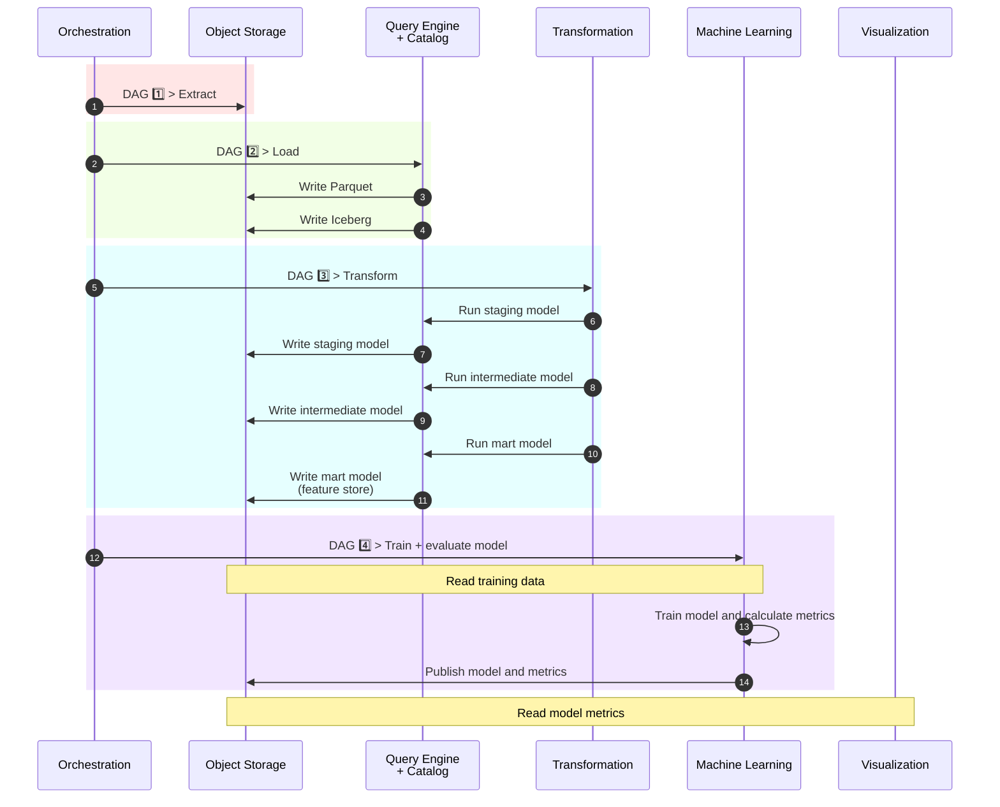
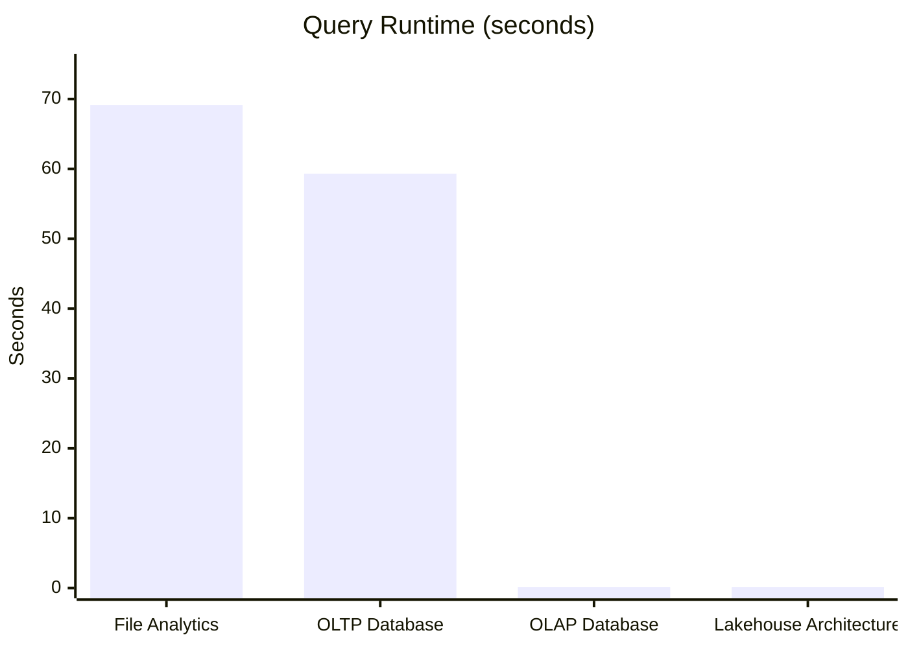

# Project 1: Local Lakehouse

*A fully containerized local lakehouse platform built with open-source technologies, modern data engineering workflows, and efficient analytical processing on commodity hardware.*

---

## Table of Contents

1. Executive Summary
2. Architecture
3. Design Decisions
4. Deployment
5. Reflections and Next Steps

---

## 1. Executive Summary

#### What was built?

This project builds a fully containerized local lakehouse platform using modern open-source data engineering tools. It ingests a public e-commerce clickstream dataset, processes it through an end-to-end analytical pipeline, and presents curated model evaluation metrics through Apache Superset.

#### What does this project demonstrate?

The platform brings together the core components of a modern analytical data stack in a reproducible local environment. It demonstrates practical experience with workflow orchestration, object storage, open table formats, analytical transformation, machine learning, and business intelligence tooling.

#### Central Design Philosophy

The pipeline was deliberately designed to make analytical processing practical on commodity hardware. By favoring columnar storage, staged processing, and out-of-core execution over large in-memory workflows, the project applies patterns that are also relevant to scalable and cost-conscious production systems.

## 2. Architecture

#### How the Components Fit Together

The platform follows a layered lakehouse architecture that separates orchestration, storage, transformation, machine learning, and visualization into independent components. Apache Airflow orchestrates the pipeline, loading raw data into Apache Iceberg tables backed by S3-compatible object storage. DuckDB and dbt transform the lakehouse data, XGBoost trains and evaluates a conversion model, and Apache Superset presents the resulting metrics.

#### High-Level Architecture

*The diagram below illustrates the flow of data through the platform and the interaction between the major components.*



#### Technology Stack

| Layer | Technology | Purpose |
| --- | --- | --- |
| Infrastructure |  | Reproducible local deployment |
| Orchestration |  | Pipeline scheduling and workflow management |
| Object Storage |  | S3-compatible object storage |
| Query Engine |  | High-performance analytical processing |
| Catalog |  | Iceberg REST catalog |
| Table Format |  | Open analytical table format |
| Transformation |  | Declarative data modeling |
| Machine Learning |  | Memory-efficient model training |
| Visualization |  | Dashboarding and data exploration |

## 3. Design Decisions

#### Benchmarking the Alternatives

Before building the lakehouse, I wanted to answer two questions:

1. How much faster are modern OLAP databases than traditional OLTP databases for analytical workloads?
2. If OLAP databases already provide excellent performance, what additional problem does a lakehouse solve?

To answer these questions, I benchmarked the same 42-million-row e-commerce clickstream dataset across four architectures: file analytics with Pandas, PostgreSQL, DuckDB, and a local lakehouse built with DuckDB, Iceberg, and Polaris.


| Stage | Architecture | Stack | Storage Cost | Memory Cost | Compute Cost | Notes |
| --- | --- | --- | --- | --- | --- | --- |
| 1 | File Analytics | Pandas + CSV.GZ | 🟠 Medium | 🔴 High | 🔴 High | Simple and flexible for exploratory analysis, but limited by available memory. |
| 2 | OLTP Database | PostgreSQL | 🔴 High | 🟢 Low | 🔴 High | Optimized for transactions and updates, not large analytical scans. |
| 3 | OLAP Database | DuckDB | 🟢 Low | 🟢 Low | 🟢 Low | Columnar OLAP systems dramatically reduce storage and query costs for analytics. |
| 4 | Lakehouse Architecture | DuckDB + Iceberg + Polaris | 🟢 Low | 🟢 Low | 🟢 Low | Lakehouses decouple storage, metadata, and compute while retaining warehouse capabilities. |

*Representative benchmark query over the full 42-million-row clickstream dataset.*

The benchmarks validated two important ideas. First, columnar OLAP systems dramatically reduce both storage and compute costs compared with traditional row-oriented databases. Second, lakehouses solve a different problem: they decouple storage, metadata, and compute while introducing capabilities such as schema evolution, governance, and ACID transactions. These observations directly informed the architecture of the final platform.

#### Resource-Aware Engineering

A central design goal throughout the project was to make analytical processing practical on commodity hardware. Rather than relying on large in-memory workflows, the pipeline was designed around columnar storage, staged processing, and out-of-core execution. These patterns support efficient local development and are also relevant to larger production systems.

Several implementation decisions followed naturally from this philosophy:

- **Columnar, out-of-core processing**. The core pipeline uses DuckDB and Parquet rather than materializing the full dataset as an in-memory Pandas DataFrame.
- **Intermediate persistence**. The ingestion pipeline was redesigned from CSV → Iceberg to CSV → Parquet → Iceberg, separating expensive CSV parsing from Iceberg table creation and reducing peak memory utilization.
- **Independent dbt model execution**. Large dbt models are orchestrated as separate Airflow tasks, allowing memory to be reclaimed between stages while improving observability and retry granularity.
- **External-memory machine learning**. The original Iceberg → Pandas → XGBoost workflow was replaced with a disk-backed pipeline using Parquet and XGBoost's external-memory mode, reducing peak memory usage without requiring the full training dataset in RAM.

A common pattern emerged across all layers of the platform: instead of solving scalability challenges by allocating more hardware, large operations were decomposed into smaller stages separated by persisted intermediate artifacts. The total amount of computation remains essentially unchanged, but peak memory consumption is substantially reduced.

## 4. Deployment

#### Setup

Prerequisites: Docker Desktop, `curl`, `jq`, and `openssl`.

Clone the repository and run the setup script:

```bash
git clone https://github.com/Rez99/data-engineering-portfolio.git
cd data-engineering-portfolio/project-1-lakehouse/pipeline/scripts/
bash setup.sh
```

The setup script provisions the lakehouse infrastructure, configures the required services, runs the end-to-end pipeline, and imports the Superset dashboard through a single command.

For a practical local demonstration, the default pipeline processes a
one-million-row sample. The benchmark results above were produced separately
using the full 42-million-row dataset.


#### Resetting the Environment

To stop the platform and return to a clean local environment, run:

```bash
cd data-engineering-portfolio/project-1-lakehouse/pipeline/scripts/
bash reset.sh
```

The reset script removes the local containers, volumes, generated credentials,
and Airflow runtime files. The next setup run rebuilds the environment from the
version-controlled configuration.

#### Platform Services

| Service | Purpose | URL | Credentials |
| --- | --- | --- | --- |
| Apache Airflow | Pipeline orchestration | http://localhost:8080 | `airflow` / `airflow` |
| RustFS | S3-compatible object storage | http://localhost:9001 | `polaris_root` / `polaris_pass` |
| Apache Polaris | Iceberg catalog | http://localhost:8181 | API only |
| Apache Superset | Model evaluation dashboard | http://localhost:8088 | `admin` / `admin` |

#### Repository Structure

```text
pipeline/
├── dags/                   # Airflow DAG definitions
├── docker/
│   ├── airflow/            # Airflow, PostgreSQL, and Redis
│   ├── dbt/                # dbt project and DuckDB profile
│   ├── polaris/            # RustFS and Polaris
│   └── superset/           # Superset and its metadata database
├── logs/
│   └── setup.log           # Detailed installer output
└── scripts/
    ├── setup.sh            # Start infrastructure and run the pipeline
    ├── reset.sh            # Delete containers, volumes, and generated artifacts
    ├── superset_config.py
    ├── superset_init_duckdb.py
    └── superset_assets/    # Version-controlled dashboard definitions
```

#### Data Pipeline

Apache Airflow orchestrates a complete end-to-end lakehouse workflow:

1. Extract raw e-commerce events into RustFS.
2. Create and query Apache Iceberg tables using DuckDB and Polaris.
3. Build the analytical session model with dbt.
4. Train an XGBoost model and publish evaluation metrics.

The generated metrics are then available for interactive exploration through the preconfigured Apache Superset dashboard.

The figures below show the platform after a successful pipeline execution.

**Apache Airflow**


**Apache Superset**


## 5. Reflections and Next Steps

#### Key Lessons

Building this project reinforced that modern data engineering is less about individual tools and more about how independent components work together. Benchmarking the alternatives and measuring resource usage directly led to better architectural decisions than relying on assumptions.

#### Trade-offs and Limitations

The platform is intentionally optimized for reproducibility and efficient local execution. Several implementation choices—such as staged processing and intermediate persistence—favor lower memory consumption over the simplest possible implementation.

#### Future Directions

The next natural step is to deploy the same architecture in a cloud environment using managed services and Infrastructure as Code. From there, the platform could evolve toward streaming ingestion and real-time analytics.
