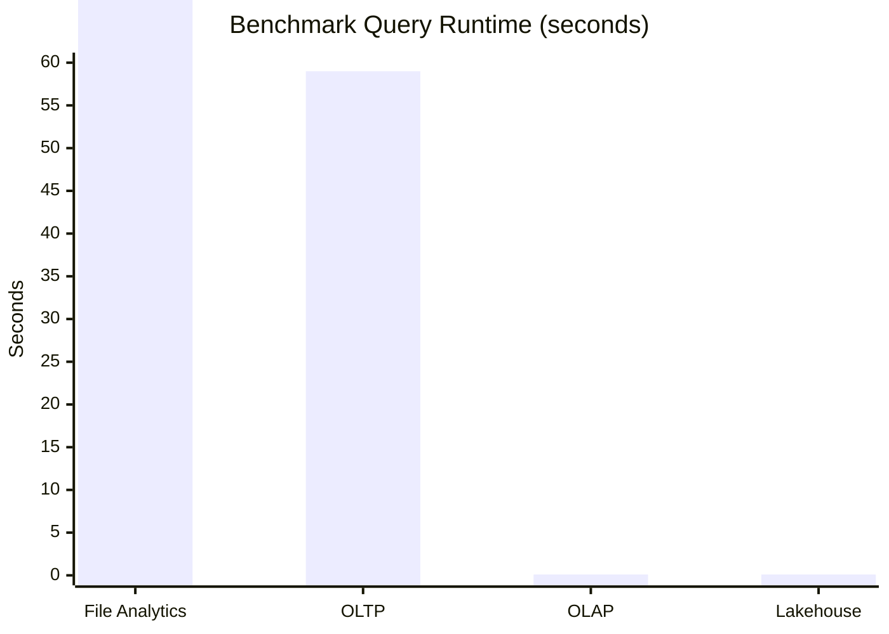

# Why Lakehouses?

Before building a lakehouse, I wanted to answer two questions:

1. How much faster are modern OLAP databases than traditional OLTP databases for analytics?
2. If OLAP databases already provide excellent analytical performance, what problem does a lakehouse solve?

To answer those questions, I benchmarked the same 42 million row ecommerce clickstream dataset across four architectures: file analytics with Pandas, PostgreSQL, DuckDB, and a local lakehouse built with DuckDB, Iceberg, and Polaris.

## How much faster is OLAP vs OLTP?

|Stage|Architecture|Stack|Storage Cost|Memory Cost|Compute Cost|Notes|
|---|---|---|---|---|---|---|
|1|File Analytics|Pandas + csv.gz|🟠 Medium|🔴 High|🔴 High|Simple and flexible for exploratory analysis, but limited by available memory.|
|2|OLTP Database|Postgres|🔴 High|🟢 Low|🔴 High|Optimized for transactions and updates, not large analytical scans.|
|3|OLAP Database|DuckDB|🟢 Low|🟢 Low|🟢 Low|Columnar OLAP systems dramatically reduce storage and query costs for analytics.|
|4|Lakehoue Architecture|DuckDB + Iceberg + Polaris|🟢 Low|🟢 Low|🟢 Low|Lakehouses decouple storage, metadata, and compute while retaining warehouse capabilities.|

**File Analytics (Pandas + CSV):** Pandas provided a simple and flexible starting point. The compressed CSV occupied 1.62 GB on disk and required a 69 second load before analysis could begin. Queries were fast once the data was loaded, but the entire dataset had to fit in memory, creating a fundamental scalability constraint as data volumes grow.

**OLTP Database (PostgreSQL):** Loading the same dataset into PostgreSQL increased storage requirements to 6.85 GB and the benchmark query took 59 seconds to complete. While PostgreSQL excels at transactions and operational workloads, the benchmark demonstrated that row-oriented databases are not optimized for large analytical scans.

**OLAP Database (DuckDB):** Moving to DuckDB's columnar storage reduced storage requirements to roughly 1.5 GB while executing the same query in just 0.13 seconds. This was the most significant result of the project, clearly demonstrating why analytical workloads migrated from OLTP systems to columnar OLAP engines.

## What problem does a lakehouse solve?

**Lakehouse (DuckDB + Iceberg + Polaris):** Query performance remained essentially unchanged at 0.13 seconds. This was expected because the benchmark dataset consisted of a single Parquet file, leaving little opportunity for Iceberg's metadata layer to improve query planning. In larger deployments containing thousands of files, Iceberg can accelerate analytics by allowing query engines to identify relevant files through metadata rather than discovering and inspecting every file individually. It also introduces capabilities such as schema evolution, time travel, governance, and ACID transactions.

The benchmark validated two important ideas. First, OLAP databases can dramatically reduce both storage and compute costs compared with traditional OLTP systems for analytical workloads. Second, lakehouses solve a different problem: managing analytical data at scale through metadata, governance, and intelligent file organization.

