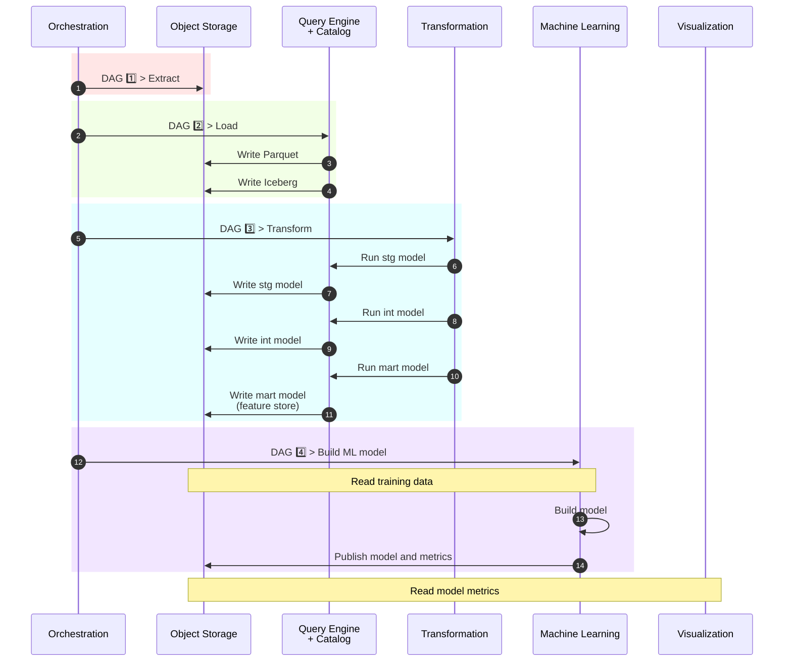
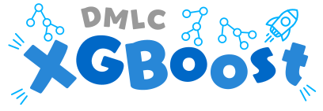
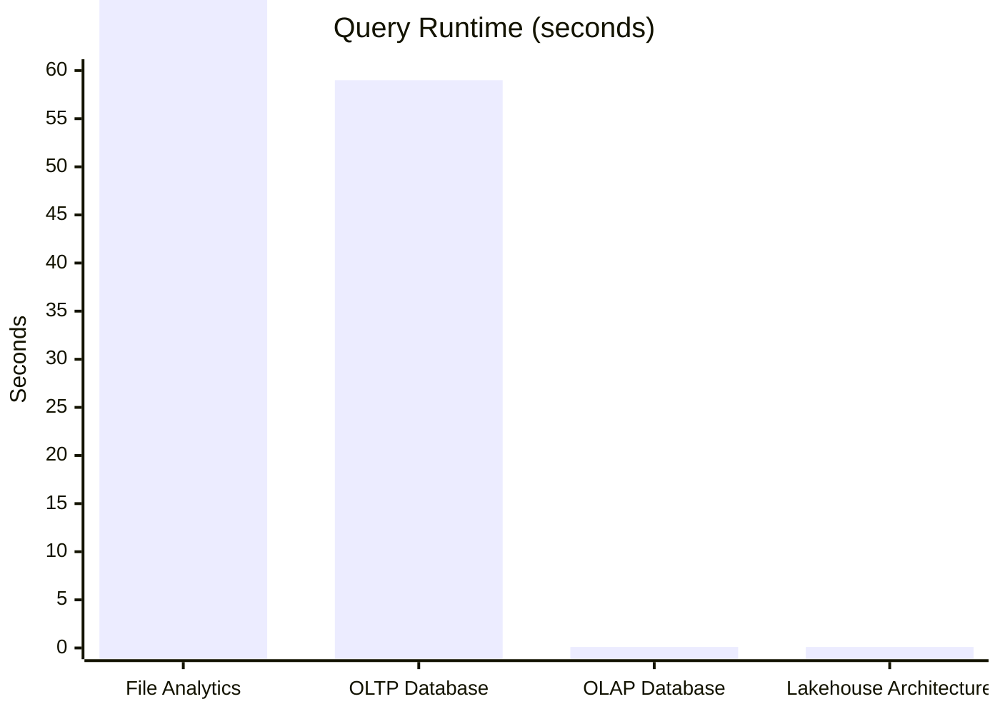
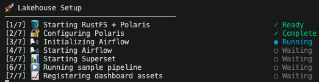
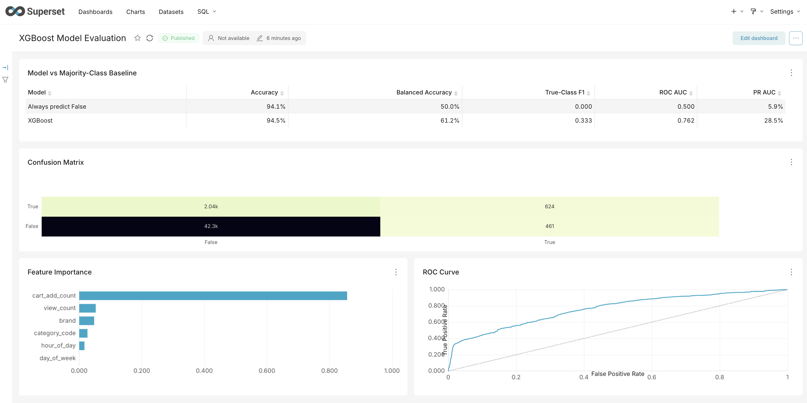

# Project 1: Local Lakehouse

## End-to-End Data Engineering on Commodity Hardware

*A fully containerized local lakehouse platform built with open-source technologies, demonstrating resource-aware architecture, modern data engineering workflows, and scalable analytical processing on commodity hardware.*

---

## Table of Contents

1. Executive Summary
2. Architecture
3. Design Decisions
4. Deployment
5. Reflections and Next Steps

---

### 1. Executive Summary

#### What was built?

This project builds a fully containerized local lakehouse platform using modern open-source data engineering tools. It ingests a large public clickstream dataset, processes it through an end-to-end analytical pipeline, and delivers curated analytics and model metadata through Apache Superset.

#### What does this project demonstrate?

The platform brings together the core components of a modern analytical data stack into a reproducible local environment. It demonstrates practical experience with workflow orchestration, object storage, open table formats, data transformation, and business intelligence tooling.

#### Central Design Philosophy

The pipeline was deliberately designed to make large-scale analytical processing practical on commodity hardware. By favoring columnar storage, staged processing, and out-of-core execution over large in-memory workflows, the same architecture that enables local development also reflects scalable and cost-conscious production engineering.


### 2. Architecture

#### How the Components Fit Together

The platform follows a layered lakehouse architecture, separating orchestration, storage, transformation, and visualization into independent services. Apache Airflow orchestrates the ingestion pipeline, loading raw data into Apache Iceberg tables backed by S3-compatible object storage. DuckDB and dbt perform analytical transformations directly against the lakehouse, while Apache Superset exposes curated analytics and model metadata for exploration and visualization.

#### High-Level Architecture

*The diagram below illustrates the flow of data through the platform and the interaction between the major components.*



#### Technology Stack

| Layer          | Technology      | Purpose                                     |
| -------------- | --------------- | ------------------------------------------- |
| Infrastructure |    | Reproducible local deployment               |
| Orchestration  |   | Pipeline scheduling and workflow management |
| Object Storage |           | S3-compatible object storage                |
| Query Engine   |           | High-performance analytical processing      |
| Catalog        |   | Iceberg REST catalog                        |
| Table Format   |   | Open analytical table format                |
| Transformation |              | Declarative data modeling                   |
| Machine Learning  |  | Memory-efficient model training for large datasets          |
| Visualization  |  | Dashboarding and data exploration           |


### 3. Design Decisions

#### Benchmarking the Alternatives

Before building the lakehouse, I wanted to answer two questions:

1. How much faster are modern OLAP databases than traditional OLTP databases for analytical workloads?
2. If OLAP databases already provide excellent performance, what additional problem does a lakehouse solve?

To answer these questions, I benchmarked the same 42 million row ecommerce clickstream dataset across four architectures: file analytics with Pandas, PostgreSQL, DuckDB, and a local lakehouse built with DuckDB, Iceberg, and Polaris.


|Stage|Architecture|Stack|Storage Cost|Memory Cost|Compute Cost|Notes|
|---|---|---|---|---|---|---|
|1|File Analytics|Pandas + csv.gz|🟠 Medium|🔴 High|🔴 High|Simple and flexible for exploratory analysis, but limited by available memory.|
|2|OLTP Database|Postgres|🔴 High|🟢 Low|🔴 High|Optimized for transactions and updates, not large analytical scans.|
|3|OLAP Database|DuckDB|🟢 Low|🟢 Low|🟢 Low|Columnar OLAP systems dramatically reduce storage and query costs for analytics.|
|4|Lakehoue Architecture|DuckDB + Iceberg + Polaris|🟢 Low|🟢 Low|🟢 Low|Lakehouses decouple storage, metadata, and compute while retaining warehouse capabilities.|

*Representative benchmark query over a 42 million row clickstream dataset.

The benchmarks validated two important ideas. First, columnar OLAP systems dramatically reduce both storage and compute costs compared with traditional row-oriented databases. Second, lakehouses solve a different problem: they decouple storage, metadata, and compute while introducing capabilities such as schema evolution, governance, and ACID transactions. These observations directly informed the architecture of the final platform.

#### Resource-Aware Engineering

A central design goal throughout the project was to make large-scale analytical processing practical on commodity hardware. Rather than relying on large in-memory workflows, the pipeline was deliberately designed around columnar storage, staged processing, and out-of-core execution. The same architectural patterns that enable local development also align with scalable and cost-conscious production engineering.

Several implementation decisions followed naturally from this philosophy:

- **Columnar, out-of-core processing**. The core pipeline uses DuckDB and Parquet rather than materializing the full dataset as an in-memory Pandas DataFrame.
- **Intermediate persistence**. The ingestion pipeline was redesigned from CSV → Iceberg to CSV → Parquet → Iceberg, separating expensive CSV parsing from Iceberg table creation and reducing peak memory utilization.
- **Independent model execution**. Large dbt models are orchestrated as separate Airflow tasks, allowing memory to be reclaimed between stages while improving observability and retry granularity.
- **External-memory machine learning**. The standard Iceberg → Pandas → XGBoost workflow was replaced with a disk-backed pipeline using Parquet and XGBoost's external-memory mode, reducing peak memory usage while preserving model performance.

A common pattern emerged across all layers of the platform: instead of solving scalability challenges by allocating more hardware, large operations were decomposed into smaller stages separated by persisted intermediate artifacts. The total amount of computation remains essentially unchanged, but peak memory consumption is substantially reduced.

### 4. Deployment

#### End-to-End Workflow

The local platform demonstrates a complete lakehouse workflow:

1. Airflow extracts ecommerce events into RustFS.
2. DuckDB writes and queries Iceberg tables registered in Polaris.
3. dbt builds the analytical session model.
4. XGBoost trains from the transformed data and publishes evaluation metrics.
5. Superset reads the generated metrics through DuckDB and serves an interactive model dashboard.

#### Setup

Clone the repository and run the setup script:

```bash
git clone https://github.com/Rez99/data-engineering-portfolio.git
cd data-engineering-portfolio/project-1-lakehouse/pipeline/scripts/
bash setup.sh
```

The setup script preserves existing volumes and performs the following high-level steps:

1. Start RustFS and Polaris.
2. Provision the Iceberg catalog and Airflow credentials.
3. Initialize and start Airflow.
4. Wait for service health checks and DAG discovery.
5. Start Superset and verify availability.
6. Trigger the Airflow pipeline and wait for successful completion.
7. Register the generated model metrics and import the Superset dashboard.

Detailed installer output is written to `pipeline/logs/setup.log` and is automatically displayed if a setup step fails.

#### Resetting the Environment

To stop the platform and return to a clean local environment, run:

```bash
cd data-engineering-portfolio/project-1-lakehouse/pipeline/scripts/
bash reset.sh
```

The reset script removes the Airflow, Polaris, RustFS, and Superset containers
and volumes, along with generated credentials and Airflow runtime files. The
next `bash setup.sh` run rebuilds the environment from the version-controlled
configuration.

#### Platform Services

| Service         | Purpose                      | URL                   |
| --------------- | ---------------------------- | --------------------- |
| Apache Airflow  | Pipeline orchestration       | http://localhost:8080 |
| RustFS          | S3-compatible object storage | http://localhost:9001 |
| Apache Polaris  | Iceberg catalog              | http://localhost:8181 |
| Apache Superset | Model evaluation dashboard   | http://localhost:8088 |

#### Repository Structure

```text
pipeline/
├── dags/                   # Airflow DAG definitions
├── docker/
│   ├── airflow/            # Airflow, Postgres, and Redis
│   ├── dbt/                # dbt project and DuckDB profile
│   ├── polaris/            # RustFS and Polaris
│   └── superset/           # Superset and its metadata database
├── logs/
│   └── setup.log           # Detailed installer output
└── scripts/
    ├── setup.sh            # Start infrastructure and run the pipeline
    ├── reset.sh            # Delete containers, volumes, and generated artifacts
    ├── superset_config.py
    ├── superset_init_duckdb.py
    └── superset_assets/    # Version-controlled dashboard definitions
```

#### Demonstration

The figures below show the platform during deployment and after a successful pipeline execution.

**Automated deployment**

The setup script provisions the lakehouse infrastructure, configures the required services, and orchestrates the end-to-end workflow through a single command.



**Apache Airflow**

Airflow orchestrates the ingestion, transformation, and machine learning workflows through a series of independent DAG stages.


**Apache Superset**

Superset connects directly to the curated analytical outputs and model evaluation metrics, providing an interactive interface for exploring the results.




### 5. Reflections and Next Steps

#### Key Lessons

Building this project reinforced that modern data engineering is less about individual tools and more about how independent components work together. Benchmarking the alternatives and measuring resource usage directly led to better architectural decisions than relying on assumptions.

#### Trade-offs and Limitations

The platform is intentionally optimized for reproducibility and efficient local execution. Several implementation choices—such as staged processing and intermediate persistence—favor lower memory consumption over the simplest possible implementation.

#### Future Directions

The next natural step is to extend the same architecture into a cloud-native environment using managed infrastructure and Infrastructure as Code, before evolving toward streaming data pipelines and real-time analytics.

