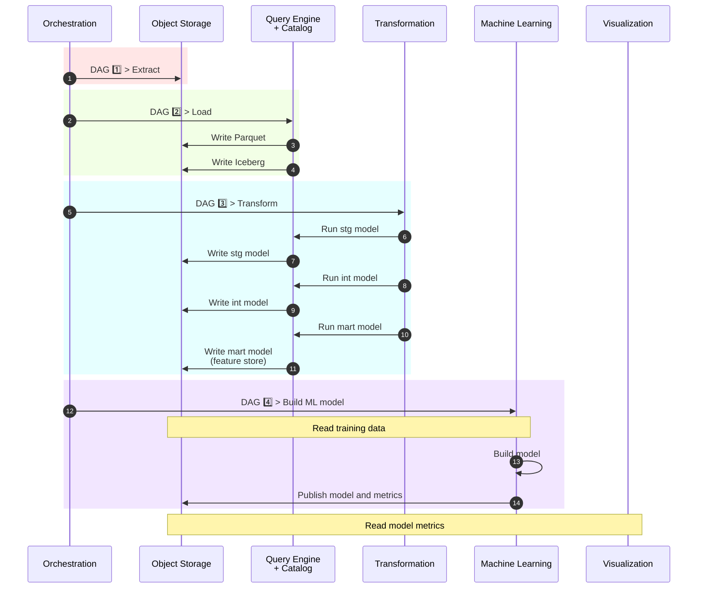

# Project 1: Local Lakehouse

## End-to-End Data Engineering on Commodity Hardware

*A fully containerized local lakehouse platform built with open-source technologies, demonstrating resource-aware architecture, modern data engineering workflows, and scalable analytical processing on commodity hardware.*

---

## Table of Contents

1. Executive Summary
2. Architecture
3. Design Decisions
4. Pipeline Walkthrough
5. Demonstration
6. Running the Project
7. Reflections and Next Steps

---

### 1. Executive Summary

#### What was built?

This project builds a fully containerized local lakehouse platform using modern open-source data engineering tools. It ingests a large public clickstream dataset, processes it through an end-to-end analytical pipeline, and delivers curated analytics and model metadata through Apache Superset.

#### What does this project demonstrate?

The platform brings together the core components of a modern analytical data stack into a reproducible local environment. It demonstrates practical experience with workflow orchestration, object storage, open table formats, data transformation, and business intelligence tooling.

#### Central Design Philosophy

The pipeline was deliberately designed to make large-scale analytical processing practical on commodity hardware. By favoring columnar storage, staged processing, and out-of-core execution over large in-memory workflows, the same architecture that enables local development also reflects scalable and cost-conscious production engineering.

### 2. Architecture

#### How the Components Fit Together

The platform follows a layered lakehouse architecture, separating orchestration, storage, transformation, and visualization into independent services. Apache Airflow orchestrates the ingestion pipeline, loading raw data into Apache Iceberg tables backed by S3-compatible object storage. DuckDB and dbt perform analytical transformations directly against the lakehouse, while Apache Superset exposes curated analytics and model metadata for exploration and visualization.

#### High-Level Architecture

*The diagram below illustrates the flow of data through the platform and the interaction between the major components.*

#### Technology Stack

| Layer          | Technology      | Purpose                                     |
| -------------- | --------------- | ------------------------------------------- |
| Infrastructure |    | Reproducible local deployment               |
| Orchestration  |   | Pipeline scheduling and workflow management |
| Object Storage |           | S3-compatible object storage                |
| Query Engine   |           | High-performance analytical processing      |
| Catalog        |   | Iceberg REST catalog                        |
| Table Format   |   | Open analytical table format                |
| Transformation |              | Declarative data modeling                   |
| Machine Learning  |  | Memory-efficient model training for large datasets          |
| Visualization  |  | Dashboarding and data exploration           |

### 3. Design Decisions

* Benchmarking the alternatives.
* Why DuckDB?
* Why CSV → Parquet → Iceberg?
* Why Airflow, dbt, Polaris, RustFS, and Superset?
* Designing for low memory usage and cost-efficient scaling.

### 4. Pipeline Walkthrough

* End-to-end data flow.
* Pipeline sequence diagram.
* How data moves from raw ingestion to dashboard.

### 5. Demonstration

* Airflow orchestration.
* Iceberg tables and transformed datasets.
* Model metadata and analytical outputs.
* Superset dashboard.

### 6. Running the Project

* Repository structure.
* One-command setup.
* Accessing Airflow and Superset.

### 7. Reflections and Next Steps

* Key lessons learned.
* Trade-offs and limitations.
* Future evolution toward cloud deployment and streaming architectures.
