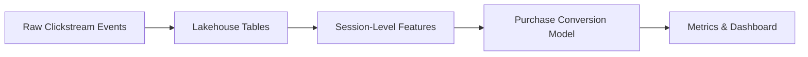
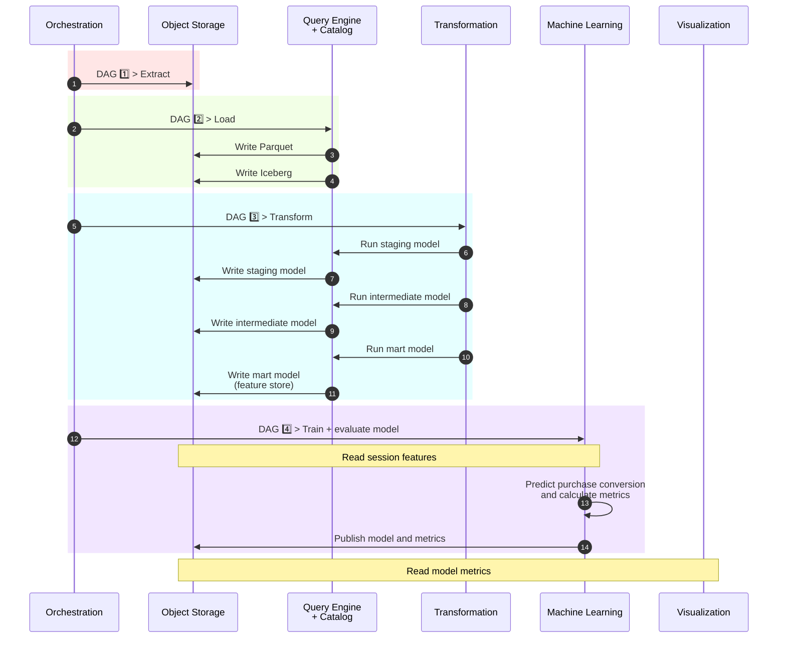
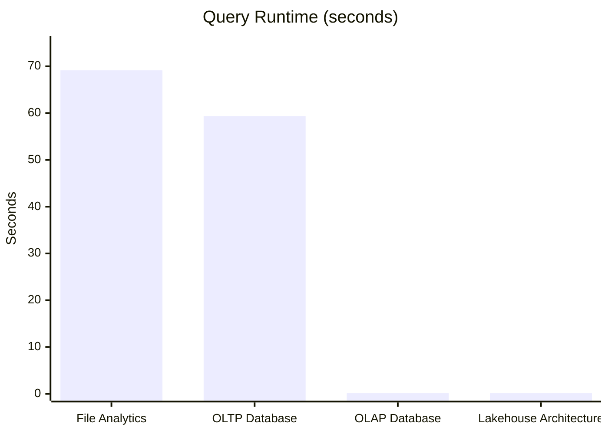
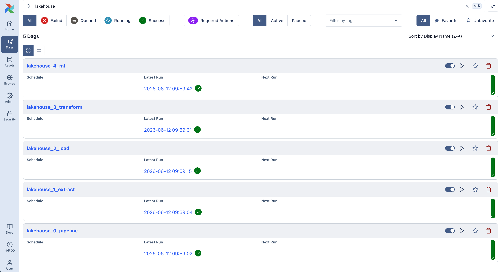

# Project 1: Local Lakehouse

An end-to-end data and machine learning platform that transforms 42 million e-commerce clickstream events into session-level features, purchase-conversion predictions, and interactive dashboards using open-source lakehouse technologies.

---

## Table of Contents

|Section|Contents|
|---|---|
| **[1. What This Project Does](#1-what-this-project-does)**         | 1.1 Problem Statement<br>1.2 Inputs and Outputs<br>1.3 End-to-End Workflow                                           |
| **[2. Follow One Session](#2-follow-one-session)**                 | 2.1 Raw Clickstream Event<br>2.2 Curated Session-Level Feature Store<br>2.3 Model Prediction<br>2.4 Model Evaluation |
| **[3. Architecture](#3-architecture)**                             | 3.1 Pipeline Sequence<br>3.2 Technology Stack                                                                        |
| **[4. Why These Choices](#4-why-these-choices)**                   | 4.1 Benchmarking the Alternatives<br>4.2 Resource-Aware Engineering                                                  |
| **[5. Deployment](#5-deployment)**                                 | 5.1 Clone<br>5.2 Repository Structure<br>5.3 Setup<br>5.4 Platform Services<br>5.5 Teardown                         |
| **[6. Results](#6-results)**                                       | 6.1 Pipeline Execution<br>6.2 Model Evaluation Dashboard                                                             |
| **[7. Reflections and Next Steps](#7-reflections-and-next-steps)** | 7.1 Key Lessons<br>7.2 Trade-offs and Limitations<br>7.3 Future Directions                                           |

# 1. What This Project Does
## 1.1 Problem Statement

This project demonstrates how raw e-commerce clickstream events can be transformed into machine-learning-ready features, purchase-conversion predictions, and interactive dashboards using a modern lakehouse architecture.

In a real e-commerce setting, these predictions could support just-in-time interventions, such as targeted offers, cart reminders, or personalized recommendations for high-intent sessions.

The project explores three questions:

1. How can large analytical datasets be processed efficiently on commodity hardware?
2. What advantages does a lakehouse provide over traditional databases and file-based analytics?
3. How can data engineering, analytics engineering, and machine learning be combined into a reproducible end-to-end workflow?

## 1.2 Inputs and Outputs

### Inputs

The pipeline uses the October 2019 file from [**Kaggle's E-Commerce Behavior Data from Multi-Category Store**](https://www.kaggle.com/datasets/mkechinov/ecommerce-behavior-data-from-multi-category-store) dataset. Each row represents a user-product interaction from a large multi-category online store.

| Attribute   | Value                                                      |
| ----------- | ---------------------------------------------------------- |
| Source      | Kaggle: E-Commerce Behavior Data from Multi-Category Store |
| File        | `2019-Oct.csv.gz`                                          |
| Format      | Compressed CSV                                             |
| Size        | 42.4 million events                                        |
| Period      | October 2019                                               |
| Granularity | One row per user event                                     |
| Event Types | `view`, `cart`, `remove_from_cart`, `purchase`             |

### Outputs

The platform produces the following artifacts:

| Output | Purpose |
| --- | --- |
| Iceberg Lakehouse Tables | Store raw events, transformed datasets, and session-level features in an open table format |
| XGBoost Model | Predict whether a user session will result in a purchase |
| Evaluation Metrics | Quantify model performance using ROC AUC, confusion matrix, and related measures |
| Superset Dashboard | Visualize model performance and explain model behavior through interactive dashboards |

## 1.3 End-to-End Workflow

The workflow below summarizes the movement of data through the platform.



# 2. Follow One Session

The machine learning workflow operates at the session level rather than the event level. Individual user interactions are first aggregated into session-level features, which are then used to train and evaluate a purchase-conversion model.

## 2.1 Raw Clickstream Event

The source dataset contains one row per user interaction.

```json
{
  "event_time": "2019-10-02 11:41:41",
  "event_type": "cart",
  "product_id": 1004856,
  "category_id": 2053013555631882655,
  "category_code": "electronics.smartphone",
  "brand": "samsung",
  "price": 130.25,
  "user_id": 512481982,
  "user_session": "88fafe35-4491-4c1c-aa0a-97237eb7d3e1"
}
```

## 2.2 Curated Session-Level Feature Store

Events belonging to the same `user_session` are aggregated into a curated session-level feature store that serves as the training dataset for the purchase-conversion model.
```json
{
  "user_session": "88fafe35-4491-4c1c-aa0a-97237eb7d3e1",
  "user_id": 512481982,
  "brand": "samsung",
  "category_code": "electronics.smartphone",
  "total_activity_count": 4,
  "view_count": 2,
  "cart_add_count": 1,
  "purchase_count": 1,
  "converted": true,
  "session_start_time": "2019-10-02 11:41:15",
  "session_end_time": "2019-10-02 11:42:45",
  "session_duration_seconds": 90,
  "day_of_week": 3,
  "hour_of_day": 11,
  "first_view_time": "2019-10-02 11:41:15",
  "first_cart_time": "2019-10-02 11:41:41",
  "seconds_to_first_cart": 26
}
```
To reduce the impact of likely bot traffic and extreme outliers, sessions above the 99.9th percentile of `total_activity_count` (`> 69` events) are excluded. This removes 9,078 of 9.24 million sessions.
## 2.3 Model Prediction

The session-level features are used to train an XGBoost classifier that estimates the probability that a session will result in a purchase.

Example prediction:

```json
{
  "user_session": "88fafe35-4491-4c1c-aa0a-97237eb7d3e1",
  "purchase_probability": 0.663804,
  "predicted_conversion": true,
  "actual_conversion": true
}
```

## 2.4 Model Evaluation

Predictions from the test dataset are aggregated into evaluation artifacts that quantify model performance.

Example metrics:

```json
{
  "roc_auc": 0.809872,
  "accuracy": 0.937585,
  "balanced_accuracy": 0.642014,
  "f1_true": 0.392943,
  "pr_auc": 0.378796
}
```

These evaluation artifacts are published to the lakehouse and visualized through an interactive dashboard.

# 3. Architecture

## 3.1 Pipeline Sequence

The architecture follows an ELT (Extract, Load, Transform) pattern in which raw events are first loaded into the lakehouse and transformed afterward using dbt.

The pipeline runs as four sequential Airflow DAGs. The first downloads the raw clickstream data into object storage. The second loads it into cataloged Iceberg tables via an intermediate Parquet conversion. The third runs dbt models that aggregate raw events into a session-level feature store. The fourth trains and evaluates the XGBoost classifier and publishes the model artifacts.

The diagram below traces these stages and the interactions between components.



## 3.2 Technology Stack

| Layer | Technology | Purpose |
| --- | --- | --- |
| Infrastructure |  | Reproducible local deployment |
| Orchestration |  | Pipeline scheduling and workflow management |
| Object Storage |  | S3-compatible object storage |
| Query Engine |  | High-performance analytical processing |
| Catalog |  | Iceberg REST catalog |
| Table Format |  | Open analytical table format |
| Transformation |  | Declarative data modeling |
| Machine Learning |  | Purchase-conversion prediction |
| Visualization |  | Dashboarding and data exploration |

# 4. Why These Choices

## 4.1 Benchmarking the Alternatives

Before building the lakehouse, I wanted to answer two questions:

1. How much faster are modern OLAP databases than traditional OLTP databases for analytical workloads?
2. If OLAP databases already provide excellent performance, what additional problem does a lakehouse solve?

To answer these questions, I benchmarked the same 42-million-row e-commerce clickstream dataset across four architectures: file analytics with Pandas, PostgreSQL, DuckDB, and a local lakehouse built with DuckDB, Iceberg, and Polaris.



| Stage | Architecture           | Stack                      | Storage Cost | Memory Cost | Compute Cost | Notes                                                                                      |
| ----- | ---------------------- | -------------------------- | ------------ | ----------- | ------------ | ------------------------------------------------------------------------------------------ |
| 1     | File Analytics         | Pandas + CSV.GZ            | 🟠 Medium    | 🔴 High     | 🔴 High      | Simple and flexible for exploratory analysis, but limited by available memory.             |
| 2     | OLTP Database          | PostgreSQL                 | 🔴 High      | 🟢 Low      | 🔴 High      | Optimized for transactions and updates, not large analytical scans.                        |
| 3     | OLAP Database          | DuckDB                     | 🟢 Low       | 🟢 Low      | 🟢 Low       | Columnar OLAP systems dramatically reduce storage and query costs for analytics.           |
| 4     | Lakehouse Architecture | DuckDB + Iceberg + Polaris | 🟢 Low       | 🟢 Low      | 🟢 Low       | Lakehouses decouple storage, metadata, and compute while retaining warehouse capabilities. |

The benchmarks validated two important ideas. First, columnar OLAP systems dramatically reduce both storage and compute costs compared with traditional row-oriented databases. Second, lakehouses solve a different problem: they decouple storage, metadata, and compute while introducing capabilities such as schema evolution, governance, and ACID transactions.

## 4.2 Resource-Aware Engineering

Four implementation decisions keep peak memory use manageable on commodity hardware:

* **Columnar, out-of-core processing** using DuckDB and Parquet rather than in-memory Pandas DataFrames.
* **Staged ingestion** using a `CSV → Parquet → Iceberg` workflow to reduce peak memory pressure during ingestion.
* **Independent dbt model execution** to reclaim memory between transformation stages and improve observability.
* **External-memory machine learning** using streamed Parquet batches and XGBoost external-memory training.

Together, these choices trade some intermediate storage and orchestration complexity for lower peak memory consumption.

# 5. Deployment

## 5.1 Clone

### Prerequisites

The platform requires:

* Docker Desktop
* `curl`
* `jq`
* `openssl`

### Clone the Repository

```bash
git clone https://github.com/Rez99/data-engineering-portfolio.git
```

## 5.2 Repository Structure

```text
pipeline/
├── dags/                   # Airflow DAG definitions
├── docker/
│   ├── airflow/            # Airflow, PostgreSQL, and Redis
│   ├── dbt/                # dbt project and DuckDB profile
│   ├── polaris/            # RustFS and Polaris
│   └── superset/           # Superset and its metadata database
├── logs/
│   └── setup.log           # Detailed installer output
└── scripts/
    ├── setup.sh            # Start infrastructure and run the pipeline
    ├── reset.sh            # Delete containers, volumes, and generated artifacts
    ├── superset_config.py
    ├── superset_init_duckdb.py
    └── superset_assets/    # Version-controlled dashboard definitions
```

## 5.3 Setup

### Change to the Project Directory

```bash
cd data-engineering-portfolio/project-1-local-lakehouse/pipeline/scripts
```

### Deploy the Platform

```bash
bash setup.sh
```

The setup script performs the complete deployment workflow:

1. Starts the required infrastructure services.
2. Configures object storage and catalog components.
3. Executes the end-to-end data pipeline.
4. Trains and evaluates the machine learning model.
5. Imports the Superset dashboard and supporting assets.

The default pipeline now processes the full 42-million-row October 2019 dataset, matching the benchmark scale used elsewhere in this write-up.


## 5.4 Platform Services

After a successful deployment, the following services are available locally:

| Service         | Purpose                      | URL                   | Credentials                     |
| --------------- | ---------------------------- | --------------------- | ------------------------------- |
| Apache Airflow  | Pipeline orchestration       | http://localhost:8080 | `airflow` / `airflow`           |
| RustFS          | S3-compatible object storage | http://localhost:9001 | `polaris_root` / `polaris_pass` |
| Apache Polaris  | Iceberg catalog              | http://localhost:8181 | API only                        |
| Apache Superset | Model evaluation dashboard   | http://localhost:8088 | `admin` / `admin`               |

## 5.5 Teardown

### Change to the Project Directory

```bash
cd data-engineering-portfolio/project-1-local-lakehouse/pipeline/scripts
```

### Destroy the Platform

```bash
bash reset.sh
```

The reset script removes:

* Docker containers
* Docker volumes
* Generated credentials
* Airflow runtime files
* Local pipeline artifacts

The next start operation recreates the environment from the version-controlled configuration.

# 6. Results

## 6.1 Pipeline Execution



Apache Airflow orchestrates the workflow from data ingestion through model evaluation. The DAG graph above shows the successful execution of the complete pipeline.

## 6.2 Model Evaluation Dashboard


The dashboard summarizes model performance and compares the trained XGBoost classifier against a majority-class baseline.

Key evaluation artifacts include:

- Baseline vs. model performance across Accuracy, Balanced Accuracy, F1, ROC AUC, and PR AUC
- Confusion matrix showing classification outcomes
- Feature importance rankings
- ROC curve visualization

The results show that while overall accuracy improves only modestly over the baseline due to class imbalance, the model substantially improves Balanced Accuracy, F1 score, ROC AUC, and PR AUC, indicating a much stronger ability to identify purchasing sessions.

# 7. Reflections and Next Steps

## 7.1 Key Lessons

### 1. How can large analytical datasets be processed efficiently on commodity hardware?

The answer is not necessarily more hardware. Modern analytical systems achieve scale through efficient storage formats, metadata, and query engines that reduce the amount of data that must be read and processed.

✅ **Parquet was both smaller and faster than expected.**

One goal of this project was to develop an intuition for concepts such as Parquet and columnar storage. The benchmarks made their value tangible: Parquet files were both smaller than compressed CSV files and orders of magnitude faster to query.

```text
events.parquet
├─ column statistics
│  ├─ min(price)
│  ├─ max(price)
│  └─ null_count(price)
├─ row groups
└─ column chunks
```

This allows analytical engines such as DuckDB to skip large portions of a dataset without reading them.

✅ **Large-scale analytics became far more accessible than I expected.**

Before this project, I would have viewed a 42-million-row dataset as something that required specialized infrastructure. In practice, modern columnar formats and analytical engines made it possible to explore, transform, and model the data efficiently on a laptop.

✅ **Storage format influences both performance and cost.**

The project demonstrated that analytical scale comes as much from architecture and storage formats as from compute resources. Efficient storage layouts reduce the amount of data that must be read and processed, which translates directly into lower infrastructure costs in cloud environments.

### 2. What advantages does a lakehouse provide over traditional databases and file-based analytics?

The primary advantage of a lakehouse is flexibility. By separating storage, metadata, and compute, data can outlive any individual processing engine, database, or cloud service.

✅ **The project clarified the difference between Parquet and a lakehouse.**

The benchmarks showed that Parquet was responsible for most of the performance gains.

```text
Object Storage
    +
Parquet
    =
Fast analytical files
```

However, a lakehouse adds capabilities beyond raw performance.

```text
Object Storage
    +
Iceberg
    =
Fast analytical files
    + ACID transactions
    + Schema evolution
    + Table abstraction
```

The key insight was that Parquet solved the performance problem, while Iceberg solved the data management problem.

✅ **Catalogs are more than an Iceberg requirement.**

Initially, I viewed Polaris as simply an implementation detail required by Iceberg. Building the platform revealed that Iceberg needs only a relatively small set of catalog capabilities, while Polaris provides a broader metadata layer.

```text
          Venn Diagram
┌────────────────────────────────┐
│      Polaris Capabilities      |
|                                |
│ Access Control                 │
│ Multi-Catalog Management       │
│ Multi-Engine Interoperability  │
│                                │
│   ┌────────────────────────┐   │
│   │     Iceberg Needs      │   │
│   │                        │   │
│   │ Catalog API            │   │
│   │ Namespace Management   │   │
│   │ Table Metadata         │   │
│   └────────────────────────┘   │
└────────────────────────────────┘
```

This helped me understand why modern data platforms increasingly treat metadata as a first-class architectural concern.

✅ **Open architectures preserve optionality.**

By storing data in open formats and managing metadata independently, the platform remains compatible with multiple query engines and deployment environments. This reduces vendor lock-in and makes it easier to evolve the architecture over time without rewriting pipelines or migrating the underlying data.

### 3. How can data engineering, analytics engineering, and machine learning be combined into a reproducible end-to-end workflow?

The key is not mastering every technology in isolation. It is developing a mental model of how the components fit together and where responsibilities are divided across the system.

✅ **Building the platform required systems thinking.**

Prior to this project, the mechanics of modern data platforms felt like a black box. I understood many of the individual tools, but not how they communicated with one another or how data moved through the system. Building the platform transformed those abstract concepts into a concrete architecture.

✅ **Diagrams became an essential engineering tool.**

As the project grew, I repeatedly returned to diagrams to establish reference points and orient myself within the system. Whether reasoning about Docker images and containers, storage and catalogs, or pipeline stages, visualizing the architecture proved far more effective than attempting to hold the entire system in my head.

✅ **Complexity became manageable once I had a mental model.**

At first, concepts such as containers, catalogs, orchestration, and storage layers felt disconnected. Over time, diagrams and architectural boundaries provided the mental model needed to reason about the platform. The lesson was that understanding a system does not require holding every implementation detail in your head at once.


## 7.2 Trade-offs and Limitations

The architecture prioritizes openness, reproducibility, and efficient local execution over operational simplicity.

Benefits include:

* Open table formats and storage interfaces
* Decoupled storage, metadata, and compute
* Reproducible containerized deployment
* Efficient analytical processing on commodity hardware

Trade-offs include:

* Higher architectural complexity than a single database solution
* Additional orchestration overhead
* Longer setup times
* More moving parts to operate and troubleshoot

## 7.3 Future Directions

This local platform became the baseline for [Project 2](../project-2-cloud-lakehouse/), which migrates the same lakehouse workflow to Google Cloud using Infrastructure as Code and managed services.

Future projects will build on this foundation by exploring distributed processing with Spark, streaming ingestion, automated model retraining, and real-time data products.
