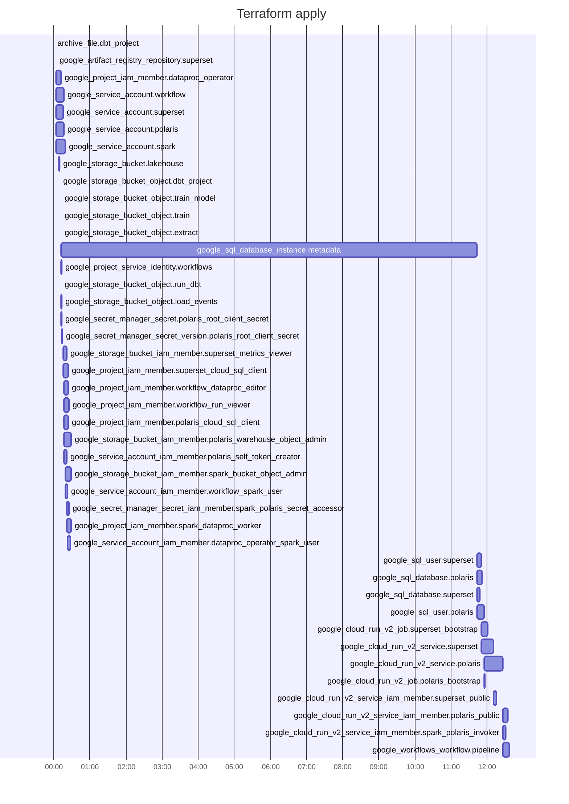
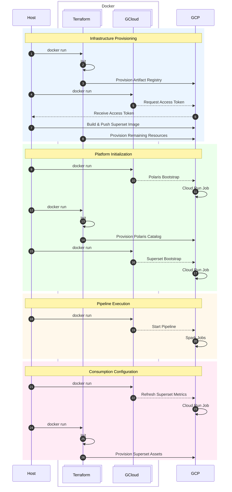

# Project 2: Cloud Lakehouse

*Project 2 extends the local lakehouse platform into a cloud-native data platform, demonstrating modern data engineering using infrastructure-as-code while prioritizing open standards and portability over vendor-specific services.*

---

## Table of Contents

1. Project Overview
2. Deployment
3. Repository Structure
4. Provisioning
5. Reflections and Next Steps

---

## 1. Project Overview

Project 2 migrates the local lakehouse from Project 1 to Google Cloud while
retaining Apache Iceberg, Apache Polaris, dbt Core, Spark, XGBoost, and
Superset.

The end-to-end pipeline downloads a public ecommerce clickstream sample, loads
it into an Iceberg table, transforms it into session-level ML features, trains
an XGBoost conversion model, and publishes model evaluation charts in Superset.
The current pipeline runs through one parent Google Workflow that creates a
temporary Spark cluster, runs the data pipeline, deletes the cluster, and
refreshes Superset.

See [docs/PROJECT_2_SPEC.md](docs/PROJECT_2_SPEC.md) for the delivery plan and
[docs/architecture.md](docs/architecture.md) for the selected architecture.

## 2. Deployment

### Setup

Prerequisites: Docker Desktop and Google Cloud Application Default Credentials
stored under `.credentials/gcloud/`.

```bash
bash scripts/setup.sh
```

The setup script provisions the cloud infrastructure, bootstraps Polaris and
Superset, deploys the pipeline artifacts, runs the end-to-end workflow, and
configures the Superset dashboard.

### Teardown

To destroy the cloud environment and stop ongoing costs, run:

```bash
bash scripts/destroy.sh
```

The teardown script removes the Terraform-managed cloud resources created for
the project.

### Platform Services

After a successful deployment, the main user-facing service is:

| Service | Purpose | URL | Credentials |
| --- | --- | --- | --- |
| Apache Superset | Model evaluation dashboard | Terraform output: `superset_service_url` | `admin` / `admin` |

Polaris is deployed as a Cloud Run service for Iceberg catalog access. It is
used by Spark and dbt rather than treated as an interactive end-user UI.

## 3. Repository Structure

```text
project-2-cloud-lakehouse/
├── deployment/           # Stage 3: PUBLISH deployable project artifacts
│   ├── containers/       # Cloud Run image build contexts for platform services
│   ├── dbt/              # dbt project adapted for Spark
│   ├── spark/            # Spark job entrypoints uploaded to GCS
│   ├── workflows/        # Google Cloud Workflows source definitions
│   └── manifest.example.json
├── docs/                 # Architecture documentation, ADRs, and project guidance
│   ├── AGENTS.md
│   ├── PROJECT_2_SPEC.md
│   ├── architecture.md
│   └── adr/
├── scripts/              # Local shell entrypoints
│   ├── bootstrap-polaris.sh
│   ├── bootstrap-superset.sh
│   ├── destroy.sh
│   ├── run-pipeline.sh
│   └── setup.sh
├── terraform/            # Terraform roots grouped by ownership boundary
│   ├── main/             # Stage 1a: PROVISION cloud infrastructure
│   ├── polaris/          # Stage 2b: MANAGE Polaris catalog state
│   └── superset/         # Stage 2c: MANAGE Superset dashboards/charts/datasets
├── tests/
│   ├── ingestion/        # Unit tests for ingestion code
│   ├── integration/      # Cross-service validation and smoke tests
│   └── ml/               # Unit tests for ML code
```

## 4. Provisioning

### 4.1 Cloud Resource Map

Terraform provisions the persistent cloud services, while the Spark cluster is created temporarily by the workflow at runtime.

```                                                                                         
 ┌─ APIs ────────────────┐  ┌─ Cloud Run ───────────┐  ┌─ Artifact Registry ────────────┐   
 │ Artifact Registry     │  │ Services              │  │ superset                       │   
 │ Compute Engine        │  │  └ polaris            │  └────────────────────────────────┘   
 │ Dataproc              │  │  └ superset           │                                       
 │ IAM Credentials       │  │ Jobs                  │                                       
 │ Cloud SQL Admin       │  │  └ polaris-bootstrap  │  ┌─ Secret Manager ───────────────┐   
 │ Cloud Run             │  │  └ superset-bootstrap │  │ polaris                        │   
 │ Secret Manager        │  └───────────────────────┘  └────────────────────────────────┘   
 │ Service Usage         │                                                                  
 │ Cloud Storage         │                                                                  
 │ Workflows             │  ┌─ Workflows ───────────┐  ┌─ IAM ──────────────────────────┐   
 └───────────────────────┘  │ pipeline              │  │ google_*_iam_member (Bindings) │   
                            └───────────────────────┘  │  └ Who? (Service Accounts)     │   
 ┌─ Cloud Storage ───────┐                             │  └ What? (Roles)               │   
 │ spark                 │                             │  └ Where? (Resources)          │   
 │  └ extract.py         │  ┌─ Spark* ──────────────┐  └────────────────────────────────┘   
 │  └ load_events.py     │  │ Cluster               │                                       
 │  └ run_dbt.py         │  │  └ spark-pipeline     │  ┌─ Cloud SQL ────────────────────┐             
 │  └ train.py           │  │                       │  │ PostgreSQL Instance            │             
 │  └ train_model.py     │  │ Created by workflow   │  │  └ metadata                    │             
 │ dbt                   │  │ at runtime            │  │      └ polaris DB              │             
 │  └ dbt-project.zip    │  │ * not Terraform       │  │      └ superset DB             │             
 └───────────────────────┘  └───────────────────────┘  └────────────────────────────────┘             
                                                                                        
```

### 4.2 Provisioning Duration

The first Terraform apply is dominated by Cloud SQL creation; most other resources complete within seconds.



### 4.3 Deployment Sequence

The deployment flow separates infrastructure provisioning, platform initialization, pipeline execution, and Superset asset configuration.


