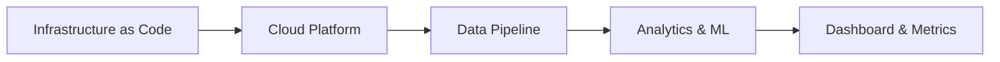
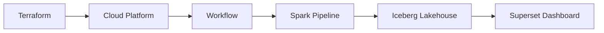
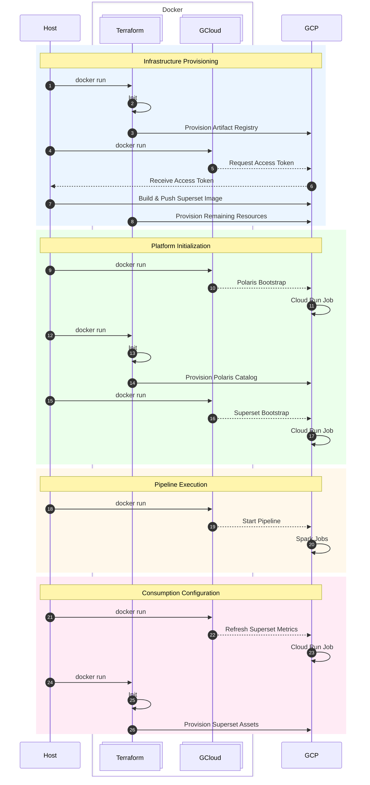
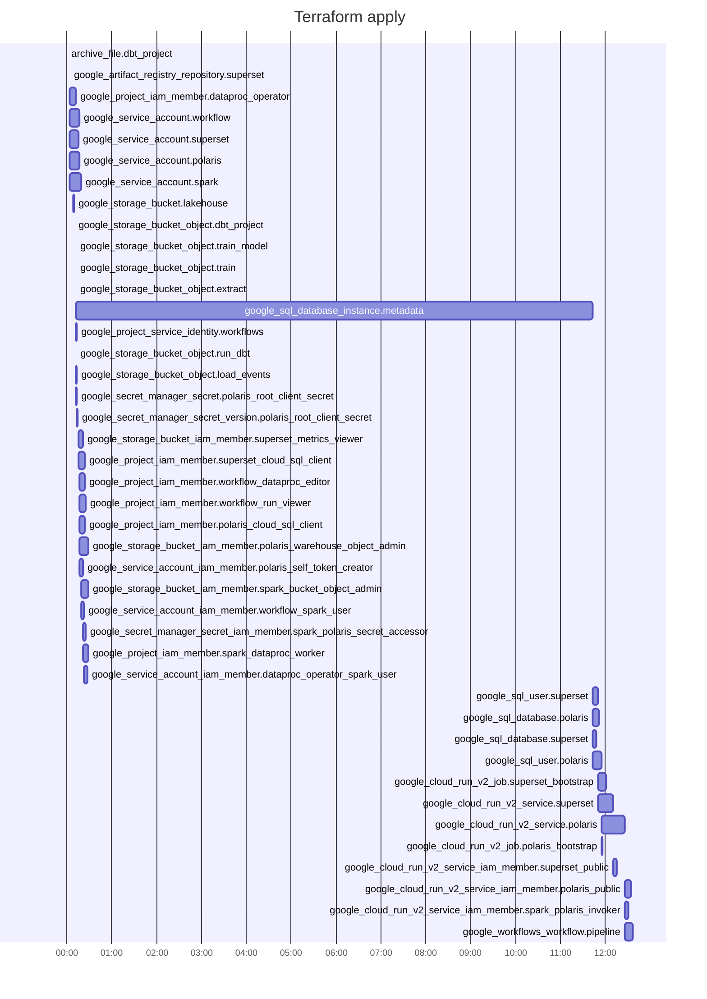

# Project 2: Cloud Lakehouse

An end-to-end cloud-native data and machine learning platform that provisions its own infrastructure, transforms e-commerce clickstream events into session-level features, trains purchase-conversion models on Spark, and publishes interactive dashboards using open lakehouse technologies on Google Cloud.

---


| Section                           | Contents                                                                                                                                                                                               |
| --------------------------------- | ------------------------------------------------------------------------------------------------------------------------------------------------------------------------------------------------------ |
| **1. What This Project Does**     | 1.1 Problem Statement<br>1.2 Inputs and Outputs<br>1.3 End-to-End Deployment Flow                                                                                                                      |
| **2. Follow One Deployment**      | 2.1 Infrastructure Provisioning<br>2.2 Platform Initialization<br>2.3 Pipeline Execution<br>2.4 Dashboard                                                                                              |
| **3. Architecture** | 3.1 Local-to-Cloud Component Mapping<br>3.2 End-to-End Pipeline Flow<br>3.3 Cloud Resource Inventory<br>3.4 Deployment Sequence<br>3.5 Provisioning Duration |
| **4. Why These Choices**          | 4.1 Why Not BigQuery?<br>4.2 Why Polaris?<br>4.3 Why Cloud Workflows Instead of Airflow?<br>4.4 Why Ephemeral Dataproc?<br>4.5 Why Terraform?                                                        |
| **5. Deployment**                 | 5.1 Prerequisites<br>5.2 Repository Structure<br>5.3 Setup<br>5.4 Services<br>5.5 Teardown                                                                                                             |
| **6. Cost Analysis**                                                                                                      |
| **7. Reflections and Next Steps** | 7.1 How can a local lakehouse be migrated to the cloud?<br>7.2 How can cloud infrastructure become reproducible?<br>7.3 How can you adopt cloud-native services without surrendering data portability? |

# 1. What This Project Does

## 1.1 Problem Statement

Project 1 demonstrated that a modern lakehouse can process 42 million e-commerce clickstream events on commodity hardware using open-source technologies.

This project asks a different question:

> How do we migrate the same architecture to the cloud while preserving openness, portability, and reproducibility?

This project extends the local lakehouse into a cloud-native environment using Infrastructure as Code, managed compute, and open data standards — without rebuilding around vendor-specific services.

The project explores three questions:

1. Which local components translate directly to cloud equivalents, and which require rethinking?
2. How can cloud infrastructure become reproducible, auditable, and repeatable?
3. How can cloud-native services be adopted without surrendering data portability?

## 1.2 Inputs and Outputs

### Inputs

The platform combines infrastructure definitions, deployment artifacts, and analytical workloads into a single reproducible system.

| Input                   | Purpose                                                           |
| ----------------------- | ----------------------------------------------------------------- |
| Terraform Configuration | Provision cloud infrastructure and IAM resources                  |
| Container Images        | Deploy Polaris and Superset to Cloud Run                          |
| Spark Jobs              | Execute ingestion, transformation, and machine learning workloads |
| dbt Project             | Build analytical models and feature stores on Spark               |
| Workflow Definitions    | Orchestrate infrastructure and data pipeline execution            |

### Outputs

The platform produces the following artifacts:

| Output                         | Purpose                                                                 |
| ------------------------------ | ----------------------------------------------------------------------- |
| Cloud Lakehouse Platform       | Fully provisioned cloud environment for analytics and machine learning  |
| Iceberg Lakehouse Tables       | Store raw, transformed, and curated datasets using an open table format |
| Session-Level Feature Store    | Provide machine-learning-ready training data                            |
| Model and Evaluation Artifacts | Publish trained models, predictions, and performance metrics            |
| Superset Dashboard             | Visualize model performance through interactive dashboards              |

## 1.3 End-to-End Platform Flow

The workflow below summarizes the major stages involved in provisioning the platform, executing the data pipeline, and publishing analytical outputs.



# 2. Follow One Deployment

This section follows a single execution of `bash scripts/setup.sh` from an empty Google Cloud project to a fully operational cloud lakehouse platform.

The deployment proceeds through four stages:

1. Infrastructure Provisioning
2. Platform Initialization
3. Pipeline Execution
4. Dashboard Publication

## 2.1 Infrastructure Provisioning

Terraform provisions the cloud resources required by the platform, including Cloud Storage, Cloud SQL, Cloud Run, IAM, Secret Manager, and Workflows.

At the end of this stage, the infrastructure exists but the platform has not yet been configured.

## 2.2 Platform Initialization

Polaris and Superset are bootstrapped using Cloud Run Jobs.

These initialization steps create the catalog, configure authentication, perform database migrations, and prepare the platform for use.

At the end of this stage, the lakehouse platform is operational.

## 2.3 Pipeline Execution

A Cloud Workflow creates an ephemeral Spark cluster and executes the data pipeline.

The pipeline extracts clickstream data, loads Iceberg tables through Polaris, builds session-level features with dbt, trains an XGBoost model, and publishes evaluation metrics.

Once processing completes, the Spark cluster is deleted.

## 2.4 Dashboard Publication

Finally, Superset datasets, charts, and dashboards are refreshed using the newly generated metrics.

The result is a fully provisioned cloud-native lakehouse platform that can be deployed from source code using a single command.

# 3. Architecture

## 3.1 Local-to-Cloud Component Mapping

Project 2 preserves the core architecture from Project 1 while replacing local infrastructure with managed cloud services. Some components translate directly, while others require redesign to take advantage of cloud-native capabilities.

| Capability     | Project 1      | Project 2       |
| -------------- | -------------- | --------------- |
| Orchestration  | Airflow        | Cloud Workflows |
| Compute        | DuckDB         | Dataproc Spark  |
| Storage        | RustFS         | Cloud Storage   |
| Catalog        | Polaris        | Polaris         |
| Table Format   | Iceberg        | Iceberg         |
| Transformation | dbt            | dbt             |
| Visualization  | Superset       | Superset        |
| Infrastructure | Docker Compose | Terraform       |

The migration preserves the separation between storage, metadata, compute, and consumption layers while replacing local services with managed cloud equivalents.

## 3.2 End-to-End Pipeline Flow

The architecture follows the same high-level ELT pattern introduced in Project 1. Infrastructure is provisioned using Terraform, platform services are initialized, and an orchestrated Spark workflow executes the data pipeline before publishing analytical outputs.



## 3.3 Cloud Resource Inventory

Terraform provisions the persistent cloud services, while the Spark cluster is created temporarily by the workflow at runtime.

```                                                                                         
 ┌─ APIs ────────────────┐  ┌─ Cloud Run ───────────┐  ┌─ Artifact Registry ────────────┐   
 │ Artifact Registry     │  │ Services              │  │ superset                       │   
 │ Compute Engine        │  │  └ polaris            │  └────────────────────────────────┘   
 │ Dataproc              │  │  └ superset           │                                       
 │ IAM Credentials       │  │ Jobs                  │                                       
 │ Cloud SQL Admin       │  │  └ polaris-bootstrap  │  ┌─ Secret Manager ───────────────┐   
 │ Cloud Run             │  │  └ superset-bootstrap │  │ polaris                        │   
 │ Secret Manager        │  └───────────────────────┘  └────────────────────────────────┘   
 │ Service Usage         │                                                                  
 │ Cloud Storage         │                                                                  
 │ Workflows             │  ┌─ Workflows ───────────┐  ┌─ IAM ──────────────────────────┐   
 └───────────────────────┘  │ pipeline              │  │ google_*_iam_member (Bindings) │   
                            └───────────────────────┘  │  └ Who? (Service Accounts)     │   
 ┌─ Cloud Storage ───────┐                             │  └ What? (Roles)               │   
 │ spark                 │                             │  └ Where? (Resources)          │   
 │  └ extract.py         │  ┌─ Spark* ──────────────┐  └────────────────────────────────┘   
 │  └ load_events.py     │  │ Cluster               │                                       
 │  └ run_dbt.py         │  │  └ spark-pipeline     │  ┌─ Cloud SQL ────────────────────┐             
 │  └ train.py           │  │                       │  │ PostgreSQL Instance            │             
 │  └ train_model.py     │  │ Created by workflow   │  │  └ metadata                    │             
 │ dbt                   │  │ at runtime            │  │      └ polaris DB              │             
 │  └ dbt-project.zip    │  │ * not Terraform       │  │      └ superset DB             │             
 └───────────────────────┘  └───────────────────────┘  └────────────────────────────────┘             
                                                                                        
```
## 3.4 Deployment Sequence

The deployment flow separates infrastructure provisioning, platform initialization, pipeline execution, and dashboard configuration.


## 3.5 Provisioning Duration

Provisioning times vary significantly across resources. Most services are created within seconds, while Cloud SQL accounts for the majority of deployment time.



# 4. Why These Choices

## 4.1 Why Open Lakehouse Over Managed Warehousing?

The simplest cloud implementation would have been BigQuery. Instead, this project retained the open lakehouse architecture from Project 1.

```text
Cloud Storage
    +
Iceberg
    +
Polaris
    +
Spark
```

This separates storage, metadata, and compute, allowing each layer to evolve independently rather than becoming coupled to a single analytical engine.

## 4.2 Why Polaris?

Project 1 showed that catalogs are more than an Iceberg requirement.

Polaris provides a dedicated metadata layer between storage and compute, allowing Spark and other engines to interact with the same Iceberg tables through a consistent interface. Retaining Polaris preserved this architectural separation in the cloud.

## 4.3 Why Cloud Workflows Instead of Airflow?

Project 1 already demonstrated orchestration with Airflow. For Project 2, the goal was to explore a cloud-native alternative.

Because the pipeline follows a largely linear sequence, Cloud Workflows provided orchestration, retries, and error handling without the operational overhead of running a persistent Airflow environment.

## 4.4 Why Ephemeral Dataproc?

The workflow creates a Spark cluster when processing begins and deletes it afterward.

```text
Storage persists.
Metadata persists.
Compute is temporary.
```

This reduces idle cost while preserving the ability to scale compute independently of storage.

## 4.5 Why Terraform?

A primary goal of Project 2 was reproducibility.

Terraform allows infrastructure to be version controlled alongside application code so that a reviewer can provision, execute, and destroy the platform using documented commands rather than manual cloud-console configuration.

# 5. Deployment

## 5.1 Prerequisites

The platform requires:

* Docker Desktop
* A Google Cloud account with billing enabled
* Google Cloud Application Default Credentials (ADC)

Credentials should be stored under:

```text
.credentials/gcloud/
```

## 5.2 Repository Structure

```text
project-2-cloud-lakehouse/
├── deployment/
│   ├── containers/          # Cloud Run image build contexts
│   ├── dbt/                 # dbt project adapted for Spark
│   ├── spark/               # Spark jobs uploaded to Cloud Storage
│   ├── workflows/           # Cloud Workflows definitions
│   └── manifest.example.json
├── docs/
│   ├── adr/                 # Architecture Decision Records
│   ├── architecture.md
│   └── PROJECT_2_SPEC.md
├── scripts/
│   ├── setup.sh
│   ├── destroy.sh
│   ├── bootstrap-polaris.sh
│   ├── bootstrap-superset.sh
│   └── run-pipeline.sh
└── terraform/
    ├── main/                # Cloud infrastructure
    ├── polaris/             # Polaris catalog resources
    └── superset/            # Superset assets
```

## 5.3 Setup

### Change to the Project Directory

```bash
cd data-engineering-portfolio/project-2-cloud-lakehouse
```

### Deploy the Platform

```bash
bash scripts/setup.sh
```

The setup script performs the complete deployment workflow:

1. Provisions cloud infrastructure using Terraform.
2. Builds and publishes required container images.
3. Bootstraps Polaris and Superset.
4. Executes the end-to-end data pipeline.
5. Publishes dashboard assets and supporting metadata.

## 5.4 Platform Services

After a successful deployment, the following service is available:

| Service         | Purpose                    | URL                                      | Credentials       |
| --------------- | -------------------------- | ---------------------------------------- | ----------------- |
| Apache Superset | Model evaluation dashboard | Terraform output: `superset_service_url` | `admin` / `admin` |

Polaris is deployed as a Cloud Run service for Iceberg catalog access. It is consumed by Spark and dbt rather than treated as an interactive end-user application.

## 5.5 Teardown

### Destroy the Platform

```bash
bash scripts/destroy.sh
```

The teardown script removes Terraform-managed infrastructure and stops ongoing cloud charges.

The next deployment recreates the environment from the version-controlled configuration.

# 6. Cost Analysis

One objective of Project 2 was to demonstrate cloud-native infrastructure while maintaining reasonable operating costs.

The first end-to-end deployment and pipeline execution incurred the following charges:

| Service                   | Cost (USD) |
| ------------------------- | ---------: |
| Cloud SQL                 |      $0.06 |
| Compute Engine (Dataproc) |      $0.06 |
| Cloud Storage             |      $0.02 |
| Cloud Run                 |      $0.00 |
| Networking                |      $0.00 |
| **Total**                 |  **$0.14** |

The cost profile reflects one of the key architectural decisions in the project:

```text
Persistent costs
    Cloud SQL

Execution costs
    Dataproc

Nearly free
    Cloud Run
    Cloud Storage
```

Cloud SQL was the primary persistent cost because both Polaris and Superset require relational metadata stores. Dataproc was the primary execution cost because Spark clusters are created on demand for pipeline execution. Cloud Run and Cloud Storage contributed little to the overall spend due to scale-to-zero behavior, free-tier allowances, and the relatively small demonstration dataset.

This cost distribution reinforces the project's broader design philosophy: persist only metadata and storage, and create compute resources only when they are needed.

# 7. Reflections and Next Steps

## 7.1 How can a local lakehouse be migrated to the cloud?

✅ **Most lakehouse concepts survive the migration unchanged.**

Iceberg remained the table format, Polaris remained the catalog, dbt remained the transformation framework, and Superset remained the consumption layer. The primary changes were infrastructural: Cloud Storage replaced local object storage, Cloud Run replaced local containers, and Spark replaced DuckDB.

## 7.2 How can cloud infrastructure become reproducible?

✅ **Infrastructure becomes reproducible when it is treated as code.**

Terraform allowed infrastructure, permissions, and deployment configuration to be managed as version-controlled code. One important lesson was that provisioning resources and initializing applications are separate concerns, requiring both infrastructure deployment and bootstrap workflows.

## 7.3 How can you adopt cloud-native services without surrendering data portability?

✅ **Managed infrastructure and open data architectures are not mutually exclusive.**

The platform uses GCP-managed infrastructure while keeping the data stack open. Cloud Storage owns the data, Iceberg owns the table format, Polaris owns the catalog, and Spark provides compute. This separation allows managed services to simplify operations without coupling the platform to a proprietary analytical engine.

### Next Steps

Project 3 extends the platform into streaming and AI-oriented workloads, introducing event-driven processing and vector-based retrieval patterns.
