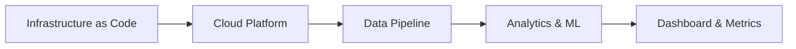
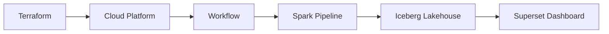

# Project 2: Cloud Lakehouse

An end-to-end cloud-native data and machine learning platform that provisions its own infrastructure, transforms e-commerce clickstream events into session-level features, trains purchase-conversion models on Spark, and publishes interactive dashboards using open lakehouse technologies on Google Cloud.

---

| Section                           | Contents                                                                                                                                                                                               |
| --------------------------------- | ------------------------------------------------------------------------------------------------------------------------------------------------------------------------------------------------------ |
| **1. What This Project Does**     | 1.1 Problem Statement 1.2 Inputs and Outputs 1.3 End-to-End Deployment Flow                                                                                                                      |
| **2. Follow One Deployment**      | 2.1 Infrastructure Provisioning 2.2 Platform Initialization 2.3 Pipeline Execution 2.4 Dashboard                                                                                              |
| **3. Architecture** | 3.1 Local-to-Cloud Component Mapping 3.2 End-to-End Pipeline Flow 3.3 Cloud Resource Inventory 3.4 Deployment Sequence 3.5 Provisioning Duration |
| **4. Why These Choices**          | 4.1 Why Not BigQuery? 4.2 Why Polaris? 4.3 Why Cloud Workflows Instead of Airflow? 4.4 Why Ephemeral Dataproc? 4.5 Why Terraform?                                                        |
| **5. Deployment**                 | 5.1 Prerequisites 5.2 Repository Structure 5.3 Setup 5.4 Services 5.5 Teardown                                                                                                             |
| **6. Results**                    | 6.1 Provisioning 6.2 Pipeline Execution 6.3 Model Evaluation Dashboard 6.4 Cost                                                                                                               |
| **7. Reflections and Next Steps** | 7.1 How can a local lakehouse be migrated to the cloud? 7.2 How can cloud infrastructure become reproducible? 7.3 How can you adopt cloud-native services without surrendering data portability? |

# 1. What This Project Does

## 1.1 Problem Statement

Project 1 demonstrated that a modern lakehouse can process 42 million e-commerce clickstream events on commodity hardware using open-source technologies.

This project asks a different question:

> How do we migrate the same architecture to the cloud while preserving openness, portability, and reproducibility?

This project extends the local lakehouse into a cloud-native environment using Infrastructure as Code, managed compute, and open data standards — without rebuilding around vendor-specific services.

The project explores three questions:

1. Which local components translate directly to cloud equivalents, and which require rethinking?
2. How can cloud infrastructure become reproducible, auditable, and repeatable?
3. How can cloud-native services be adopted without surrendering data portability?

## 1.2 Inputs and Outputs

### Inputs

The platform combines infrastructure definitions, deployment artifacts, and analytical workloads into a single reproducible system.

| Input                   | Purpose                                                           |
| ----------------------- | ----------------------------------------------------------------- |
| Terraform Configuration | Provision cloud infrastructure and IAM resources                  |
| Container Images        | Deploy Polaris and Superset to Cloud Run                          |
| Spark Jobs              | Execute ingestion, transformation, and machine learning workloads |
| dbt Project             | Build analytical models and feature stores on Spark               |
| Workflow Definitions    | Orchestrate infrastructure and data pipeline execution            |

### Outputs

The platform produces the following artifacts:

| Output                         | Purpose                                                                 |
| ------------------------------ | ----------------------------------------------------------------------- |
| Cloud Lakehouse Platform       | Fully provisioned cloud environment for analytics and machine learning  |
| Iceberg Lakehouse Tables       | Store raw, transformed, and curated datasets using an open table format |
| Session-Level Feature Store    | Provide machine-learning-ready training data                            |
| Model and Evaluation Artifacts | Publish trained models, predictions, and performance metrics            |
| Superset Dashboard             | Visualize model performance through interactive dashboards              |

## 1.3 End-to-End Platform Flow

The workflow below summarizes the major stages involved in provisioning the platform, executing the data pipeline, and publishing analytical outputs.

# 2. Follow One Deployment

This section follows a single execution of `bash scripts/setup.sh` from an empty Google Cloud project to a fully operational cloud lakehouse platform.

The deployment proceeds through four stages:

1. Infrastructure Provisioning
2. Platform Initialization
3. Pipeline Execution
4. Dashboard Publication

## 2.1 Infrastructure Provisioning

Terraform provisions the cloud resources required by the platform, including Cloud Storage, Cloud SQL, Cloud Run, IAM, Secret Manager, and Workflows.

At the end of this stage, the infrastructure exists but the platform has not yet been configured.

## 2.2 Platform Initialization

Polaris and Superset are bootstrapped using Cloud Run Jobs.

These initialization steps create the catalog, configure authentication, perform database migrations, and prepare the platform for use.

At the end of this stage, the lakehouse platform is operational.

## 2.3 Pipeline Execution

A Cloud Workflow creates an ephemeral Spark cluster and executes the data pipeline.

The pipeline extracts clickstream data, loads Iceberg tables through Polaris, builds session-level features with dbt, trains an XGBoost model, and publishes evaluation metrics.

Once processing completes, the Spark cluster is deleted.

## 2.4 Dashboard Publication

Finally, Superset datasets, charts, and dashboards are refreshed using the newly generated metrics.

The result is a fully provisioned cloud-native lakehouse platform that can be deployed from source code using a single command.

# 3. Architecture

## 3.1 Local-to-Cloud Component Mapping

Project 2 preserves the core architecture from Project 1 while replacing local infrastructure with managed cloud services. Some components translate directly, while others require redesign to take advantage of cloud-native capabilities.

| Capability     | Project 1      | Project 2       |
| -------------- | -------------- | --------------- |
| Orchestration  | Airflow        | Cloud Workflows |
| Compute        | DuckDB         | Dataproc Spark  |
| Storage        | RustFS         | Cloud Storage   |
| Catalog        | Polaris        | Polaris         |
| Table Format   | Iceberg        | Iceberg         |
| Transformation | dbt            | dbt             |
| Visualization  | Superset       | Superset        |
| Infrastructure | Docker Compose | Terraform       |

The migration preserves the separation between storage, metadata, compute, and consumption layers while replacing local services with managed cloud equivalents.

## 3.2 End-to-End Pipeline Flow

The architecture follows the same high-level ELT pattern introduced in Project 1. Infrastructure is provisioned using Terraform, platform services are initialized, and an orchestrated Spark workflow executes the data pipeline before publishing analytical outputs.

## 3.3 Cloud Resource Inventory

Terraform provisions the persistent cloud services, while the Spark cluster is created temporarily by the workflow at runtime.

*Insert existing ASCII resource inventory diagram here.*

## 3.4 Deployment Sequence

The deployment flow separates infrastructure provisioning, platform initialization, pipeline execution, and dashboard configuration.

*Insert existing deployment sequence diagram here.*

## 3.5 Provisioning Duration

Provisioning times vary significantly across resources. Most services are created within seconds, while Cloud SQL accounts for the majority of deployment time.

*Insert existing provisioning Gantt chart here.*
