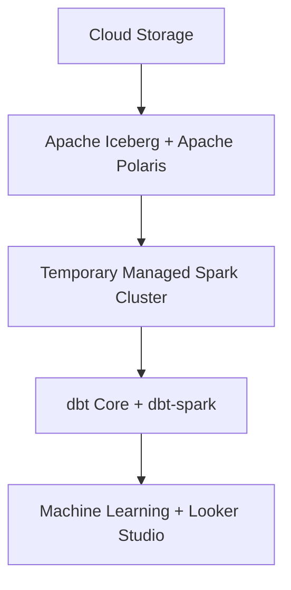

# ADR-0003: Select the Project 2 Cloud Architecture

## Status

Accepted

## Context

ADR-0002 evaluates the candidate GCP services that could replace or host the Project 1 components. This ADR records the choices made from that analysis and explains how they fit together as one architecture.

The selected architecture should:

- Preserve the useful lakehouse concepts demonstrated in Project 1.
- Use managed GCP services where they reduce undifferentiated operational work.
- Minimize idle cost for an intermittently run portfolio pipeline.
- Remain reproducible through Terraform.
- Support clean teardown.

## Architecture Summary

| Layer | Project 1 | Project 2 |
| --- | --- | --- |
| Orchestration | Apache Airflow | Workflows + Cloud Scheduler |
| Object Storage | RustFS | Cloud Storage |
| Table Format | Apache Iceberg | Apache Iceberg |
| Catalog | Apache Polaris | Apache Polaris on Cloud Run with Cloud SQL persistence |
| Transformation | dbt Core | dbt Core with `dbt-spark` |
| Query Engine | DuckDB | Temporary Managed Spark cluster |
| Machine Learning | XGBoost in Docker | XGBoost in a Cloud Run Job |
| Visualization | Apache Superset | Looker Studio |

These selections define the target architecture. Their implementation assumptions will be validated incrementally during the milestones that provision and deploy them.

## Operational Scope

| Decision | Selection |
| --- | --- |
| GCP project | `rez-cloud-lakehouse` |
| Region | `us-central1` |
| Demonstration dataset | The header and first 10,000 data rows from the public [REES46 October 2019 ecommerce clickstream](https://data.rees46.com/datasets/marketplace/2019-Oct.csv.gz) |
| Machine learning | XGBoost training and evaluation in a Cloud Run Job |
| Visualization | Looker Studio |
| Local tooling | Dockerized Google Cloud CLI and Terraform; neither tool is installed locally |
| Monthly budget | An initial USD 25 budget with alerts at 50%, 80%, and 100% |
| Teardown | Delete temporary Spark resources after every workflow run and use Terraform to destroy persistent demonstration infrastructure |

The extractor will stream the compressed source and stop after the header and first 10,000 data rows. It will not download or materialize the complete dataset locally. This deterministic sample keeps runs fast and inexpensive while preserving the same ingestion, Iceberg, dbt, machine-learning, and visualization stages as the complete pipeline.

Budget alerts provide notification rather than a hard spending cap. Cost control therefore also depends on zero minimum Cloud Run instances, bounded job timeouts, automatic Spark-cluster deletion on success and failure, a maximum cluster lifetime, and documented `terraform destroy` instructions.

## Open Lakehouse Principle

The architecture deliberately keeps the core data stack open:

- Data is stored in Cloud Storage rather than inside a proprietary warehouse.
- Apache Iceberg provides an open table format.
- Apache Polaris owns the catalog independently of the query engine.
- Apache Spark provides distributed processing without owning the tables.
- dbt retains the transformation models and software engineering workflow.

This does not eliminate GCP-specific infrastructure. Workflows, Cloud Run, Cloud SQL, and Cloud Storage still create cloud dependencies. The objective is narrower: avoid coupling ownership of the data, table metadata, and transformation logic to a single proprietary analytical engine.

## Architecture Diagram

The diagram emphasizes the portable lakehouse path rather than every operational interaction:



Operational details such as Polaris persistence, dbt-to-Spark integration, and cluster teardown are documented in the sections below.

## Selected Orchestration

Workflows will coordinate pipeline stages, dependencies, retries, and failures. Cloud Scheduler will provide scheduled invocation, while manual workflow execution will support demonstrations. Workflows will create a temporary Managed Spark cluster for lakehouse processing, invoke Cloud Run Jobs for lightweight tasks, and delete the cluster after the dependent stages finish.

The Project 1 Airflow DAGs will not be deployed directly. Their task ordering, retry behavior, and underlying Python and dbt logic should be reused where practical.

Cloud Composer was not selected because:

- The pipeline is sufficiently linear to express in Workflows.
- Composer has persistent environment and supporting infrastructure costs.
- Provisioning and teardown are heavier than the proposed usage-based managed services.
- Workflows demonstrates selecting an orchestration service appropriate to the workload rather than preserving Airflow by default.

Self-managed Airflow would add responsibility for its scheduler, workers, metadata database, networking, and upgrades. Cloud Scheduler alone would not model dependencies or multi-stage failure handling.

The orchestration implementation must support:

1. Creation and deletion of the temporary Managed Spark cluster.
2. Sequential invocation of Cloud Run Jobs, Spark jobs, and dbt.
3. Failure propagation that prevents dependent stages from running.
4. Observable workflow and job errors.
5. Manual and scheduled execution.

## Selected Lakehouse Direction

The architecture will retain Apache Polaris as the Iceberg REST catalog, store Iceberg tables in Cloud Storage, and use a temporary Managed Service for Apache Spark cluster as the distributed query and write engine.

```text
Temporary Managed Spark cluster
        |
        v
Apache Polaris on Cloud Run
        |
        v
Cloud SQL for catalog application state
        |
        v
Apache Iceberg tables on Cloud Storage
```

Polaris supports GCS-backed catalogs and relational JDBC persistence. A Cloud Run Service provides its REST API without requiring a managed VM or Kubernetes cluster, while Cloud SQL for PostgreSQL preserves catalog state when Cloud Run instances stop or restart.

Managed Spark clusters support Iceberg components, initialization actions, dependency configuration, and scheduled deletion. These capabilities allow the cluster to be configured for Polaris and removed after each demonstration or pipeline run.

BigQuery may still receive small reporting tables for visualization, but it will not own or serve as the primary writer of the lakehouse tables.

## Selected Transformation Direction

Project 2 will retain dbt Core and adapt the existing project to `dbt-spark`.

M3 will select the simplest viable execution model that allows dbt Core to run
against temporary Spark compute and access Iceberg tables through Polaris. A
temporary Spark Thrift endpoint is one candidate, but it is not assumed before
the integration smoke test.

This preserves:

- The existing SQL models and dependency graph.
- The staging, intermediate, and mart boundaries.
- Independent model execution and observability.

The selected execution model must prioritize simplicity while retaining dbt.
Workflows must delete temporary Spark resources after success or failure, and
the cluster should also have a scheduled deletion safeguard.

## Implementation Risks

Acceptance of this ADR approves the target architecture; it does not claim that every integration has already been deployed. The following assumptions must be validated during infrastructure and pipeline milestones:

1. **Validated in M1:** Terraform can provision a private GCS bucket, and authenticated tooling can upload, download, compare, and delete an object.
2. **M2:** Polaris on Cloud Run can persist catalog state in Cloud SQL for PostgreSQL.
3. **M2:** Polaris can create and access a GCS-backed Iceberg catalog using service-account credentials.
4. **M2:** A temporary Managed Spark cluster can load Iceberg and connect to Polaris.
5. **M2:** Spark can create an Iceberg table through Polaris, write rows to Cloud Storage, and read them back.
6. **M3:** A minimal dbt model can query `bronze.events` through Spark and Polaris.
7. **M2-M3:** Workflows can delete temporary Spark resources after success and failure.

If implementation invalidates an assumption, this ADR will be amended. The principal fallback for the Spark and dbt integration is BigQuery with `dbt-bigquery`; intermediate options include a persistent managed Spark cluster or a supported third-party Spark platform.

## Cost Implications

The architecture favors services with usage-based billing and little idle cost.

| Cost behavior | Services | Control |
| --- | --- | --- |
| Persistent while provisioned | Cloud SQL; stored Cloud Storage data | Use the smallest development database, keep the 10,000-row dataset small, and destroy demonstration infrastructure when it is not needed. |
| Billed while jobs or requests run | Cloud Run Jobs, Cloud Run Service, Workflows | Set zero minimum Cloud Run instances, bounded timeouts, retry limits, and small CPU and memory allocations. |
| Potentially highest cost per run | Temporary Managed Spark cluster | Use minimum viable nodes, scheduled deletion, and workflow cleanup on success and failure. |
| No separate infrastructure charge | Terraform, dbt Core, Apache Iceberg, Apache Polaris, XGBoost | Underlying compute, database, network, and storage usage still incur GCP charges. |

The project uses an initial USD 25 monthly budget with alerts at 50%, 80%, and 100%. M2 must record selected resource sizes and refine the estimated cost per demonstration run before provisioning the full platform.

## Relationship to ADR-0002

ADR-0002 remains the neutral comparison of candidate services. This ADR is the authoritative record of selected services and their rationale.

## Official References

- [Polaris runtime configuration](https://github.com/apache/polaris/blob/main/runtime/defaults/src/main/resources/application.properties)
- [Managed Spark cluster components](https://cloud.google.com/dataproc/docs/concepts/components/overview)
- [Managed Spark cluster scheduled deletion](https://cloud.google.com/dataproc/docs/concepts/configuring-clusters/scheduled-deletion)
- [dbt Spark setup](https://docs.getdbt.com/docs/core/connect-data-platform/spark-setup)
