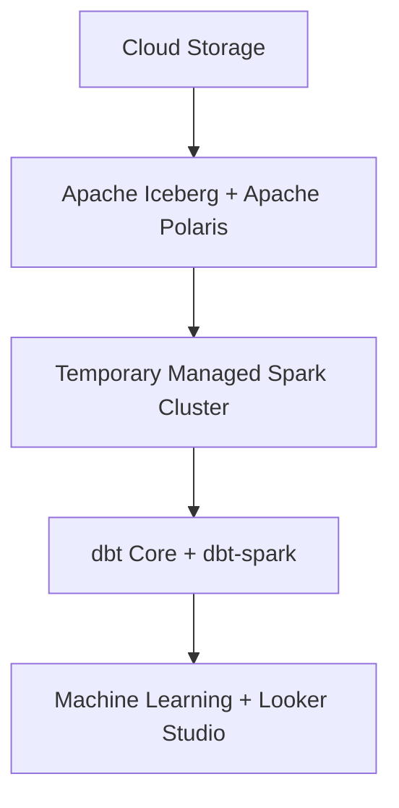

# ADR-0003: Select the Project 2 Cloud Architecture

## Status

Proposed

## Context

ADR-0002 evaluates the candidate GCP services that could replace or host the Project 1 components. This ADR records the choices made from that analysis and explains how they fit together as one architecture.

The selected architecture should:

- Preserve the useful lakehouse concepts demonstrated in Project 1.
- Use managed GCP services where they reduce undifferentiated operational work.
- Minimize idle cost for an intermittently run portfolio pipeline.
- Remain reproducible through Terraform.
- Support clean teardown.

## Architecture Summary

| Layer | Project 1 | Project 2 |
| --- | --- | --- |
| Orchestration | Apache Airflow | Workflows + Cloud Scheduler |
| Object Storage | RustFS | Cloud Storage |
| Table Format | Apache Iceberg | Apache Iceberg |
| Catalog | Apache Polaris | Apache Polaris on Cloud Run with Cloud SQL persistence |
| Transformation | dbt Core | dbt Core with `dbt-spark` |
| Query Engine | DuckDB | Temporary Managed Spark cluster |
| Machine Learning | XGBoost in Docker | XGBoost in a Cloud Run Job |
| Visualization | Apache Superset | Looker Studio |

The Polaris, Spark, dbt, machine learning, and visualization selections remain subject to the validation and final approval requirements below.

## Operational Scope

| Decision | Selection |
| --- | --- |
| GCP project | `rez-cloud-lakehouse` |
| Region | `us-central1` |
| Demonstration dataset | A deterministic 10,000-row sample of the public ecommerce clickstream dataset |
| Machine learning | XGBoost training and evaluation in a Cloud Run Job |
| Visualization | Looker Studio |
| Local tooling | Dockerized Google Cloud CLI and Terraform; neither tool is installed locally |
| Monthly budget | An initial USD 25 budget with alerts at 50%, 80%, and 100% |
| Teardown | Delete temporary Spark resources after every workflow run and use Terraform to destroy persistent demonstration infrastructure |

The 10,000-row sample keeps runs fast and inexpensive while preserving the same ingestion, Iceberg, dbt, machine-learning, and visualization stages as the complete pipeline. The sampling rule must be deterministic so repeated deployments process the same observations.

Budget alerts provide notification rather than a hard spending cap. Cost control therefore also depends on zero minimum Cloud Run instances, bounded job timeouts, automatic Spark-cluster deletion on success and failure, a maximum cluster lifetime, and documented `terraform destroy` instructions.

## Open Lakehouse Principle

The architecture deliberately keeps the core data stack open:

- Data is stored in Cloud Storage rather than inside a proprietary warehouse.
- Apache Iceberg provides an open table format.
- Apache Polaris owns the catalog independently of the query engine.
- Apache Spark provides distributed processing without owning the tables.
- dbt retains the transformation models and software engineering workflow.

This does not eliminate GCP-specific infrastructure. Workflows, Cloud Run, Cloud SQL, and Cloud Storage still create cloud dependencies. The objective is narrower: avoid coupling ownership of the data, table metadata, and transformation logic to a single proprietary analytical engine.

## Architecture Diagram

The diagram emphasizes the portable lakehouse path rather than every operational interaction:



Operational details such as Polaris persistence, the Spark Thrift endpoint, and cluster teardown are documented in the sections below.

## Selected Orchestration

Workflows will coordinate pipeline stages, dependencies, retries, and failures. Cloud Scheduler will provide scheduled invocation, while manual workflow execution will support demonstrations. Workflows will create a temporary Managed Spark cluster for lakehouse processing, invoke Cloud Run Jobs for lightweight tasks, and delete the cluster after the dependent stages finish.

The Project 1 Airflow DAGs will not be deployed directly. Their task ordering, retry behavior, and underlying Python and dbt logic should be reused where practical.

Cloud Composer was not selected because:

- The pipeline is sufficiently linear to express in Workflows.
- Composer has persistent environment and supporting infrastructure costs.
- Provisioning and teardown are heavier than the proposed usage-based managed services.
- Workflows demonstrates selecting an orchestration service appropriate to the workload rather than preserving Airflow by default.

Self-managed Airflow would add responsibility for its scheduler, workers, metadata database, networking, and upgrades. Cloud Scheduler alone would not model dependencies or multi-stage failure handling.

The orchestration implementation must support:

1. Creation and deletion of the temporary Managed Spark cluster.
2. Sequential invocation of Cloud Run Jobs, Spark jobs, and dbt.
3. Failure propagation that prevents dependent stages from running.
4. Observable workflow and job errors.
5. Manual and scheduled execution.

## Selected Lakehouse Direction

The architecture will retain Apache Polaris as the Iceberg REST catalog, store Iceberg tables in Cloud Storage, and use a temporary Managed Service for Apache Spark cluster as the distributed query and write engine.

```text
Temporary Managed Spark cluster
        |
        v
Apache Polaris on Cloud Run
        |
        v
Cloud SQL for catalog application state
        |
        v
Apache Iceberg tables on Cloud Storage
```

Polaris supports GCS-backed catalogs and relational JDBC persistence. A Cloud Run Service provides its REST API without requiring a managed VM or Kubernetes cluster, while Cloud SQL for PostgreSQL preserves catalog state when Cloud Run instances stop or restart.

Managed Spark clusters support Iceberg components, initialization actions, dependency configuration, and scheduled deletion. These capabilities allow the cluster to be configured for Polaris and removed after each demonstration or pipeline run.

BigQuery may still receive small reporting tables for visualization, but it will not own or serve as the primary writer of the lakehouse tables.

## Selected Transformation Direction

Project 2 will retain dbt Core and adapt the existing project to `dbt-spark`.

A temporary Managed Spark cluster will be configured through an initialization action to expose a private Spark Thrift endpoint for the duration of the pipeline. A Cloud Run Job containing dbt Core will connect to that endpoint over the project network and execute the staging, intermediate, and mart models.

This preserves:

- The existing SQL models and dependency graph.
- dbt tests and generated documentation.
- The staging, intermediate, and mart boundaries.
- Independent model execution and observability.

The trade-off is additional cluster startup time, network configuration, and cost while the cluster is running. Workflows must delete the cluster after success or failure, and the cluster should also have a scheduled deletion safeguard.

## Required Validation Spike

Before ADR-0003 is accepted, a minimal technical spike must prove:

1. A Polaris Cloud Run Service can persist its state in Cloud SQL for PostgreSQL.
2. Polaris can create and access a GCS-backed Iceberg catalog using service-account credentials.
3. A temporary Managed Spark cluster can load Iceberg and connect to Polaris.
4. Spark can create an Iceberg table through Polaris, write rows to Cloud Storage, and read them back.
5. The cluster can expose a private Spark Thrift endpoint.
6. A dbt Core Cloud Run Job can connect to the endpoint and materialize a downstream Iceberg model.
7. Workflows can delete the cluster after success and failure.

If the temporary cluster and Thrift approach fails, the fallback options are a persistent managed Spark cluster, a supported third-party Spark platform, or BigQuery with `dbt-bigquery`.

## Remaining Choices

Before this ADR can be accepted:

1. Complete the dbt, Spark Thrift, Polaris, Cloud SQL, and Cloud Storage validation spike.
2. Select resource sizes and estimate the cost of one demonstration run.
3. Confirm the automatic teardown behavior through the validation spike.
4. Update the architecture diagram if the validation spike changes the selected components.

## Cost Implications

The architecture favors services with usage-based billing and little idle cost. Implementation must include:

- Expected cost by service and demonstration run.
- CPU and memory limits for each Cloud Run Job.
- Master, worker, memory, disk, autoscaling, and maximum-lifetime settings for the Managed Spark cluster.
- Workflow retry and timeout limits.
- A USD 25 monthly budget with alerts at 50%, 80%, and 100%.
- Terraform-based teardown instructions.
- Any persistent resources that continue to incur charges after pipeline execution.

## Relationship to ADR-0002

ADR-0002 remains the neutral comparison of candidate services. This ADR is the authoritative record of selected services and their rationale.

## Official References

- [Polaris runtime configuration](https://github.com/apache/polaris/blob/main/runtime/defaults/src/main/resources/application.properties)
- [Managed Spark cluster components](https://cloud.google.com/dataproc/docs/concepts/components/overview)
- [Managed Spark cluster scheduled deletion](https://cloud.google.com/dataproc/docs/concepts/configuring-clusters/scheduled-deletion)
- [dbt Spark setup](https://docs.getdbt.com/docs/core/connect-data-platform/spark-setup)
