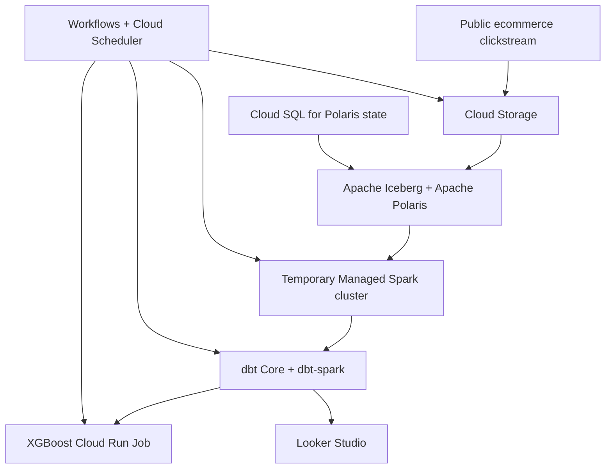

# Project 2 Architecture

Project 2 migrates the local lakehouse from Project 1 to Google Cloud while preserving an open data stack. Google Cloud provides managed infrastructure, but Apache Iceberg, Apache Polaris, Apache Spark, and dbt remain responsible for the core lakehouse and transformation workflow.

## Component Mapping

| Layer | Project 1 | Project 2 |
| --- | --- | --- |
| Orchestration | Apache Airflow | Workflows + Cloud Scheduler |
| Object Storage | RustFS | Cloud Storage |
| Table Format | Apache Iceberg | Apache Iceberg |
| Catalog | Apache Polaris | Apache Polaris on Cloud Run |
| Catalog State | Polaris container | Cloud SQL for PostgreSQL |
| Transformation | dbt Core | dbt Core with `dbt-spark` |
| Query Engine | DuckDB | Temporary Managed Spark cluster |
| Machine Learning | XGBoost in Docker | XGBoost in a Cloud Run Job |
| Visualization | Apache Superset | Looker Studio |

## Architecture Diagram

## Data Flow

1. A Cloud Run ingestion job streams the source file and writes a deterministic 10,000-row sample to Cloud Storage.
2. Spark converts the source data into Iceberg tables stored in Cloud Storage and registered through Polaris.
3. dbt Core executes against Spark and builds staging, sessionization, feature, and reporting models.
4. An XGBoost Cloud Run Job trains and evaluates the conversion model from the session-level feature data.
5. Model metrics and reporting outputs are exposed to Looker Studio.
6. Workflows coordinates the stages, while Cloud Scheduler provides optional scheduled execution.

## Storage Boundaries

- **Cloud Storage** owns source files, Iceberg data and metadata files, model artifacts, and exported metrics.
- **Cloud SQL for PostgreSQL** stores Polaris application and catalog state. It does not store the ecommerce dataset.
- **Polaris** owns catalog definitions, namespaces, access-control metadata, and pointers to current Iceberg metadata.
- **Spark and dbt** process data but do not own the underlying tables.

## Deployment Boundaries

- Terraform provisions project services, IAM, storage, database, compute, and orchestration resources.
- Python application code is packaged into Docker images, pushed to Artifact Registry, and referenced by Cloud Run resources managed through Terraform.
- Cloud Run Jobs host finite ingestion and machine-learning workloads. The dbt runtime is selected during M3 platform integration.
- A Cloud Run Service hosts the Polaris REST API and can scale to zero when idle.
- The Spark cluster exists only while lakehouse processing and dbt execution require it.
- Dockerized Google Cloud CLI and Terraform keep local installation requirements limited to Docker.

## Cost and Teardown

Cloud SQL is the primary persistent cost while the environment exists. Cloud Run, Workflows, and temporary Spark resources are usage-based, although Spark is expected to be the largest per-run cost. The project uses a USD 25 monthly budget with alerts at 50%, 80%, and 100%.

Workflows must delete temporary Spark resources after success or failure. Terraform owns persistent demonstration infrastructure and provides the final teardown path. Resource sizing and a per-run estimate will be refined during M2 before the complete platform is provisioned.

## Decisions and Risks

- [ADR-0001: Select Google Cloud as the Cloud Provider](adr/0001-cloud-provider.md)
- [ADR-0002: Evaluate Project 1 to GCP Service Mappings](adr/0002-service-mapping.md)
- [ADR-0003: Select the Project 2 Cloud Architecture](adr/0003-cloud-architecture.md)

The dbt, Spark, Polaris, and Cloud SQL integrations remain implementation risks to validate in M2-M5. If testing invalidates an assumption, ADR-0003 will be amended rather than extending architecture planning indefinitely.
