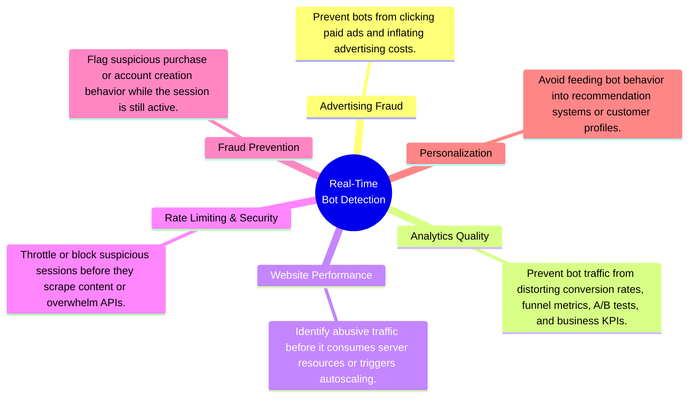
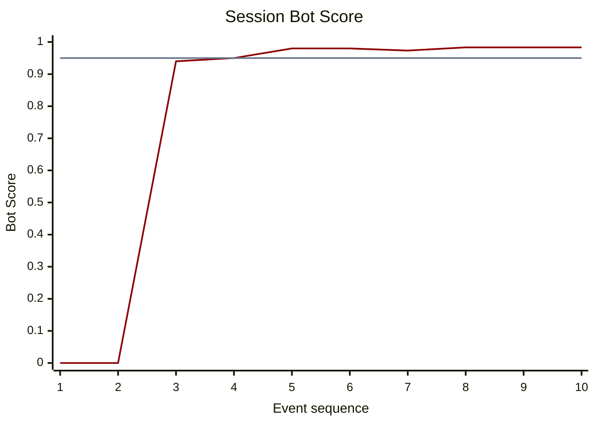
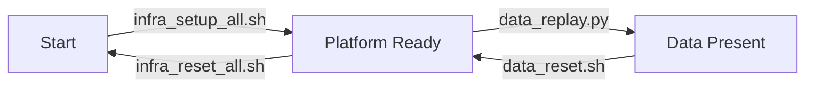
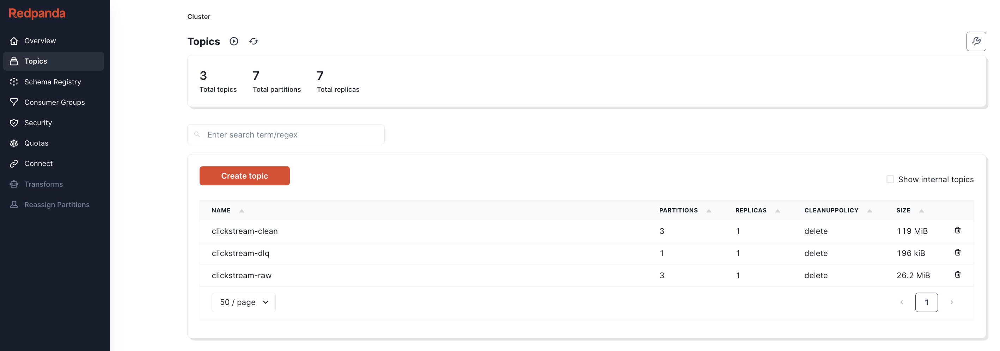
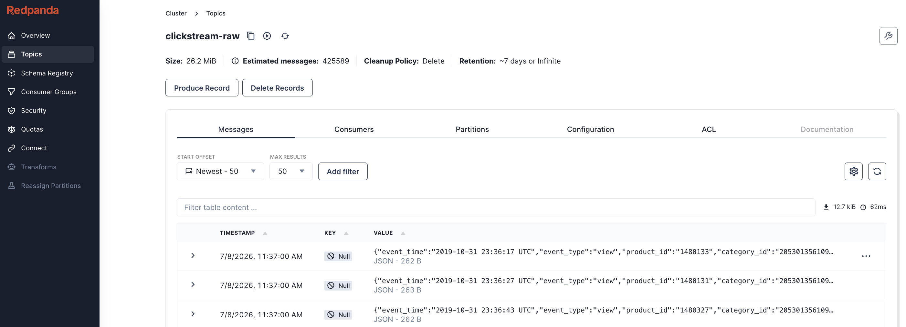
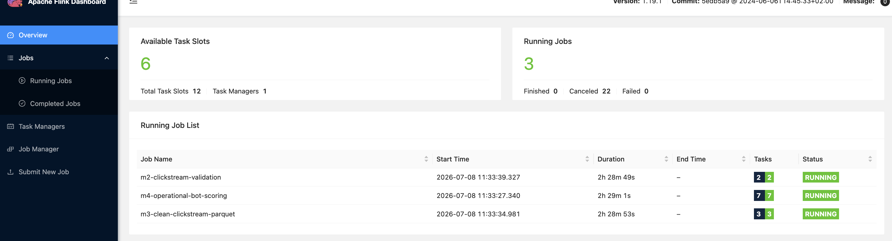

# Project 3: Streaming Lakehouse

An end-to-end streaming data platform that transforms e-commerce clickstream events into real-time bot detection metrics, continuously updated analytical datasets, and live operational dashboards using open-source streaming technologies.

---

| Section | Contents |
| ------- | -------- |
| **[1. What This Project Does](#1-what-this-project-does)** | 1.1 Problem Statement<br>1.2 Inputs and Outputs<br>1.3 End-to-End Workflow |
| **[2. Follow One Session](#2-follow-one-session)** | 2.1 Inspect the Original Clickstream<br>2.2 Watch the Bot Score Evolve<br>2.3 View the Final Session State<br>2.4 Explain the Final Score |
| **[3. Streaming Capabilities](#3-streaming-capabilities)** | 3.1 Data Flow<br>3.2 Stream Processing<br>3.3 Outputs<br>3.4 Reliability<br>3.5 Operations<br>3.6 Extensibility |
| **[4. Deployment](#4-deployment)** | 4.1 Prerequisites<br>4.2 Repository Structure<br>4.3 Deployment State Model<br>4.4 Setup<br>4.5 Platform Services<br>4.6 Reset and Teardown |
| **[5. Results](#5-results)** | 5.1 Kafka Topic Activity<br>5.2 Flink Job Execution<br>5.3 Live Bot Detection Dashboard<br>5.4 Operational Session Scores |

# 1. What This Project Does
## 1.1 Problem Statement

The portfolio follows a three-stage progression:

1. **Project 1 — Build:** A modern local lakehouse capable of processing 42 million e-commerce clickstream events on commodity hardware using open-source technologies.
2. **Project 2 — Migrate:** The same architecture to the cloud while preserving openness, portability, and reproducibility.
3. **Project 3 — Extend:** The same clickstream dataset into a real-time streaming platform, evolving from historical analytics to operational analytics.

Unlike historical analytics, operational analytics enables organizations to act while events are still occurring rather than after they have already been collected and analyzed. Real-time bot detection serves as the demonstration application throughout this project. The value of real-time bot detection lies not in identifying bots itself, but in enabling immediate action across multiple business domains:



The project explores three questions:

1. How should historical batch analytics be adapted to stateful stream processing?
2. How can streaming systems be designed for reliability through replay, checkpointing, and fault tolerance?
3. How can analytical and operational workloads be supported from a single streaming pipeline?

## 1.2 Inputs and Outputs

### Inputs

The platform replays the October 2019 e-commerce clickstream dataset as a real-time event stream.

| Input | Purpose |
| ------ | ------- |
| October 2019 Clickstream Dataset | Simulate a production event stream for real-time processing |

### Outputs

The platform continuously produces the following artifacts:

| Output | Purpose |
| ------ | ------- |
| Clean Event Stream | Validated events for downstream consumers |
| Analytical Dataset | Persist historical event data for offline analytics |
| Operational Dashboard | Visualize live bot metrics and streaming health |

## 1.3 End-to-End Workflow
At a high level, the streaming platform supports two complementary workloads: historical analytics and real-time operational analytics.

The following workflow expands this view to show how replayed clickstream events flow through Kafka topics and Flink jobs to produce each output.

`*` Iceberg integration demonstrated in Projects 1 & 2.

# 2. Follow One Session

To illustrate how the streaming platform operates, this section follows a single clickstream session from its original events through to its final bot classification.

The session used throughout is:

```text
d1f516da-7272-461a-bf97-05f9d06a8187
```

---

## 2.1 Inspect the Original Clickstream

The original clickstream events can be queried directly from the source dataset.

```bash
docker compose -f infra/compose/duckdb.yml run --rm duckdb
```

```sql
SELECT
    event_time,
    event_type,
    brand,
    datediff(
        'millisecond',
        LAG(event_time) OVER (
            PARTITION BY user_session
            ORDER BY event_time
        ),
        event_time
    ) AS interval_ms
FROM read_csv_auto('/work/datasets/source/2019-Oct.csv.gz')
WHERE user_session = 'd1f516da-7272-461a-bf97-05f9d06a8187';
```

```text
┌─────────────────────┬────────────┬─────────┬─────────────┐
│     event_time      │ event_type │  brand  │ interval_ms │
│      timestamp      │  varchar   │ varchar │    int64    │
├─────────────────────┼────────────┼─────────┼─────────────┤
│ 2019-10-18 20:14:09 │ view       │ oppo    │        NULL │
│ 2019-10-18 20:14:16 │ view       │ oppo    │        7000 │
│ 2019-10-18 20:14:23 │ view       │ oppo    │        7000 │
│ 2019-10-18 20:14:29 │ view       │ oppo    │        6000 │
│ 2019-10-18 20:14:32 │ view       │ oppo    │        3000 │
│ 2019-10-18 20:14:36 │ view       │ oppo    │        4000 │
│ 2019-10-18 20:14:47 │ view       │ oppo    │       11000 │
│ 2019-10-18 20:14:49 │ view       │ oppo    │        2000 │
│ 2019-10-18 20:14:54 │ view       │ oppo    │        5000 │
│ 2019-10-18 20:14:58 │ view       │ oppo    │        4000 │
└─────────────────────┴────────────┴─────────┴─────────────┘
```

As these events are replayed into Kafka, the operational pipeline maintains state for this session. After every new event, the session statistics are updated and a new bot score is calculated.

---

## 2.2 Watch the Bot Score Evolve

The bot score changes continuously as additional click intervals become available.



After only four events the session exceeds the operational bot threshold (0.95). From this point onward the session could be flagged in real time while it is still active, allowing downstream systems to react immediately rather than waiting for historical batch processing.

After ~90 minutes of inactivity (corresponding to the 99th percentile of historical maximum session click intervals), the session is closed and its final statistics are written to PostgreSQL.

---

## 2.3 View the Final Session State

```bash
docker compose -f infra/compose/postgres.yml exec postgres \
  psql -U clickstream -d clickstream
```

```sql
\x

SELECT *
FROM session_bot_scores
WHERE user_session = 'd1f516da-7272-461a-bf97-05f9d06a8187';
```

```text
-[ RECORD 1 ]----------+-------------------------------------
user_session           | d1f516da-7272-461a-bf97-05f9d06a8187
last_event_time        | 2019-10-18 20:14:58
closed_at              | 2019-10-18 21:41:58
updated_at             | 2026-07-08 16:36:54.648
session_status         | closed
event_count            | 10
interval_count         | 9
mean_click_interval_ms | 5444
min_click_interval_ms  | 2000
sd_click_interval_ms   | 2698
bot_score              | 0.9833
is_bot                 | t
```

The operational pipeline stores only the running statistics required for scoring rather than every individual click event. This allows each session to be updated efficiently as new events arrive while keeping the amount of maintained state small.

---

## 2.4 Explain the Final Score

The bot score is computed from three behavioral features:

- Mean click interval
- Minimum click interval
- Standard deviation of click intervals

Each feature is converted into its percentile rank relative to all historical sessions before being combined into a single score.

```text
bot_score
      = 1 - mean(
            percentile_rank(mean_click_interval_ms),
            percentile_rank(min_click_interval_ms),
            percentile_rank(sd_click_interval_ms)
        )

      = 1 - mean(0%, 3%, 2%)

      = 98%
```

This session exhibits consistently short click intervals with very little variation, placing it among the most uniform sessions in the dataset. As a result, its final bot score is **98%**, exceeding the operational threshold of **95%** and causing the session to be classified as a bot.

# 3. Streaming Capabilities

The workflow in Section 1 describes how data moves through the platform. This section highlights the core streaming capabilities demonstrated by the implementation.

## 3.1 Data Flow

The platform ingests an unbounded stream of clickstream events through Kafka. Historical data is replayed to simulate a production event stream, validated, and published to a clean topic for downstream consumers. Independent analytical and operational pipelines consume the same validated stream without interfering with one another.

**Capabilities**

- Continuous event stream: historical clickstream rows are replayed as live events so the pipeline behaves like an always-on production feed rather than a one-time batch load.
- Kafka topics: raw, clean, and DLQ topics separate ingestion, validation, and error handling concerns while preserving a durable event log for downstream consumers.
- Multiple producers and consumers: event replay, validation, Parquet storage, bot scoring, and dashboarding operate as independent components connected through Kafka.

---

## 3.2 Stream Processing

Unlike batch processing, the operational pipeline maintains state while sessions are still active. Running statistics are updated after every event, allowing the bot score to evolve continuously until the session expires.

**Capabilities**

- Stateful processing: the bot scorer keeps running per-session statistics instead of recalculating from the full click history after each event.
- Session windows: inactivity-based session closure mirrors the user-session logic from the historical dataset and lets the stream decide when a session is complete.
- Real-time scoring: bot scores are recalculated as events arrive, so suspicious sessions can be flagged before the session has fully ended.

---

## 3.3 Outputs

The same validated event stream supports both analytical and operational workloads. Historical events are persisted for offline analysis, while live bot scores are continuously exposed for operational monitoring.

**Capabilities**

- Historical data storage: validated events are written to Parquet so the same stream can support offline analytics, replay, and future model development.
- Live dashboards: operational bot metrics are written to PostgreSQL and visualized while the pipeline is running.
- Shared event stream: analytical and operational workloads consume the clean Kafka topic independently, avoiding duplicate ingestion logic.

---

## 3.4 Reliability

Schema validation separates malformed events into a Dead Letter Queue before downstream processing. Replay and Flink checkpointing allow deterministic testing and recovery following failures.

**Capabilities**

- Schema validation: malformed or incomplete clickstream records are rejected before they can corrupt analytical datasets or bot-scoring state.
- Dead Letter Queue: invalid events are preserved in a separate Kafka topic so failures can be inspected without blocking valid traffic.
- Replay: the replay engine can rerun the same source data at configurable speeds, making behavior reproducible during development and testing.
- Checkpointing: Flink checkpoints preserve processing progress and session state so jobs can recover after failure without starting from scratch.

---

## 3.5 Operations

Operational dashboards expose the health of the streaming platform in real time. Configurable replay speeds allow the system to be exercised under production-like event rates while monitoring throughput and latency.

**Capabilities**

- Live monitoring: dashboards expose bot metrics and pipeline behavior while events are flowing through the system.
- Replay at configurable speed: the replay engine can accelerate historical traffic to stress the pipeline and observe how it behaves under higher event rates.
- Operational observability: throughput, latency, and health signals make the streaming system inspectable rather than a black-box data mover.

---

## 3.6 Extensibility

The platform has been designed so additional producers, consumers, and event schemas can be introduced without changing the overall architecture.

Future enhancements include Avro-based schema evolution, a Schema Registry, and additional operational consumers.

**Capabilities**

- Schema evolution: future Avro schemas would allow clickstream events to change over time without breaking existing consumers.
- Schema Registry: a registry would enforce compatibility rules between producers and consumers as the event contract evolves.
- Pluggable consumers: new operational or analytical consumers can subscribe to the clean topic without changing the producer or validation layers.

# 4. Deployment

## 4.1 Prerequisites

The platform requires:

* Docker Desktop
* Python 3
* Project dependencies installed from `requirements.txt`
* The October 2019 clickstream source file under `datasets/source/`

The project runs locally through Docker Compose. Kafka-compatible streaming is provided by Redpanda, stream processing by Flink, operational storage by PostgreSQL, and dashboarding by Grafana.

## 4.2 Repository Structure

```text
project-3-streaming-bot-detection/
├── datasets/
│   ├── analytics/               # Generated Parquet output
│   ├── flink-checkpoints/       # Flink checkpoint state
│   ├── reference/               # Generated normalization and bot-scoring config
│   └── source/                  # Source clickstream CSV data
├── docs/
│   ├── scoring_design.md       # Why operational scoring uses Flink DataStream instead of SQL
│   └── planning.md              # Planning notes and design exploration
├── infra/
│   ├── compose/                 # Docker Compose service definitions
│   ├── flink/                   # Flink connector jars and generated job artifacts
│   ├── grafana/                 # Dashboard provisioning assets
│   └── scripts/                 # Setup, reset, and state inspection scripts
└── streaming/
    ├── flink_job_analytics.sql  # Clean Kafka to Parquet job
    ├── flink_job_validation.sql # Raw Kafka to clean Kafka and DLQ job
    ├── java/                    # Operational Flink bot-scoring job
    ├── normalization.sql        # Historical reference query for bot scoring
    ├── postgres_schema.sql      # Operational database schema
    └── data_replay.py           # Historical clickstream replay engine
```

Planning documentation is captured in `docs/`. The deployment workflow below treats the project as a small state machine so setup, replay, reset, and teardown remain explicit.

## 4.3 Deployment State Model

The deployment workflow has three states:



`Start` means no local streaming platform is running. `Platform Ready` means the containers, Kafka topics, Flink jobs, PostgreSQL tables, and dashboard services are available. `Data Present` means replayed clickstream events have flowed through Kafka and produced analytical or operational outputs.

## 4.4 Setup

### Change to the Project Directory

```bash
cd data-engineering-portfolio/project-3-streaming-bot-detection
```

### Check the Current State

```bash
./infra/scripts/state_show.sh
```

The state script reports the current deployment state and the next valid action. From a clean start, it directs the user to set up the complete platform.

### Deploy the Platform

```bash
./infra/scripts/infra_setup_all.sh
```

The setup script performs the complete local deployment workflow:

1. Starts Redpanda, Redpanda Console, Flink, PostgreSQL, and Grafana.
2. Creates the raw, clean, and dead-letter Kafka topics.
3. Submits the validation and analytical Flink jobs.
4. Prepares the operational bot-scoring artifacts and PostgreSQL schema.
5. Starts the operational scoring job and Grafana dashboard services.

### Replay Clickstream Data

```bash
python3 streaming/data_replay.py \
    --sink kafka \
    --speed 100000x \
    --quiet \
    --progress-every 5000000
```

The replay engine turns historical clickstream rows into a live Kafka event stream. After replay begins, the platform moves from `Platform Ready` to `Data Present`.

### Replay Parameters

The replay engine is configurable so the same source dataset can be used for quick local checks, fault-tolerance tests, and full historical replays.

| Parameter | Purpose | Example |
| --------- | ------- | ------- |
| `--sink` | Choose whether events are printed locally or published to Kafka. | `--sink kafka` |
| `--speed` | Scale event time relative to wall-clock time. Higher values stress the streaming jobs faster. | `--speed 100x` |
| `--start-row` | Begin replay from a specific zero-based source row. | `--start-row 100000` |
| `--rows` | Limit the number of source rows replayed for a bounded test run. | `--rows 1000000` |
| `--full` | Replay the full source dataset. This is also the default when `--rows` is omitted. | `--full` |
| `--delay-probability` | Simulate out-of-order arrival by delaying a fraction of events. | `--delay-probability 0.02` |
| `--mean-delay-seconds` | Set the average artificial event-time delay for delayed events. | `--mean-delay-seconds 5` |
| `--corrupt-probability` | Inject malformed records to exercise validation and DLQ handling. | `--corrupt-probability 0.02` |
| `--random-seed` | Make delay and corruption simulation reproducible across runs. | `--random-seed 1` |
| `--quiet` | Suppress per-event logs during larger runs. | `--quiet` |
| `--progress-every` | Print compact progress updates every N dispatched events when quiet mode is enabled. | `--progress-every 100000` |

Source and Kafka connection parameters are also configurable through `--dataset-path`, `--source-url`, `--kafka-topic`, `--kafka-brokers`, and `--compose-file`, but the defaults are designed for the local Docker Compose deployment.

## 4.5 Platform Services

After a successful deployment, the following services are available:

| Service | Purpose | URL | Credentials |
| ------- | ------- | --- | ----------- |
| Redpanda Console | Inspect Kafka topics, messages, and consumer activity | `http://localhost:8080` | None |
| Flink Web UI | Inspect running stream-processing jobs and checkpoint behavior | `http://localhost:8081` | None |
| Grafana | View live bot detection metrics and streaming health | `http://localhost:3000` | `admin` / `admin` |

The live dashboard is provisioned as `Streaming Bot Detection Live`.

## 4.6 Reset and Teardown

### Reset Replay Data

```bash
./infra/scripts/data_reset.sh
```

The data reset keeps the platform running but clears replay outputs: Kafka topic contents, generated Parquet data, PostgreSQL metric rows, and Flink checkpoints. This returns the project from `Data Present` to `Platform Ready` so another replay can be run against a clean state.

### Destroy the Platform

```bash
./infra/scripts/infra_reset_all.sh
```

The teardown script stops the Docker Compose platform, removes service volumes, clears generated analytics output, removes generated Flink artifacts, and returns the project to `Start`. Source data, code, Compose files, connector jars, and Grafana provisioning files are preserved.

# 5. Results

## 5.1 Kafka Topic Activity



Redpanda Console shows the raw, clean, and dead-letter Kafka topics used by the streaming platform. This view confirms that replayed clickstream events are moving through the ingestion and validation layers.



The raw topic view shows replayed clickstream events arriving as JSON messages before validation. This provides a direct check that historical rows are being converted into an inspectable event stream.

## 5.2 Flink Job Execution



The Flink Web UI shows the running validation, analytical Parquet writer, and operational bot-scoring jobs. This view confirms that the platform is processing the clean stream continuously and maintaining checkpointed state.

## 5.3 Live Bot Detection Dashboard


The Grafana dashboard visualizes live bot detection metrics from PostgreSQL, including active session scores, stream-level bot rates, and operational health signals.

## 5.4 Operational Session Scores


The operational scoring table stores continuously updated session-level bot scores. This output connects the live streaming pipeline back to the session walkthrough in Section 2.
