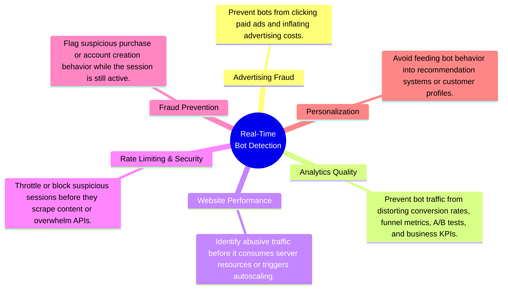
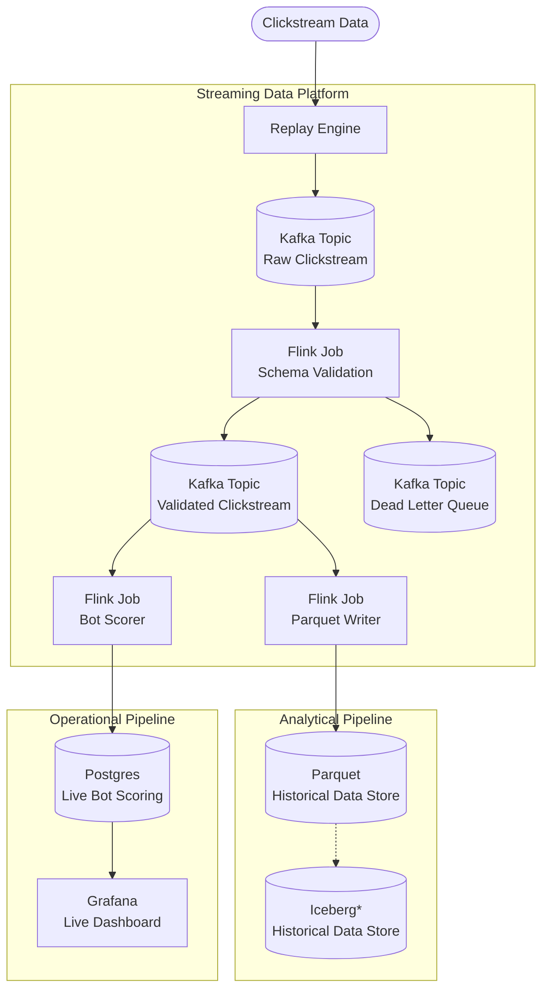
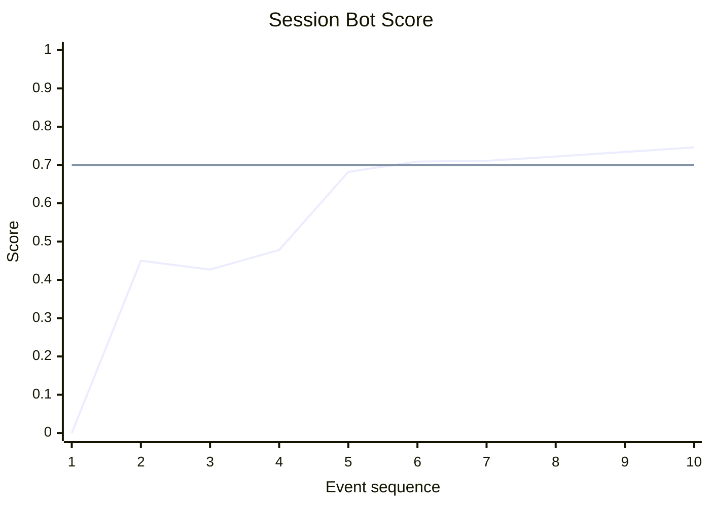

# Project 3: Streaming Lakehouse

An end-to-end streaming data platform that transforms e-commerce clickstream events into real-time bot detection metrics, continuously updated analytical datasets, and live operational dashboards using open-source streaming technologies.

---

| Section | Contents |
| ------- | -------- |
| **[1. What This Project Does](#1-what-this-project-does)** | 1.1 Problem Statement<br>1.2 Inputs and Outputs<br>1.3 End-to-End Workflow |
| **[2. Follow One Session](#2-follow-one-deployment)** | 2.1 Infrastructure Provisioning<br>2.2 Platform Initialization<br>2.3 Pipeline Execution<br>2.4 Dashboard Publication |

# 1. What This Project Does
## 1.1 Problem Statement

The portfolio follows a three-stage progression:

1. **Project 1 — Build:** A modern local lakehouse capable of processing 42 million e-commerce clickstream events on commodity hardware using open-source technologies.
2. **Project 2 — Migrate:** The same architecture to the cloud while preserving openness, portability, and reproducibility.
3. **Project 3 — Extend:** The same clickstream dataset into a real-time streaming platform, evolving from historical analytics to operational analytics.

Unlike historical analytics, operational analytics enables organizations to act while events are still occurring rather than after they have already been collected and analyzed. Real-time bot detection serves as the demonstration application throughout this project. The value of real-time bot detection lies not in identifying bots itself, but in enabling immediate action across multiple business domains:



The project explores three questions:

1. How should historical batch analytics be adapted to stateful stream processing?
2. How can streaming systems be designed for reliability through replay, checkpointing, and fault tolerance?
3. How can analytical and operational workloads be supported from a single streaming pipeline?

## 1.2 Inputs and Outputs

### Inputs

The platform replays the October 2019 e-commerce clickstream dataset as a real-time event stream.

| Input | Purpose |
| ------ | ------- |
| October 2019 Clickstream Dataset | Simulate a production event stream for real-time processing |

### Outputs

The platform continuously produces the following artifacts:

| Output | Purpose |
| ------ | ------- |
| Clean Event Stream | Validated events for downstream consumers |
| Analytical Dataset | Persist historical event data for offline analytics |
| Operational Dashboard | Visualize live bot metrics and streaming health |

## 1.3 End-to-End Workflow
At a high level, the streaming platform supports two complementary workloads: historical analytics and real-time operational analytics.

The following workflow expands this view to show how replayed clickstream events flow through Kafka topics and Flink jobs to produce each output.

`*` Iceberg integration demonstrated in Projects 1 & 2.

# 2. Follow One Session
## 2.1 Find a candidate bot session
```bash
docker compose -f infra/compose/postgres.yml exec postgres \
  psql -U clickstream -d clickstream
```  
```sql
\x
SELECT
    *
FROM session_bot_scores
WHERE 1=1
      AND is_bot IS TRUE 
      AND bot_score BETWEEN 0.75 AND 0.76 
      AND event_count = 10
ORDER BY event_count DESC
LIMIT 1;
```
```text
-[ RECORD 1 ]----------+-------------------------------------
user_session           | 244448ee-2162-4f2f-af77-fc9210bbd6e4
last_event_time        | 2019-10-17 15:10:05
closed_at              | 2019-10-17 16:37:05
updated_at             | 2026-07-08 02:13:03.443
session_status         | closed
event_count            | 10
interval_count         | 9
mean_click_interval_ms | 31556
min_click_interval_ms  | 7000
sd_click_interval_ms   | 23287
bot_score              | 0.75
is_bot                 | t
```
```text
bot_score 
      = 1 - mean(
                  percentile_rank(mean_interval_ms),
                  percentile_rank(min_click_interval_ms),
                  percentile_rank(sd_click_interval_ms)
            )
      
      = 1 - mean(26%, 15%, 33%)

      = 75%
```
## 2.2 Inspect session
 ```bash
docker compose -f infra/compose/duckdb.yml run --rm duckdb
```
```sql
    SELECT
        event_time,
        event_type,
        brand,
        datediff(
            'millisecond',
            LAG(event_time) OVER (
                PARTITION BY user_session
                ORDER BY event_time
            ),
            event_time
        ) AS interval_ms
    FROM read_csv_auto('/work/data/source/2019-Oct.csv.gz')
    WHERE user_session = '244448ee-2162-4f2f-af77-fc9210bbd6e4';
```
```text
┌─────────────────────┬────────────┬─────────┬─────────────┐
│     event_time      │ event_type │  brand  │ interval_ms │
│      timestamp      │  varchar   │ varchar │    int64    │
├─────────────────────┼────────────┼─────────┼─────────────┤
│ 2019-10-17 15:05:21 │ view       │ sony    │        NULL │
│ 2019-10-17 15:05:59 │ view       │ sony    │       38000 │
│ 2019-10-17 15:07:17 │ view       │ apple   │       78000 │
│ 2019-10-17 15:07:53 │ view       │ nillkin │       36000 │
│ 2019-10-17 15:08:00 │ view       │ nillkin │        7000 │
│ 2019-10-17 15:08:23 │ view       │ nillkin │       23000 │
│ 2019-10-17 15:09:12 │ view       │ apple   │       49000 │
│ 2019-10-17 15:09:49 │ view       │ samsung │       37000 │
│ 2019-10-17 15:09:57 │ view       │ nillkin │        8000 │
│ 2019-10-17 15:10:05 │ view       │ samsung │        8000 │
```
