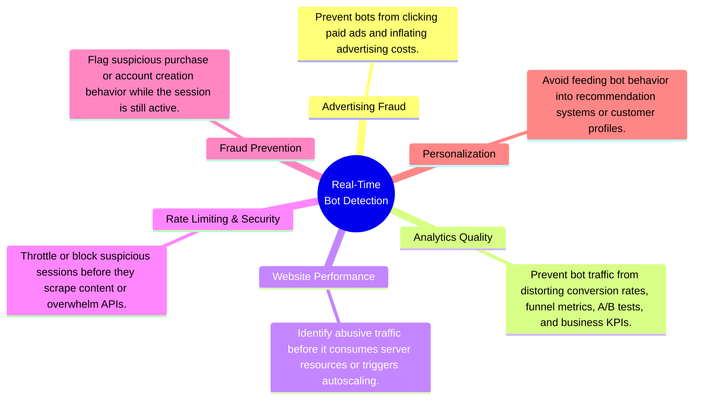
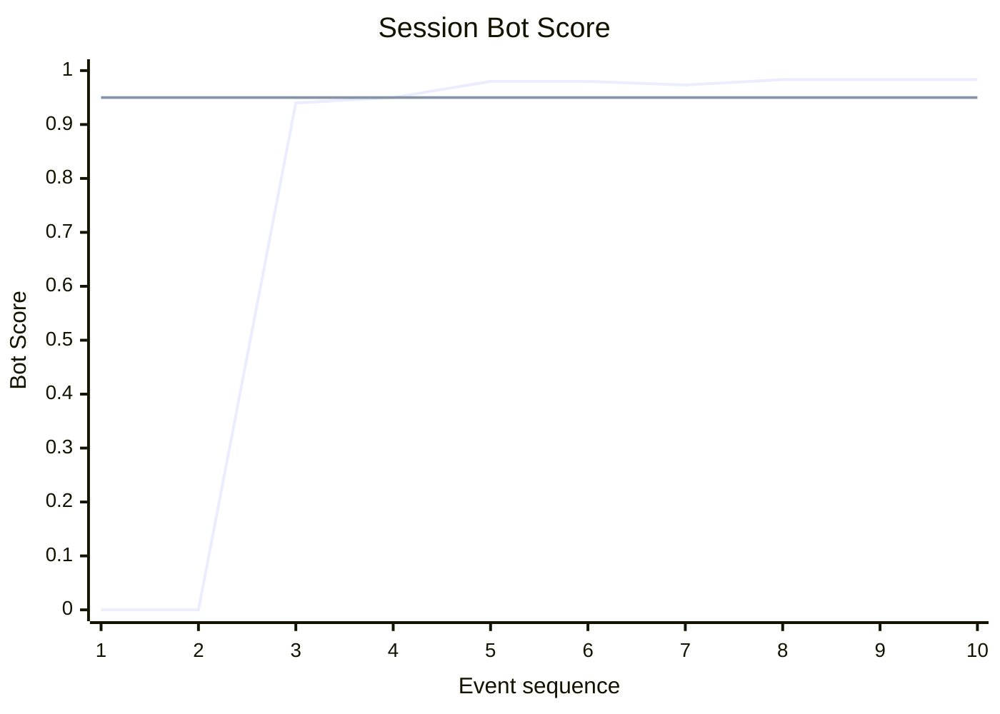

# Project 3: Streaming Lakehouse

An end-to-end streaming data platform that transforms e-commerce clickstream events into real-time bot detection metrics, continuously updated analytical datasets, and live operational dashboards using open-source streaming technologies.

---

| Section | Contents |
| ------- | -------- |
| **[1. What This Project Does](#1-what-this-project-does)** | 1.1 Problem Statement<br>1.2 Inputs and Outputs<br>1.3 End-to-End Workflow |
| **[2. Follow One Session](#2-follow-one-session)** | 2.1 Inspect the Original Clickstream<br>2.2 Watch the Bot Score Evolve<br>2.3 View the Final Session State<br>2.4 Explain the Final Score |

# 1. What This Project Does
## 1.1 Problem Statement

The portfolio follows a three-stage progression:

1. **Project 1 — Build:** A modern local lakehouse capable of processing 42 million e-commerce clickstream events on commodity hardware using open-source technologies.
2. **Project 2 — Migrate:** The same architecture to the cloud while preserving openness, portability, and reproducibility.
3. **Project 3 — Extend:** The same clickstream dataset into a real-time streaming platform, evolving from historical analytics to operational analytics.

Unlike historical analytics, operational analytics enables organizations to act while events are still occurring rather than after they have already been collected and analyzed. Real-time bot detection serves as the demonstration application throughout this project. The value of real-time bot detection lies not in identifying bots itself, but in enabling immediate action across multiple business domains:



The project explores three questions:

1. How should historical batch analytics be adapted to stateful stream processing?
2. How can streaming systems be designed for reliability through replay, checkpointing, and fault tolerance?
3. How can analytical and operational workloads be supported from a single streaming pipeline?

## 1.2 Inputs and Outputs

### Inputs

The platform replays the October 2019 e-commerce clickstream dataset as a real-time event stream.

| Input | Purpose |
| ------ | ------- |
| October 2019 Clickstream Dataset | Simulate a production event stream for real-time processing |

### Outputs

The platform continuously produces the following artifacts:

| Output | Purpose |
| ------ | ------- |
| Clean Event Stream | Validated events for downstream consumers |
| Analytical Dataset | Persist historical event data for offline analytics |
| Operational Dashboard | Visualize live bot metrics and streaming health |

## 1.3 End-to-End Workflow
At a high level, the streaming platform supports two complementary workloads: historical analytics and real-time operational analytics.

The following workflow expands this view to show how replayed clickstream events flow through Kafka topics and Flink jobs to produce each output.

`*` Iceberg integration demonstrated in Projects 1 & 2.

# 2. Follow One Session

To illustrate how the streaming platform operates, this section follows a single clickstream session from its original events through to its final bot classification.

The session used throughout is:

```text
d1f516da-7272-461a-bf97-05f9d06a8187
```

---

## 2.1 Inspect the Original Clickstream

The original clickstream events can be queried directly from the source dataset.

```bash
docker compose -f infra/compose/duckdb.yml run --rm duckdb
```

```sql
SELECT
    event_time,
    event_type,
    brand,
    datediff(
        'millisecond',
        LAG(event_time) OVER (
            PARTITION BY user_session
            ORDER BY event_time
        ),
        event_time
    ) AS interval_ms
FROM read_csv_auto('/work/data/source/2019-Oct.csv.gz')
WHERE user_session = 'd1f516da-7272-461a-bf97-05f9d06a8187';
```

```text
┌─────────────────────┬────────────┬─────────┬─────────────┐
│     event_time      │ event_type │  brand  │ interval_ms │
│      timestamp      │  varchar   │ varchar │    int64    │
├─────────────────────┼────────────┼─────────┼─────────────┤
│ 2019-10-18 20:14:09 │ view       │ oppo    │        NULL │
│ 2019-10-18 20:14:16 │ view       │ oppo    │        7000 │
│ 2019-10-18 20:14:23 │ view       │ oppo    │        7000 │
│ 2019-10-18 20:14:29 │ view       │ oppo    │        6000 │
│ 2019-10-18 20:14:32 │ view       │ oppo    │        3000 │
│ 2019-10-18 20:14:36 │ view       │ oppo    │        4000 │
│ 2019-10-18 20:14:47 │ view       │ oppo    │       11000 │
│ 2019-10-18 20:14:49 │ view       │ oppo    │        2000 │
│ 2019-10-18 20:14:54 │ view       │ oppo    │        5000 │
│ 2019-10-18 20:14:58 │ view       │ oppo    │        4000 │
└─────────────────────┴────────────┴─────────┴─────────────┘
```

As these events are replayed into Kafka, the operational pipeline maintains state for this session. After every new event, the session statistics are updated and a new bot score is calculated.

---

## 2.2 Watch the Bot Score Evolve

The bot score changes continuously as additional click intervals become available.



After only four events the session exceeds the operational bot threshold (0.95). From this point onward the session could be flagged in real time while it is still active, allowing downstream systems to react immediately rather than waiting for historical batch processing.

After ~90 minutes of inactivity (corresponding to the 99th percentile of historical maximum session click intervals), the session is closed and its final statistics are written to PostgreSQL.

---

## 2.3 View the Final Session State

```bash
docker compose -f infra/compose/postgres.yml exec postgres \
  psql -U clickstream -d clickstream
```

```sql
\x

SELECT *
FROM session_bot_scores
WHERE user_session = 'd1f516da-7272-461a-bf97-05f9d06a8187';
```

```text
-[ RECORD 1 ]----------+-------------------------------------
user_session           | d1f516da-7272-461a-bf97-05f9d06a8187
last_event_time        | 2019-10-18 20:14:58
closed_at              | 2019-10-18 21:41:58
updated_at             | 2026-07-08 16:36:54.648
session_status         | closed
event_count            | 10
interval_count         | 9
mean_click_interval_ms | 5444
min_click_interval_ms  | 2000
sd_click_interval_ms   | 2698
bot_score              | 0.9833
is_bot                 | t
```

The operational pipeline stores only the running statistics required for scoring rather than every individual click event. This allows each session to be updated efficiently as new events arrive while keeping the amount of maintained state small.

---

## 2.4 Explain the Final Score

The bot score is computed from three behavioral features:

- Mean click interval
- Minimum click interval
- Standard deviation of click intervals

Each feature is converted into its percentile rank relative to all historical sessions before being combined into a single score.

```text
bot_score
      = 1 - mean(
            percentile_rank(mean_click_interval_ms),
            percentile_rank(min_click_interval_ms),
            percentile_rank(sd_click_interval_ms)
        )

      = 1 - mean(0%, 3%, 2%)

      = 98%
```

This session exhibits consistently short click intervals with very little variation, placing it among the most uniform sessions in the dataset. As a result, its final bot score is **98%**, exceeding the operational threshold of **95%** and causing the session to be classified as a bot.
python3 streaming/replay_data.py --dataset-path data/source/2019-Oct-sessions-1pct.csv.gz --sink kafka --speed 100000x --quiet --progress-every 5000000
