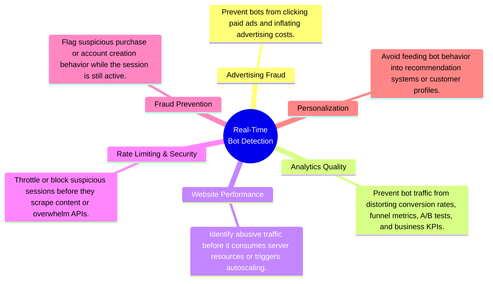

# Project 3: Streaming Lakehouse

An end-to-end streaming data platform that transforms e-commerce clickstream events into real-time bot detection metrics, continuously updated analytical datasets, and live operational dashboards using open-source streaming technologies.

---

| Section | Contents |
| ------- | -------- |
| **[1. What This Project Does](#1-what-this-project-does)** | 1.1 Problem Statement 1.2 Inputs and Outputs 1.3 End-to-End Workflow |
| **[2. Follow One Deployment](#2-follow-one-deployment)** | 2.1 Infrastructure Provisioning 2.2 Platform Initialization 2.3 Pipeline Execution 2.4 Dashboard Publication |

## 1.1 Problem Statement

The first two projects focused on historical analytics:

1. ***Project 1*** demonstrated how 42 million e-commerce clickstream events could be transformed into machine-learning-ready features using a modern local lakehouse.
2. ***Project 2*** migrated the same architecture to the cloud using Infrastructure as Code while preserving openness, portability, and reproducibility.

This project asks a different question:

> **How can the same clickstream be processed as a real-time streaming pipeline to detect bots while user sessions are still active, rather than after the damage has already been done?**

Unlike historical analytics, real-time bot detection must identify suspicious behavior as events arrive. Detecting bots after a session has ended may explain what happened, but it cannot prevent fraudulent traffic from skewing analytics, consuming resources, or interacting with the application in real time.

The project explores three questions:

1. How should historical batch analytics be adapted to stateful stream processing?
2. How can streaming systems be designed for reliability through replay, checkpointing, and fault tolerance?
3. How can analytical and operational workloads be supported from a single streaming pipeline?
