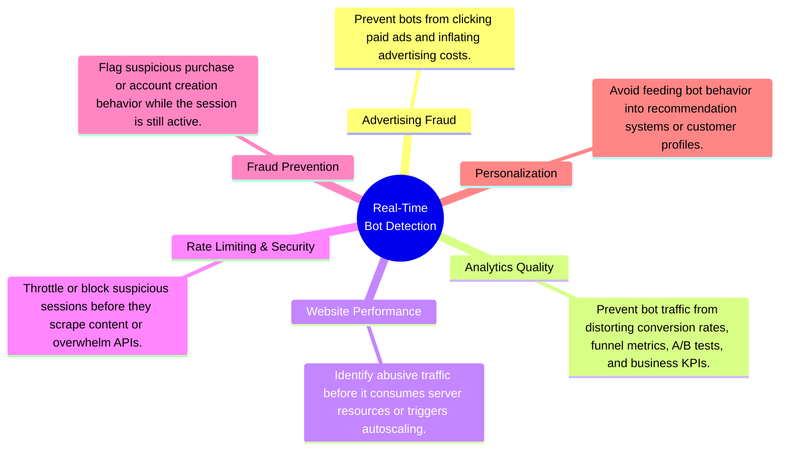

# Project 3: Streaming Lakehouse

An end-to-end streaming data platform that transforms e-commerce clickstream events into real-time bot detection metrics, continuously updated analytical datasets, and live operational dashboards using open-source streaming technologies.

---

| Section | Contents |
| ------- | -------- |
| **[1. What This Project Does](#1-what-this-project-does)** | 1.1 Problem Statement<br>1.2 Inputs and Outputs<br>1.3 End-to-End Workflow |
| **[2. Follow One Session](#2-follow-one-deployment)** | 2.1 Infrastructure Provisioning<br>2.2 Platform Initialization<br>2.3 Pipeline Execution<br>2.4 Dashboard Publication |

# 1. What This Project Does
## 1.1 Problem Statement

The portfolio follows a three-stage progression:

1. **Project 1 — Build:** A modern local lakehouse capable of processing 42 million e-commerce clickstream events on commodity hardware using open-source technologies.
2. **Project 2 — Migrate:** The same architecture to the cloud while preserving openness, portability, and reproducibility.
3. **Project 3 — Extend:** The same clickstream dataset into a real-time streaming platform, evolving from historical analytics to operational analytics.

Unlike historical analytics, operational analytics enables organizations to act while events are still occurring rather than after they have already been collected and analyzed. Real-time bot detection serves as the demonstration application throughout this project. The value of real-time bot detection lies not in identifying bots itself, but in enabling immediate action across multiple business domains:



The project explores three questions:

1. How should historical batch analytics be adapted to stateful stream processing?
2. How can streaming systems be designed for reliability through replay, checkpointing, and fault tolerance?
3. How can analytical and operational workloads be supported from a single streaming pipeline?

## 1.2 Inputs and Outputs

### Inputs

The platform replays the October 2019 e-commerce clickstream dataset as a real-time event stream.

| Input | Purpose |
| ------ | ------- |
| October 2019 Clickstream Dataset | Simulate a production event stream for real-time processing |

### Outputs

The platform continuously produces the following artifacts:

| Output | Purpose |
| ------ | ------- |
| Clean Event Stream | Validated events for downstream consumers |
| Analytical Dataset | Persist historical event data for offline analytics |
| Operational Dashboard | Visualize live bot metrics and streaming health |

## 1.3 End-to-End Workflow
At a high level, the streaming platform supports two complementary workloads: historical analytics and real-time operational analytics.

The following workflow expands this view to show how replayed clickstream events flow through Kafka topics and Flink jobs to produce each output.

`*` Iceberg integration demonstrated in Projects 1 & 2.

# 2. Follow One Session
```bash
docker compose -f infra/compose/duckdb.yml run --rm duckdb
```
```sql
SELECT
    user_session,
    COUNT(*) AS event_count,
    MIN(event_time) as min_event_time,
    MAX(event_time) as max_event_time
FROM read_csv_auto('/work/data/source/2019-Oct.csv.gz')
GROUP BY user_session
ORDER BY event_count DESC
LIMIT 5;
```
```text
┌──────────────────────────────────────┬─────────────┬─────────────────────┬─────────────────────┐
│             user_session             │ event_count │   min_event_time    │   max_event_time    │
│               varchar                │    int64    │      timestamp      │      timestamp      │
├──────────────────────────────────────┼─────────────┼─────────────────────┼─────────────────────┤
│ fb075266-182d-4c11-b5f7-4e4dcdabd4a7 │        1159 │ 2019-10-01 03:23:28 │ 2019-10-07 12:48:04 │
│ cfb90a35-9575-495c-b6aa-48ddca2a7a9c │        1137 │ 2019-10-22 04:36:22 │ 2019-10-22 10:42:37 │
│ 2183f046-46f1-4ff6-96ef-f74986e7c8a1 │         584 │ 2019-10-24 08:27:05 │ 2019-10-24 17:41:11 │
│ b2101293-44c1-4814-836a-94b0c03bb9c2 │         564 │ 2019-10-27 14:55:23 │ 2019-10-27 17:41:02 │
│ e9d2b8ad-3e69-47f2-8b8a-1fadfc583756 │         425 │ 2019-10-31 15:20:56 │ 2019-10-31 19:58:33 │
└──────────────────────────────────────┴─────────────┴─────────────────────┴─────────────────────┘
```
```sql
SELECT
    *
FROM read_csv_auto('/work/data/source/2019-Oct.csv.gz')
WHERE user_session = 'b2101293-44c1-4814-836a-94b0c03bb9c2';
```
```text
┌─────────────────────┬────────────┬────────────┬─────────────────────┬──────────────────────────┬──────────┬────────┬───────────┬─────────────────────────┐
│     event_time      │ event_type │ product_id │     category_id     │      category_code       │  brand   │ price  │  user_id  │      user_session       │
│      timestamp      │  varchar   │   int64    │        int64        │         varchar          │ varchar  │ double │   int64   │         varchar         │
├─────────────────────┼────────────┼────────────┼─────────────────────┼──────────────────────────┼──────────┼────────┼───────────┼─────────────────────────┤
│ 2019-10-27 14:55:23 │ view       │    3701464 │ 2053013565983425517 │ appliances.environment.… │ dauscher │  46.28 │ 532769022 │ b2101293-44c1-4814-836… │
│ 2019-10-27 14:55:41 │ view       │    3701093 │ 2053013565983425517 │ appliances.environment.… │ vitek    │  69.45 │ 532769022 │ b2101293-44c1-4814-836… │
```
```sql
WITH events AS (
    SELECT
        user_session,
        event_time,
        LAG(event_time) OVER (ORDER BY event_time) AS prev_event_time
    FROM read_csv_auto('/work/data/source/2019-Oct.csv.gz')
    WHERE user_session = 'f99f60c1-151d-4f5a-a160-216acda87327'
),
intervals AS (
    SELECT
        user_session,
        event_time,
        prev_event_time,
        datediff('millisecond', prev_event_time, event_time) AS interval_ms
    FROM events
    WHERE prev_event_time IS NOT NULL
)

SELECT
    user_session,
    COUNT(*) AS n_intervals,
    MIN(interval_ms) AS min_ms,
    AVG(interval_ms) AS mean_ms,
    STDDEV_SAMP(interval_ms) AS sd_ms
FROM intervals group by all;
```
```text
┌──────────────────────────────────────┬─────────────┬────────┬───────────────────┬──────────────────┐
│             user_session             │ n_intervals │ min_ms │      mean_ms      │      sd_ms       │
│               varchar                │    int64    │ int64  │      double       │      double      │
├──────────────────────────────────────┼─────────────┼────────┼───────────────────┼──────────────────┤
│ f99f60c1-151d-4f5a-a160-216acda87327 │         112 │   3000 │ 9089.285714285714 │ 9782.82515195217 │
└──────────────────────────────────────┴─────────────┴────────┴───────────────────┴──────────────────┘
```
---
```bash
docker compose -f infra/compose/postgres.yml exec postgres \
  psql -U clickstream -d clickstream
```  
```sql
SELECT
    user_session,
    event_count,
    bot_score,
    session_status,
    last_event_time
FROM session_bot_scores
WHERE is_bot IS TRUE
ORDER BY event_count DESC
LIMIT 20;
```
```text
             user_session             | event_count |     bot_score      | session_status |   last_event_time   
--------------------------------------+-------------+--------------------+----------------+---------------------
 f99f60c1-151d-4f5a-a160-216acda87327 |         113 | 0.7433333333333333 | closed         | 2019-10-11 06:07:00
 c4e16c44-f60a-4515-a08c-4580c41189b9 |         109 | 0.7433333333333333 | closed         | 2019-10-07 14:24:41
 deafd3f3-f320-4043-b204-a13821966df9 |          89 | 0.9133333333333334 | closed         | 2019-10-04 02:08:26
 d926e177-667d-4b9f-b8e1-b3e6228d7535 |          86 | 0.8166666666666668 | closed         | 2019-10-06 15:52:40
 ```
```sql
 WITH session_events AS (
    SELECT
        CAST(event_time AS TIMESTAMP) AS event_time
    FROM read_csv_auto('/work/data/source/2019-Oct.csv.gz')
    WHERE user_session = 'fb075266-182d-4c11-b5f7-4e4dcdabd4a7'
),
intervals AS (
    SELECT
        event_time,
        LAG(event_time) OVER (ORDER BY event_time) AS previous_event_time,
        EXTRACT(EPOCH FROM (
            event_time - LAG(event_time) OVER (ORDER BY event_time)
        )) AS interval_seconds
    FROM session_events
)
SELECT
    MAX(interval_seconds) AS max_interval_seconds
FROM intervals;
```
```sql
SELECT * FROM session_bot_scores WHERE user_session = 'b2101293-44c1-4814-836a-94b0c03bb9c2';
```
```sql
SELECT 
      user_session, 
      event_count, 
      interval_count, 
      bot_score, 
      mean_click_interval_ms,
      min_click_interval_ms,
      sd_click_interval_ms 
FROM 
      session_bot_scores 
WHERE user_session = 'f99f60c1-151d-4f5a-a160-216acda87327';
```
```text
-[ RECORD 1 ]----------+-------------------------------------
user_session           | f99f60c1-151d-4f5a-a160-216acda87327
event_count            | 113
interval_count         | 112
bot_score              | 0.94
mean_click_interval_ms | 9089.285714285714
min_click_interval_ms  | 3000
sd_click_interval_ms   | 9782.825151952167
 ```


 WITH events AS (
    SELECT
        user_session,
        event_time,
        LAG(event_time) OVER (ORDER BY event_time) AS prev_event_time
    FROM read_csv_auto('/work/data/source/2019-Oct.csv.gz')
    WHERE user_session = '11423d57-d1d2-d4ca-4dc1-87534c172b7c'
),
intervals AS (
    SELECT
        user_session,
        event_time,
        prev_event_time,
        datediff('millisecond', prev_event_time, event_time) AS interval_ms
    FROM events
    WHERE prev_event_time IS NOT NULL
)

SELECT
    user_session,
    COUNT(*) AS n_intervals,
    MIN(interval_ms) AS min_ms,
    AVG(interval_ms) AS mean_ms,
    STDDEV_SAMP(interval_ms) AS sd_ms
FROM intervals group by all;


SELECT
    *
FROM read_csv_auto('/work/data/source/2019-Oct.csv.gz')
WHERE user_session = '11423d57-d1d2-d4ca-4dc1-87534c172b7c';