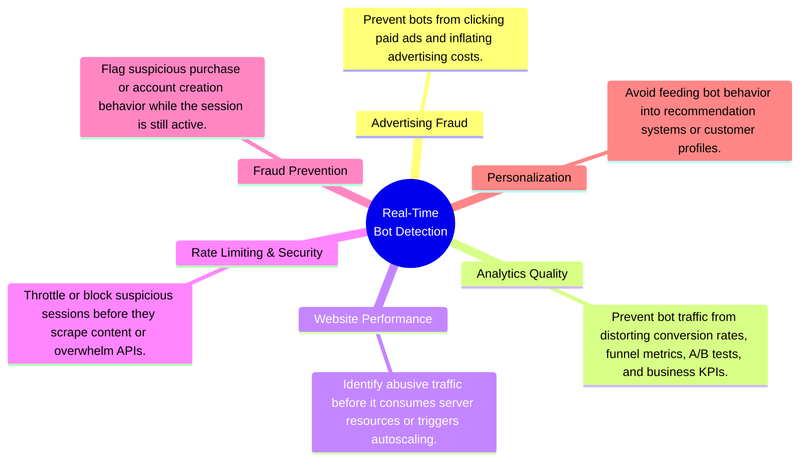
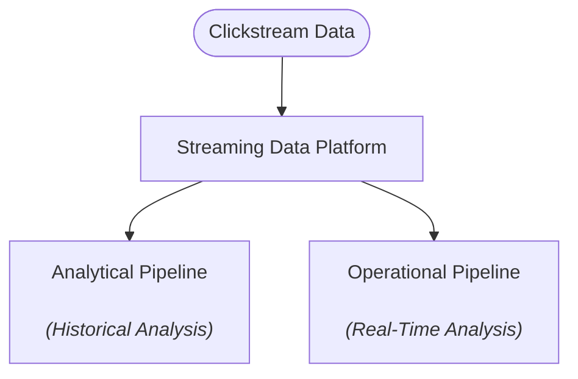
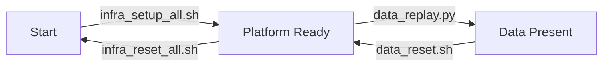
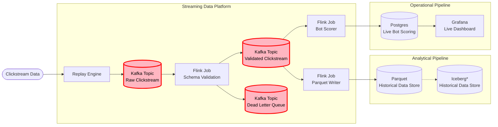
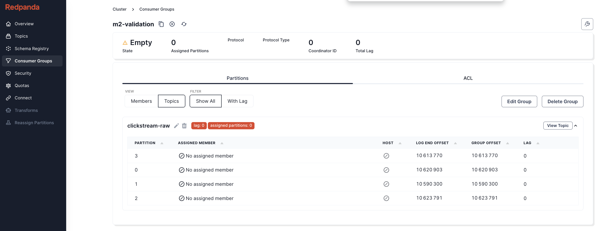
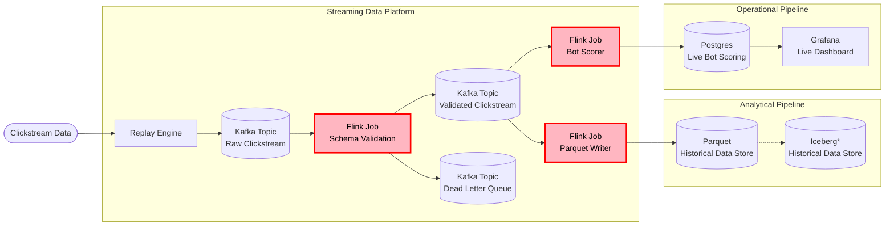
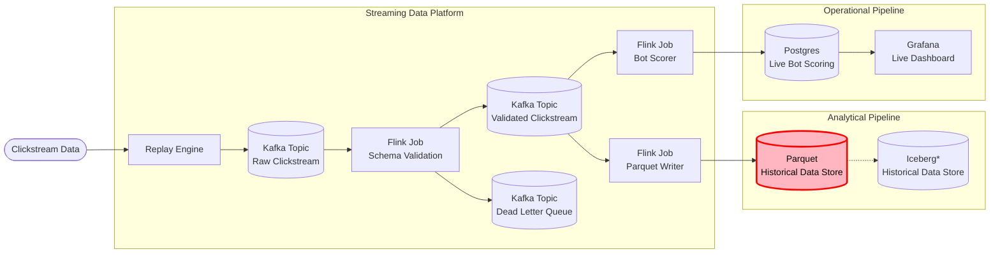
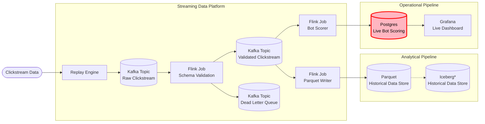
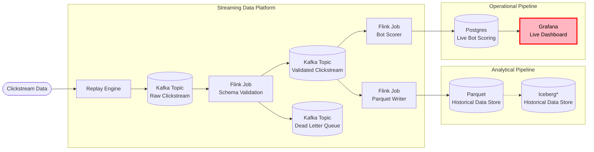
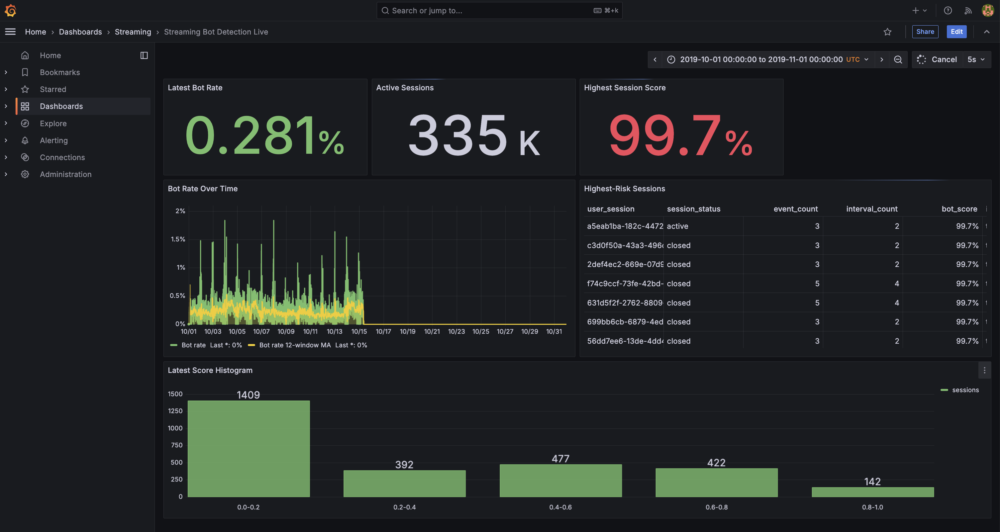

# Project 3: Streaming Lakehouse

An end-to-end streaming data platform that transforms e-commerce clickstream events into real-time bot detection metrics, continuously updated analytical datasets, and live operational dashboards using open-source streaming technologies.

---

| Section | Contents |
| ------- | -------- |
| **[1. What This Project Does](#1-what-this-project-does)** | 1.1 Problem Statement<br>1.2 Inputs and Outputs<br>1.3 End-to-End Workflow |
| **[2. Follow One Session](#2-follow-one-session)** | 2.1 Inspect the Original Clickstream<br>2.2 Observe Flink's Keyed Session State<br>2.3 Watch the Bot Score Evolve<br>2.4 View the Final Session State<br>2.5 Explain the Final Score |
| **[3. Streaming Resilience](#3-streaming-resilience)** | 3.1 Invalid Data: Isolate with a Dead-Letter Queue<br>3.2 Late Data: Reorder with Event-Time Buffering and Watermarks<br>3.3 Processing Failures: Recover with Checkpoints<br>3.4 Capacity Mismatch: Decouple Producers and Consumers with a Kafka Topic |
| **[4. Deployment](#4-deployment)** | 4.1 Prerequisites<br>4.2 Repository Structure<br>4.3 Deployment State Model<br>4.4 Setup<br>4.5 Platform Services<br>4.6 Reset and Teardown |
| **[5. Results](#5-results)** | 5.1 Kafka Topic Activity<br>5.2 Flink Job Execution<br>5.3 Analytical Parquet Output<br>5.4 Operational Session Scores<br>5.5 Live Bot Detection Dashboard |
| **[6. Reflections and Next Steps](#6-reflections-and-next-steps)** | 6.1 Building an Intuitive Understanding of Streaming<br>6.2 Root Cause Analysis<br>6.3 Future Directions |


# 1. What This Project Does
## 1.1 Problem Statement

The portfolio follows a three-stage progression:

1. **Project 1 — Build:** A modern local lakehouse capable of processing 42 million e-commerce clickstream events on commodity hardware using open-source technologies.
2. **Project 2 — Migrate:** The same architecture to the cloud while preserving openness, portability, and reproducibility.
3. **Project 3 — Extend:** The same clickstream dataset into a real-time streaming platform, evolving from historical analytics to operational analytics.

Unlike historical analytics, operational analytics enables organizations to act while events are still occurring rather than after they have already been collected and analyzed. Real-time bot detection serves as the demonstration application throughout this project. The value of real-time bot detection lies not in identifying bots itself, but in enabling immediate action across multiple business domains:



Alongside these technical objectives, the project has a central learning objective:

> Build an intuitive understanding of how a streaming pipeline works.

Of the three portfolio projects, streaming is the area in which I have the least prior intuition. Building the pipeline provides a practical mental model of how producers, Kafka topics, Flink jobs, state, checkpoints, lag, and backpressure fit together as a continuously running system.

## 1.2 Inputs and Outputs

### Inputs

The platform replays the October 2019 e-commerce clickstream dataset as a real-time event stream.

| Input | Purpose |
| ------ | ------- |
| October 2019 Clickstream Dataset | Simulate a production event stream for real-time processing |

### Outputs

The platform continuously produces the following artifacts:

| Output | Purpose |
| ------ | ------- |
| Clean Event Stream | Validated events for downstream consumers |
| Analytical Dataset | Persist historical event data for offline analytics |
| Operational Dashboard | Visualize live bot metrics and streaming health |

## 1.3 End-to-End Workflow
At a high level, the streaming platform supports two complementary workloads: historical analytics and real-time operational analytics.

The following workflow expands this view to show how replayed clickstream events flow through Kafka topics and Flink jobs to produce each output.

`*` Iceberg integration demonstrated in Projects 1 & 2.

# 2. Follow One Session

To illustrate how the streaming platform operates, this section follows a single clickstream session from its original events through to its final bot classification.

The session used throughout is:

```text
d1f516da-7272-461a-bf97-05f9d06a8187
```

---

## 2.1 Inspect the Original Clickstream

The original clickstream events can be queried directly from the source dataset.

```bash
docker compose -f infra/compose/duckdb.yml run --rm duckdb
```

```sql
SELECT
    event_time,
    event_type,
    brand,
    datediff(
        'millisecond',
        LAG(event_time) OVER (
            PARTITION BY user_session
            ORDER BY event_time
        ),
        event_time
    ) AS interval_ms
FROM read_csv_auto('/work/datasets/source/2019-Oct.csv.gz')
WHERE user_session = 'd1f516da-7272-461a-bf97-05f9d06a8187';
```

```text
┌─────────────────────┬────────────┬─────────┬─────────────┐
│     event_time      │ event_type │  brand  │ interval_ms │
│      timestamp      │  varchar   │ varchar │    int64    │
├─────────────────────┼────────────┼─────────┼─────────────┤
│ 2019-10-18 20:14:09 │ view       │ oppo    │        NULL │
│ 2019-10-18 20:14:16 │ view       │ oppo    │        7000 │
│ 2019-10-18 20:14:23 │ view       │ oppo    │        7000 │
│ 2019-10-18 20:14:29 │ view       │ oppo    │        6000 │
│ 2019-10-18 20:14:32 │ view       │ oppo    │        3000 │
│ 2019-10-18 20:14:36 │ view       │ oppo    │        4000 │
│ 2019-10-18 20:14:47 │ view       │ oppo    │       11000 │
│ 2019-10-18 20:14:49 │ view       │ oppo    │        2000 │
│ 2019-10-18 20:14:54 │ view       │ oppo    │        5000 │
│ 2019-10-18 20:14:58 │ view       │ oppo    │        4000 │
└─────────────────────┴────────────┴─────────┴─────────────┘
```

As these events are replayed into Kafka, the operational pipeline maintains state for this session. After every new event, the session statistics are updated and a new bot score is calculated.

---

## 2.2 Observe Flink's Keyed Session State

The operational scoring job partitions the validated stream with `keyBy(user_session)`. That means every event for this session is routed to the same keyed Flink operator, where one compact state object is maintained for the active session.

Flink does not need to retain and rescan the full list of click events. For each key, the scorer updates a few running counters and accumulators:

```text
State keyed by user_session

user_session = d1f516da-7272-461a-bf97-05f9d06a8187

previous_event_time       = current_event_time

event_count              += 1
interval_count           += 1
interval_sum_ms          += current_interval_ms
interval_sum_squares_ms  += current_interval_ms²
minimum_interval_ms       = min(minimum_interval_ms, current_interval_ms)

mean_interval_ms          = interval_sum_ms / interval_count
sd_interval_ms            = derived from interval_sum_squares_ms

session_close_timer       = current_event_time + inactivity_timeout
```

The first event initializes the keyed state and sets the previous event time, but it does not produce a click interval. Each later event creates one new interval, updates the running accumulators, recalculates the derived mean and sample standard deviation, and resets the inactivity timer.

Using the first three events from this session:

```text
Event 1 - 20:14:09

previous_event_time = 20:14:09
event_count        += 1          -> 1

No interval exists yet.
```

```text
Event 2 - 20:14:16

current_interval_ms       = 7,000
event_count              += 1       -> 2
interval_count           += 1       -> 1
interval_sum_ms          += 7,000   -> 7,000
interval_sum_squares_ms  += 7,000²  -> 49,000,000
minimum_interval_ms       = 7,000
previous_event_time       = 20:14:16
```

```text
Event 3 - 20:14:23

current_interval_ms       = 7,000
event_count              += 1       -> 3
interval_count           += 1       -> 2
interval_sum_ms          += 7,000   -> 14,000
interval_sum_squares_ms  += 7,000²  -> 98,000,000
minimum_interval_ms       = min(7,000, 7,000) -> 7,000

mean_interval_ms          = 14,000 / 2 -> 7,000
sd_interval_ms            = 0
```

After each event, the derived mean, minimum, and standard deviation are converted to historical percentile ranks and used to recalculate the live bot score shown below. When the inactivity timer fires, the session is marked closed and the final state is persisted to PostgreSQL. Because the implementation intentionally keeps only running statistics rather than every timestamp or interval, per-session state and checkpoint size stay small.

---

## 2.3 Watch the Bot Score Evolve

The bot score changes continuously as additional click intervals become available.


After only four events the session exceeds the operational bot threshold (0.95). From this point onward the session could be flagged in real time while it is still active, allowing downstream systems to react immediately rather than waiting for historical batch processing.

After ~90 minutes of inactivity (corresponding to the 99th percentile of historical maximum session click intervals), the session is closed and its final statistics are written to PostgreSQL.

---

## 2.4 View the Final Session State

```bash
docker compose -f infra/compose/postgres.yml exec postgres \
  psql -U clickstream -d clickstream
```

```sql
\x

SELECT *
FROM session_bot_scores
WHERE user_session = 'd1f516da-7272-461a-bf97-05f9d06a8187';
```

```text
-[ RECORD 1 ]----------+-------------------------------------
user_session           | d1f516da-7272-461a-bf97-05f9d06a8187
last_event_time        | 2019-10-18 20:14:58
closed_at              | 2019-10-18 21:41:58
updated_at             | 2026-07-08 16:36:54.648
session_status         | closed
event_count            | 10
interval_count         | 9
mean_click_interval_ms | 5444
min_click_interval_ms  | 2000
sd_click_interval_ms   | 2698
bot_score              | 0.9833
is_bot                 | t
```

The operational pipeline stores only the running statistics required for scoring rather than every individual click event. This allows each session to be updated efficiently as new events arrive while keeping the amount of maintained state small.

---

## 2.5 Explain the Final Score

The bot score is computed from three behavioral features:

- Mean click interval
- Minimum click interval
- Standard deviation of click intervals

Each feature is converted into its percentile rank relative to all historical sessions before being combined into a single score.

```text
bot_score
      = 1 - mean(
            percentile_rank(mean_click_interval_ms),
            percentile_rank(min_click_interval_ms),
            percentile_rank(sd_click_interval_ms)
        )

      = 1 - mean(0%, 3%, 2%)

      = 98%
```

This session exhibits consistently short click intervals with very little variation, placing it among the most uniform sessions in the dataset. As a result, its final bot score is **98%**, exceeding the operational threshold of **95%** and causing the session to be classified as a bot.

# 3. Streaming Resilience
## 3.1 Invalid Data: Isolate with a Dead-Letter Queue
Every event is parsed and validated before it can enter either the analytical or operational pipeline.

```text
Event type           Destination
-----------------    -------------------
Valid                clickstream-clean
Invalid              clickstream-dlq
```

Valid events continue through the platform. Invalid events are diverted to the Dead Letter Queue, preventing malformed data from disrupting downstream processing while preserving the rejected record for later inspection, correction, or reprocessing.

### Raw Event

The replay engine publishes source records to `clickstream-raw` as JSON.

```json
{
  "event_time": "2019-10-31 23:58:57 UTC",
  "event_type": "view",
  "product_id": "1005205",
  "category_id": "2053013555631882655",
  "category_code": "electronics.smartphone",
  "brand": "oppo",
  "price": "256.74",
  "user_id": "512789086",
  "user_session": "cc782b99-88ab-4573-8311-c62e1d447757"
}
```

### Clean Event

If validation succeeds, the event is published to `clickstream-clean`.

```json
{
  "event_time": "2019-10-31 23:58:57 UTC",
  "event_type": "view",
  "product_id": "1005205",
  "category_id": "2053013555631882655",
  "category_code": "electronics.smartphone",
  "brand": "oppo",
  "price": "256.74",
  "user_id": "512789086",
  "user_session": "cc782b99-88ab-4573-8311-c62e1d447757"
}
```

### Dead-Letter Event

If parsing or validation fails, the event is published to `clickstream-dlq` with the reason for rejection.

```json
{
  "original_payload": {
    "event_time": "not-a-timestamp",
    "event_type": "view",
    "product_id": "26403676",
    "category_id": "2053013563651392361",
    "category_code": "",
    "brand": "lucente",
    "price": "216.48",
    "user_id": "520815996",
    "user_session": "76432830-1f65-47b2-bac8-bafe06828019"
  },
  "failure_reason": "invalid event_time",
  "processing_timestamp": "2026-07-11T18:45:06.267926300Z"
}
```
## 3.2 Late Data: Reorder with Event-Time Buffering and Watermarks

Events do not always arrive in the order in which they occurred.

For example, the replay engine may delay Event 4 from the real session followed in Section 2:

```text id="l6k9qm"
Source event    Event time             Notes
------------    -------------------    ----------------
Event 3         2019-10-18 20:14:23
Event 5         2019-10-18 20:14:32
Event 4         2019-10-18 20:14:29    ← delayed event
```

Flink processes time-based behavior using the timestamp stored in each record rather than the wall-clock time at which the event arrives.

```text id="xb5fnd"
Event time         When the click occurred
Processing time    When Flink processed it
```

The operational scorer assigns timestamps from `event_time` and uses a 5-second bounded out-of-orderness watermark.

> A watermark tells Flink: “I have probably received all events that occurred before this timestamp, so time-based processing can now move forward.”

```text id="0srzl5"
Highest event time observed     20:14:32
Out-of-order allowance         -       5s
Watermark                       20:14:27
```

Because the delayed `20:14:29` event is still ahead of the `20:14:27` watermark, it remains eligible for live scoring.

The scorer briefly buffers events by `user_session` and processes them in event-time order once the watermark reaches their timestamps.

```text id="cr924u"
Streamed to bot scorer

20:14:23
20:14:32
20:14:29

Processed by bot scorer

20:14:23
20:14:29
20:14:32
```

This keeps session timers and interval calculations aligned with when the user activity actually occurred rather than with temporary delays in delivery or processing.

The guarantee is intentionally bounded: events arriving within the configured out-of-orderness allowance are scored in event-time order. Events arriving after the watermark has already passed their timestamp are excluded from live scoring.

## 3.3 Processing Failures: Recover with Checkpoints
Checkpointing allows a Flink job to recover after a processing failure without restarting the stream from the beginning.

A checkpoint records a consistent snapshot of source position and in-flight state:

```text
Checkpoint component      What it preserves
----------------------    -----------------------------------------------
Kafka source position     The next Kafka offset each source partition reads
Active session state      Active sessions, pending events, and scheduled timers
```

A streaming system must decide how processing and offset commits are coordinated.

### At-most-once (commit offset, then process)
```text
Commit offset for Event 101       Process Event 101
              │                           │
              ▼                           ▼
──────────────●───────────────X───────────●───────────────────────── Time
                              Failure

Restart:
The committed offset says Event 101 was already handled,
so consumption resumes at Event 102.

Result:
Event 101 is lost.
```

### At-least-once (process, then commit offset)
```text
Process Event 101                 Commit offset after Event 101
        │                                  │
        ▼                                  ▼
────────●──────────────────X───────────────●──────────────────────── Time
                           Failure

Restart:
The committed offset still points to Event 101,
so Event 101 is processed again.

Result:
Event 101 is duplicated.
```

### Exactly-once (process everything as one transaction)
```text
BEGIN TRANSACTION
        │
        ├── Process Event 101
        ├── Update session state
        └── Commit offset
        │
        ▼
      COMMIT

Result:
Either every step is committed together or none is,
so Event 101 affects the final result exactly once.
```

### This Project

The validation and operational Flink jobs create a checkpoint every 60 seconds and use Flink’s exactly-once checkpointing mode.

```java
env.enableCheckpointing(60_000);

env.getCheckpointConfig().setCheckpointingMode(
        CheckpointingMode.EXACTLY_ONCE
);
```

The same checkpointing mechanism is used in two jobs:

```text
Flink job              Checkpointed information
--------------------   --------------------------------------------------
Validation             Kafka source offsets and validation progress
Operational scorer     Kafka source offsets, active sessions, delayed-event
                       buffers, running statistics, and session timers
```

This means Flink can recover its source position and internal state from the latest completed checkpoint. The external outputs still use practical delivery patterns: Kafka clean/DLQ writes are at-least-once, PostgreSQL bot scores use upserts, and Parquet output coordinates file commits with checkpoints.

## 3.4 Capacity Mismatch: Decouple Producers and Consumers with a Kafka Topic

Without a durable topic between the producer and consumer, a slow consumer forces the system to choose how to handle new events:
```text
Producer ──▶ Consumer
                │
                ▼
          Consumer slows

Producer must wait, reject events, or drop them
```
A Kafka topic decouples the producer’s throughput from the consumer’s throughput by providing a durable buffer between them:
```text
Producer ──▶ Kafka topic ──▶ Consumer
               ▲
               │
         durable backlog
```
The producer can continue writing events to Kafka while the consumer processes them at its own speed. If the consumer falls behind, the backlog remains in the topic and consumer lag increases.

This is how **backpressure** is absorbed at the system boundary: the consumer slows down, while Kafka holds the excess events until the consumer can catch up.

# 4. Deployment

## 4.1 Prerequisites

The platform requires:

* Docker Desktop
* Python 3
* Project dependencies installed from `requirements.txt`
* The October 2019 clickstream source file under `datasets/source/`

The project runs locally through Docker Compose. Kafka-compatible streaming is provided by Redpanda, stream processing by Flink, operational storage by PostgreSQL, and dashboarding by Grafana.

## 4.2 Repository Structure

```text
project-3-streaming-bot-detection/
├── datasets/
│   ├── analytics/               # Generated Parquet output
│   ├── flink-checkpoints/       # Flink checkpoint state
│   ├── reference/               # Generated normalization and bot-scoring config
│   └── source/                  # Source clickstream CSV data
├── docs/
│   ├── scoring_design.md       # Why operational scoring uses Flink DataStream instead of SQL
│   └── planning.md              # Planning notes and design exploration
├── infra/
│   ├── compose/                 # Docker Compose service definitions
│   ├── flink/                   # Flink connector jars and generated job artifacts
│   ├── grafana/                 # Dashboard provisioning assets
│   └── scripts/                 # Setup, reset, and state inspection scripts
└── streaming/
    ├── flink_job_analytics.sql  # Clean Kafka to Parquet job
    ├── flink_job_validation.sql # Raw Kafka to clean Kafka and DLQ job
    ├── java/                    # Operational Flink bot-scoring job
    ├── normalization.sql        # Historical reference query for bot scoring
    ├── postgres_schema.sql      # Operational database schema
    └── data_replay.py           # Historical clickstream replay engine
```

Planning documentation is captured in `docs/`. The deployment workflow below treats the project as a small state machine so setup, replay, reset, and teardown remain explicit.

## 4.3 Deployment State Model

The deployment workflow has three states:



`Start` means no local streaming platform is running. `Platform Ready` means the containers, Kafka topics, Flink jobs, PostgreSQL tables, and dashboard services are available. `Data Present` means replayed clickstream events have flowed through Kafka and produced analytical or operational outputs.

## 4.4 Setup

### Change to the Project Directory

```bash
cd data-engineering-portfolio/project-3-streaming-bot-detection
```

### Check the Current State

```bash
./infra/scripts/state_show.sh
```

The state script reports the current deployment state and the next valid action. From a clean start, it directs the user to set up the complete platform.

### Deploy the Platform

```bash
./infra/scripts/infra_setup_all.sh
```

The setup script performs the complete local deployment workflow:

1. Starts Redpanda, Redpanda Console, Flink, PostgreSQL, and Grafana.
2. Creates the raw, clean, and dead-letter Kafka topics.
3. Submits the validation and analytical Flink jobs.
4. Prepares the operational bot-scoring artifacts and PostgreSQL schema.
5. Starts the operational scoring job and Grafana dashboard services.

### Replay Clickstream Data

```bash
python3 streaming/data_replay.py \
    --sink kafka \
    --speed 100000x \
    --quiet \
    --progress-every 5000000
```

The replay engine turns historical clickstream rows into a live Kafka event stream. After replay begins, the platform moves from `Platform Ready` to `Data Present`.

For a quicker development run, replay the 1% sample CSV instead of the full October dataset:

```bash
python3 streaming/data_replay.py \
    --dataset-path datasets/source/2019-Oct-sessions-1pct.csv.gz \
    --sink kafka \
    --speed 100000x \
    --quiet \
    --progress-every 100000
```

### Replay Parameters

The replay engine is configurable so the same source dataset can be used for quick local checks, fault-tolerance tests, and full historical replays.

| Parameter | Purpose | Example |
| --------- | ------- | ------- |
| `--sink` | Choose whether events are printed locally or published to Kafka. | `--sink kafka` |
| `--speed` | Scale event time relative to wall-clock time. Higher values stress the streaming jobs faster. | `--speed 100x` |
| `--start-row` | Begin replay from a specific zero-based source row. | `--start-row 100000` |
| `--rows` | Limit the number of source rows replayed for a bounded test run. | `--rows 1000000` |
| `--full` | Replay the full source dataset. This is also the default when `--rows` is omitted. | `--full` |
| `--delay-probability` | Simulate out-of-order arrival by delaying a fraction of events. | `--delay-probability 0.02` |
| `--mean-delay-seconds` | Set the average artificial event-time delay for delayed events. | `--mean-delay-seconds 5` |
| `--corrupt-probability` | Inject malformed records to exercise validation and DLQ handling. | `--corrupt-probability 0.02` |
| `--random-seed` | Make delay and corruption simulation reproducible across runs. | `--random-seed 1` |
| `--quiet` | Suppress per-event logs during larger runs. | `--quiet` |
| `--progress-every` | Print compact progress updates every N dispatched events when quiet mode is enabled. | `--progress-every 100000` |

Source and Kafka connection parameters are also configurable through `--dataset-path`, `--source-url`, `--kafka-topic`, and `--kafka-brokers`, but the defaults are designed for the local Docker Compose deployment.

## 4.5 Platform Services

After a successful deployment, the following services are available:

| Service | Purpose | URL | Credentials |
| ------- | ------- | --- | ----------- |
| Redpanda Console | Inspect Kafka topics, messages, and consumer activity | `http://localhost:8080` | None |
| Flink Web UI | Inspect running stream-processing jobs and checkpoint behavior | `http://localhost:8081` | None |
| Grafana | View live bot detection metrics and streaming health | `http://localhost:3000` | `admin` / `admin` |

The live dashboard is provisioned as `Streaming Bot Detection Live`.

## 4.6 Reset and Teardown

### Reset Replay Data

```bash
./infra/scripts/data_reset.sh
```

The data reset keeps the platform running but clears replay outputs: Kafka topic contents, generated Parquet data, PostgreSQL metric rows, and Flink checkpoints. This returns the project from `Data Present` to `Platform Ready` so another replay can be run against a clean state.

### Destroy the Platform

```bash
./infra/scripts/infra_reset_all.sh
```

The teardown script stops the Docker Compose platform, removes service volumes, clears generated analytics output, removes generated Flink artifacts, and returns the project to `Start`. Source data, code, Compose files, connector jars, and Grafana provisioning files are preserved.

# 5. Results

## 5.1 Kafka Topic Activity



Redpanda Console shows the raw, clean, and dead-letter Kafka topics used by the streaming platform. This view confirms that replayed clickstream events are moving through the ingestion and validation layers.


The raw topic view shows replayed clickstream events arriving as JSON messages before validation. This provides a direct check that historical rows are being converted into an inspectable event stream.



Redpanda Console shows the raw topic split across four partitions, allowing Kafka and Flink to process the stream in parallel while tracking an independent offset and lag for each partition.

## 5.2 Flink Job Execution



The Flink Web UI shows the running validation, analytical Parquet writer, and operational bot-scoring jobs. This view confirms that the platform is processing the clean stream continuously and maintaining checkpointed state.

## 5.3 Analytical Parquet Output


The analytical branch writes validated clickstream events to partitioned Parquet files.

```text
datasets/analytics/
└── clickstream/
    └── event_date=2019-10-18/
        ├── part-00000-....parquet
        └── part-00001-....parquet
```

The directory tree shows the partitioned Parquet output, and a DuckDB query confirms the files can be read as analytical data:

```sql
SELECT
    COUNT(*),
    MIN(event_time),
    MAX(event_time)
FROM read_parquet('datasets/analytics/**/*.parquet');
```

## 5.4 Operational Session Scores


The operational scorer writes two tables to PostgreSQL. The first table, `session_bot_scores`, stores the latest score and state for each user session.

```text
user_session                          status  events  intervals  mean_ms  min_ms  sd_ms  bot_score  is_bot
------------------------------------  ------  ------  ---------  -------  ------  -----  ---------  ------
d1f516da-7272-461a-bf97-05f9d06a8187  closed      10          9     5444    2000   2698     0.9833  true
8e2f...sample-session                 active       7          6     8100    3000   4120     0.7433  false
43aa...sample-session                 active      14         13     3900    1000   1580     0.9567  true
```

The second PostgreSQL table, `stream_bot_metrics`, stores aggregate bot-rate metrics for dashboard windows.

```text
window_start          window_end            active_sessions  bot_sessions  bot_rate  avg_bot_score
-------------------   -------------------   ---------------  ------------  --------  -------------
2019-10-18 20:14:00   2019-10-18 20:15:00                42            8    0.1905         0.4121
2019-10-18 20:15:00   2019-10-18 20:16:00                37           11    0.2973         0.5388
```

## 5.5 Live Bot Detection Dashboard



The Grafana dashboard visualizes live bot detection metrics from PostgreSQL, including active session scores from `session_bot_scores`, stream-level bot rates from `stream_bot_metrics`, and operational health signals.

# 6. Reflections and Next Steps
## 6.1 Building an Intuitive Understanding of Streaming

The central learning objective of this project is to build an intuitive understanding of how a streaming pipeline works. I begin by asking:

> **If I were to demonstrate a true streaming project, what components, features, and capabilities would it need to include?**

```text
Streaming Project

├── 1. Data Flow
│     ├── Unbounded event stream
│     ├── Message broker (Kafka)
│     ├── Multiple producers
│     └── Multiple consumers
│
├── 2. Stream Processing
│     ├── Stateful processing
│     ├── Windowing
│     ├── Event time + watermarks
│     └── Non-trivial transformations
│
├── 3. Outputs
│     ├── Live serving
│     ├── Persistent storage
│     └── Replay
│
├── 4. Reliability
│     ├── Offset management
│     ├── Delivery semantics
│     ├── Validation
│     └── Dead letter queue
│
├── 5. Operations
│     ├── Consumer lag
│     ├── Throughput & latency
│     ├── Backpressure
│     └── Horizontal scaling
│
└── 6. Nice to Have
      └── Schema evolution
```

Building these capabilities turns the checklist into a practical mental model of how the pieces work together. Many real-world systems are naturally streams: users click, transactions occur, and machines emit data continuously. A streaming platform responds to that reality by processing events while they are still occurring. The trade-off is complexity: more components remain continuously in motion, maintain state, operate at different speeds, and must recover from malformed data, delayed events, capacity mismatches, and failure.

## 6.2 Root Cause Analysis

Integrating the complete streaming platform exposed several problems that only became visible once the system was running end to end. Resolving them required an iterative process of observation, hypothesis, experimentation, and measurement.

```text
1. Platform instability
   └── Memory profiling suggested that the runtime environment itself
       was contributing to excessive memory usage. Replacing the
       emulated amd64 Flink image with a native ARM image confirmed
       that the environment was part of the problem.

2. Runaway memory growth
   └── With the runtime stabilized, profiling showed that the
       operational job was retaining more state than necessary,
       leading to further reductions in memory usage and checkpoint
       size.

3. Throughput limitations
    └── Consumer lag and Flink backpressure exposed throughput bottlenecks; 
        EXPLAIN plans then revealed duplicate processing, allowing replay, 
        validation, and PostgreSQL writes to be optimized.
```

Each investigation produced a new understanding of the system, but also revealed the next constraint. Rather than searching for a single root cause, the process became one of progressively eliminating the most significant limitation until the pipeline operated reliably at full scale.

## 6.3 Future Directions

This project completes the three-stage progression of the portfolio: building a modern lakehouse, migrating it to the cloud, and extending it into a real-time streaming platform. Rather than continuing to add infrastructure or operational complexity, the focus now shifts from understanding data engineering systems to applying them to new problems and domains.
