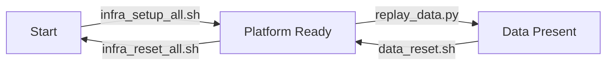

# Streaming Bot Detection Runbook

Use the project as a three-state system.

## Table Of Contents

- [State Diagram](#state-diagram)
- [Quick Start](#quick-start)
- [Useful URLs](#useful-urls)

## State Diagram



## Quick Start

Start from the project root:

```bash
cd /Users/rezwanhoppe-islam/data-engineering-portfolio/project-3-streaming-bot-detection
```

Ask the project where you are:

```bash
./infra/scripts/state_show.sh
```

The script prints:

```text
State: Start | Platform Ready | Data Present
Next valid action:
  python3 streaming/replay_data.py --start-row 100000 --rows 1000000 --speed 100x --sink kafka --corrupt-probability 0.02 --delay-probability 0.02 --quiet --progress-every 100000
Why: ...
```

Follow the `Next valid action` returned by the script. After that action finishes, run `./infra/scripts/state_show.sh` again.

To run the whole pipeline:
```bash
python3 streaming/replay_data.py \
    --sink kafka \
    --speed 100000x \
    --quiet \
    --progress-every 5000000
```

## Useful URLs

```text
Redpanda Console: http://localhost:8080
Flink Web UI:     http://localhost:8081
Grafana:          http://localhost:3000
```

Grafana login:

```text
Username: admin
Password: admin
Dashboard: Streaming Bot Detection Live
```
