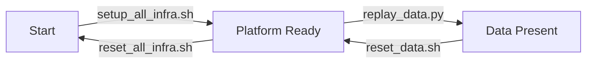

# Streaming Bot Detection Runbook

Use the project as a three-state system.

## Table Of Contents

- [State Diagram](#state-diagram)
- [Quick Start](#quick-start)
- [States](#states)
- [Useful URLs](#useful-urls)

## State Diagram



## Quick Start

Start from the project root:

```bash
cd /Users/rezwanhoppe-islam/data-engineering-portfolio/project-3-streaming-bot-detection
```

Ask the project where you are:

```bash
./infra/scripts/state.sh
```

The script prints:

```text
State: Start | Platform Ready | Data Present
Next valid action: ...
Why: ...
```

## States

### Start

The complete live platform is not available yet.

Valid next action:

```bash
./infra/scripts/setup_all_infra.sh
```

Then check again:

```bash
./infra/scripts/state.sh
```

### Platform Ready

The live platform is up, but no replayed data is present.

Valid next action:

```bash
python3 streaming/replay_data.py \
  --start-row 100000 \
  --rows 500 \
  --speed 100x \
  --sink kafka \
  --no-sleep \
  --corrupt-probability 0.02 \
  --delay-probability 0.02 \
  --quiet \
  --progress-every 250
```

Then check again:

```bash
./infra/scripts/state.sh
```

You can also reset the whole project back to Start:

```bash
./infra/scripts/reset_all_infra.sh
```

### Data Present

The platform is up and Kafka or PostgreSQL contains replay records.

Valid next action:

```bash
./infra/scripts/reset_data.sh
```

This clears processed data and keeps the infrastructure running, so the next state should be `Platform Ready`.

Then check again:

```bash
./infra/scripts/state.sh
```

## Useful URLs

```text
Redpanda Console: http://localhost:8080
Flink Web UI:     http://localhost:8081
Grafana:          http://localhost:3000
```

Grafana login:

```text
Username: admin
Password: admin
Dashboard: Streaming Bot Detection Live
```
