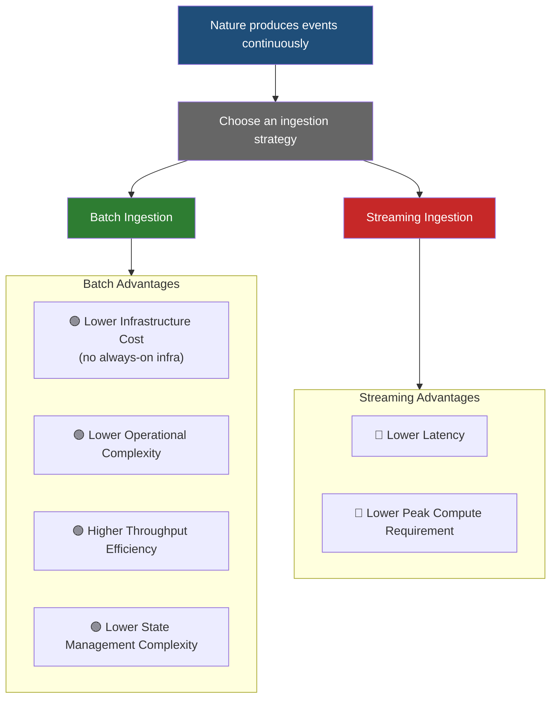

ref: [Batch vs Streaming Processing: Differences, Use Cases & Trade-Offs](https://kestra.io/resources/data/batch-vs-streaming-processing)




```mermaid
flowchart LR

    YT[100 News YouTube Channels]

    subgraph INGESTION["Event Ingestion"]
        P[Channel Poller]
        K1[(Kafka Topic<br/>new_videos)]
    end

    subgraph AI["AI Enrichment Pipeline"]
        T[Transcript Fetcher]
        S[LLM Summarizer]
        E[Embedding Generator]
        V[(Vector Database)]
        D[(Article / Video Metadata Store)]
    end

    subgraph STREAM["Streaming Analytics"]
        K2[(Kafka Topic<br/>enriched_videos)]
        SP[Spark Structured Streaming]

        TV[Topic Velocity]
        BL[Breaking News Detection]
        SL[Story Lifecycle Tracking]
        CM[Channel Activity Metrics]

        DASH[(Analytics Dashboard)]
    end

    YT --> P
    P --> K1

    K1 --> T
    T --> S
    S --> E

    T --> D
    S --> D

    E --> V

    S --> K2
    E --> K2

    K2 --> SP

    SP --> TV
    SP --> BL
    SP --> SL
    SP --> CM

    TV --> DASH
    BL --> DASH
    SL --> DASH
    CM --> DASH
    ```