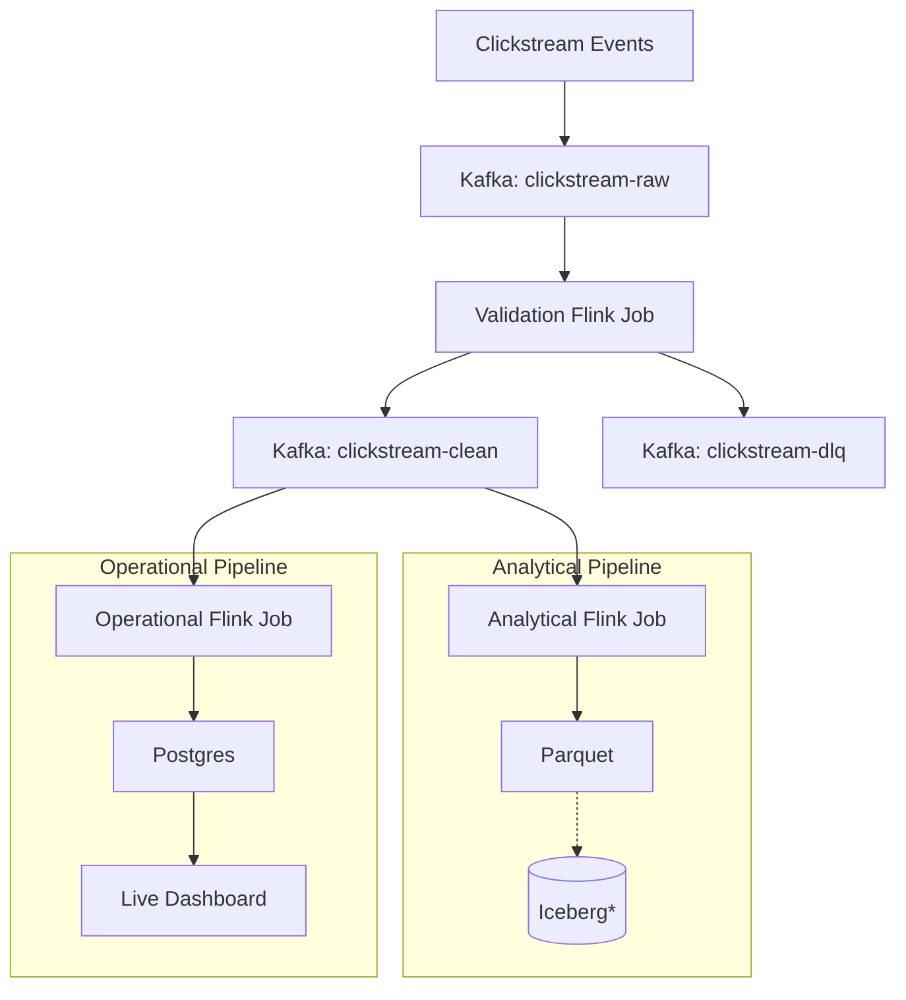
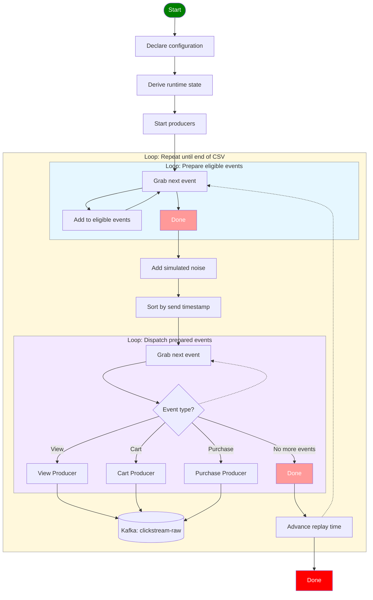
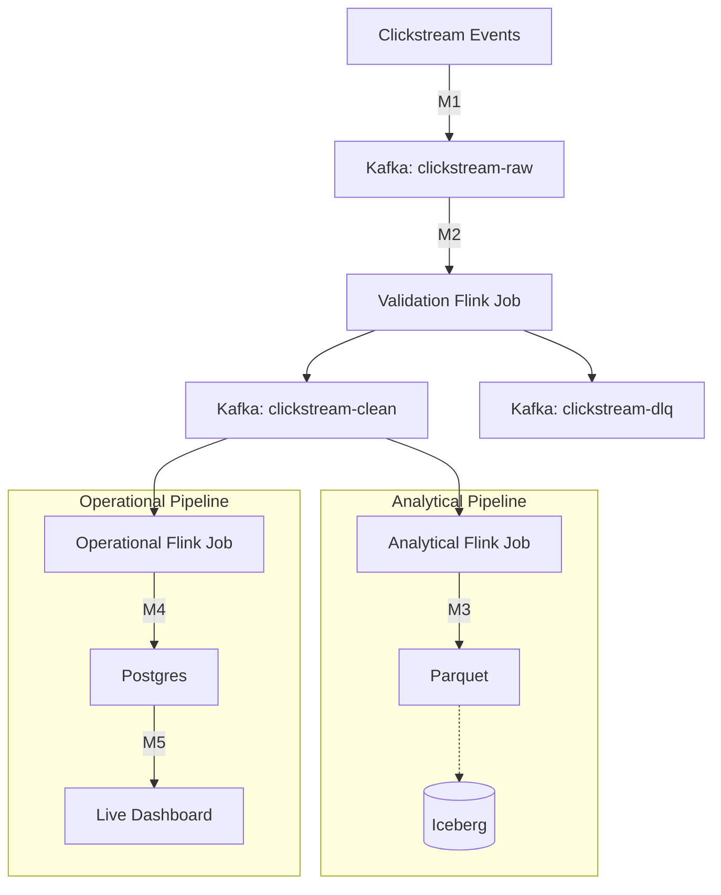

# Table of Contents
- [1. Exploration](#1-exploration)
  - [1.1 What features should a streaming project demonstrate?](#11-what-features-should-a-streaming-project-demonstrate)
  - [1.2 What domain should I pick?](#12-what-domain-should-i-pick)
  - [1.3 Why I chose the real-time clickstream project](#13-why-i-chose-the-real-time-clickstream-project)
  - [1.4 High-level (Kappa) architecture](#14-high-level-kappa-architecture)
- [2. Implementation sketch](#2-implementation-sketch)
  - [2.1 Producers -> Raw Kafka](#21-producers---raw-kafka)
    - [2.1.1 Pseudo-logic for `replay.py`](#211-pseudo-logic-for-replaypy)
    - [2.1.2 Mermaid diagram illustrating the replay logic](#212-mermaid-diagram-illustrating-the-replay-logic)
    - [2.1.3 Example console output to verify success](#213-example-console-output-to-verify-success)
  - [2.2 Kafka → Flink → Kafka validation layer](#22-kafka--flink--kafka-validation-layer)
  - [2.3 Clean Kafka → Flink → Parquet](#23-clean-kafka--flink--parquet)
  - [2.4 Clean Kafka → Flink → Postgres](#24-clean-kafka--flink--postgres)
    - [2.4.1 Session-level bot scoring](#241-session-level-bot-scoring)
    - [2.4.2 Stream-level bot scoring](#242-stream-level-bot-scoring)
    - [2.4.3 Historical normalization lookup table](#243-historical-normalization-lookup-table)
    - [2.4.4 Session state](#244-session-state)
- [3. Implementation milestones](#3-implementation-milestones)
  - [3.1 Milestone Summary](#31-milestone-summary)
  - [3.2 Containerized development environment](#32-containerized-development-environment)
  - [3.3 Running the milestones](#33-running-the-milestones)
  - [3.4 Running the pipeline](#34-running-the-pipeline)
  - [3.5 M1: Producer → Raw Kafka](#35-m1-producer--raw-kafka)
  - [3.6 M2: Validation Layer → Clean Kafka + DLQ](#36-m2-validation-layer--clean-kafka--dlq)
  - [3.7 M3: Clean Kafka → Flink → Parquet](#37-m3-clean-kafka--flink--parquet)
  - [3.8 M4: Clean Kafka → Flink → Postgres](#38-m4-clean-kafka--flink--postgres)
  - [3.9 M5: Live Dashboard](#39-m5-live-dashboard)
  - [3.10 M6: Observability](#310-m6-observability)
- [4. Repository Structure](#4-repository-structure)

# 1. Exploration
## 1.1 What features should a streaming project demonstrate?

> "If I were to demonstrate a true streaming project, then what components, features, capabilities would you expect to see? What does a strong streaming project look like?"

```text
Streaming Project

├── 1. Data Flow
│     ├── Unbounded event stream
│     ├── Message broker (Kafka)
│     ├── Multiple producers
│     └── Multiple consumers
│
├── 2. Stream Processing
│     ├── Stateful processing
│     ├── Windowing
│     ├── Event time + watermarks
│     └── Non-trivial transformations
│
├── 3. Outputs
│     ├── Live serving
│     ├── Persistent storage
│     └── Replay
│
├── 4. Reliability
│     ├── Offset management
│     ├── Delivery semantics
│     ├── Validation
│     └── Dead letter queue
│
├── 5. Operations
│     ├── Consumer lag
│     ├── Throughput & latency
│     ├── Backpressure
│     └── Horizontal scaling
│
└── 6. Nice to Have
      └── Schema evolution
```

## 1.2 What domain should I pick?

> Now, can you add another two columns to this table? Each column will be for a different domain.The first domain will be basically a continuation of Project 1 and Project 2. You know how we used the October dataset, the web, the clickstream dataset. I'm guessing we could do something with that, like, for example, identify bots in real time. Because if you remember, we removed sessions or users who had a very large number of events per session post hoc. But we could do this in real time. We could, I guess, generate a number of metrics, which might look like robots. That's what I'm thinking. If you have better ideas, by all means speak up. But I want you to add a column and put this domain in there, and then tell me what each of these rows in the table would look like for that domain. And then for the other column, the other domain, that would be a text ingestion process. I don't know whether it's a live news feed or it's blue sky firehose or something like that, but what could the project look like to meet all the essential capabilities?

| Area | Essential Capabilities | Why It Matters | **Domain A: Real-Time Bot Detection (Clickstream)** | **Domain B: Live Text Feed Processing** |
|---|---|---|---|---|
| **Prerequisite** | • Latency-sensitive use case<br>• Continuous, valuable data | Justifies streaming over batch | Bots cause real-time harm — skewed analytics, ad fraud, server load. Post-hoc detection means damage is already done. Session ends in minutes; you must score it while it's live. | Detect emerging stories and trends while they are still developing rather than after the news cycle has moved on. |
| **1. Data Flow** | • Unbounded event stream<br>• Message broker (Kafka/Redpanda)<br>• Multiple producers<br>• Multiple consumers<br>• Partitions & consumer groups | Event-driven architecture and scalable ingestion | Simulated producers per site section (homepage, search, product, checkout) emit click events continuously to a raw `clickstream-raw` topic. A validation Flink job publishes valid records to `clickstream-clean` and malformed records to `clickstream-dlq`. Downstream consumers read only the clean topic: analytical Parquet writer, operational bot scorer, and dashboard feeder. | Multiple independent feed producers (RSS, Bluesky firehose, news APIs) emit text events continuously. Kafka partitioned by topic/story hash — not source — so related content lands on the same partition. Consumers: enricher, topic state updater, velocity detector, raw storage writer. |
| **2. Stream Processing** | • Stateful processing<br>• Windowing (tumbling/sliding/session)<br>• Event time & watermarks<br>• Non-trivial transformations | True streaming semantics, not simple ETL | Session windows accumulate per-user state: events/min, click entropy, page repeat rate, navigation speed, impossible click intervals, purchase oscillation. Watermarks handle late mobile events. Output: bot probability score per session, continuously updated. | Tumbling windows count mentions per topic per 5-min bucket. Sliding windows compute velocity (rate of change). Stateful topic tracking detects emergence, acceleration, and decay. Watermarks handle feed delays and out-of-order publication timestamps. Transformation: topic state update, not per-article NLP. |
| **3. Outputs** | • Live dashboard / API / alerts<br>• Persistent storage (Iceberg/Parquet)<br>• Replay capability | Makes the stream useful downstream | Dashboard: live bot rate, top suspicious sessions, risk heatmap, score distribution, anomaly spikes. Iceberg stores raw events + session scores for model retraining. Replay lets you re-score historical sessions after rule or model updates. | Dashboard: emerging topics, story velocity, coverage by source, entity co-occurrence shifts. Iceberg stores raw articles + topic state snapshots. Replay lets new consumers bootstrap full topic history from retained offsets. |
| **4. Reliability** | • Offset management<br>• At-least-once / exactly-once semantics<br>• Validation<br>• Dead letter queue | Correctness and resilience under failure | Validation is centralized before analytics: malformed events (null `user_session`, missing timestamps, unknown event types) go to `clickstream-dlq`, while valid records continue through `clickstream-clean`. Exactly-once matters downstream because duplicate events inflate velocity scores and cause false positives. Offset management ensures the scorer resumes mid-session after crash. | At-least-once acceptable: duplicate articles deduped by URL hash before state update. Offset management ensures topic state resumes correctly after crash. DLQ captures unparseable feed payloads or encoding errors. |
| **5. Operations** | • Consumer lag monitoring<br>• Throughput & latency metrics<br>• Backpressure handling<br>• Horizontal scaling | Production readiness and observability | Lag on scorer = delayed bot flags, bots escape the session window. Scale partitions during traffic spikes. Latency target: score updated within session window (~60s). Alert if lag exceeds one window length. | Lag on topic updater = stale trending topics, missed emergence window. Scale during breaking news when feed volume spikes. Latency target: topic state updated within one tumbling window (~5 min). NLP enrichment is the likely bottleneck — scale that consumer independently. |
| **6. Nice to Have** | • Schema evolution (Avro/Protobuf)<br>• Schema Registry | Long-lived streams without breaking consumers | Click event schema evolves as new UI ships — new event types, device fields, campaign tags. Avro + Registry prevents downstream consumers breaking on schema changes. | Feed schemas vary by source and evolve over time. Registry enforces a canonical event envelope across all producers regardless of source format. |

---

## 1.3 Why I chose the real-time clickstream project

I considered two domains for Project 3:

* Real-time clickstream analytics (bot detection)
* Live news/text stream processing

I chose the clickstream project for two reasons.

First, it provides a natural continuation of Projects 1 and 2, completing a clear progression from historical analytics, to cloud analytics, to real-time analytics.

Second, it keeps the scope focused on the learning objective: streaming data engineering. The clickstream domain is primarily a technical implementation problem, allowing me to focus on Kafka, stateful processing, windowing, event-time semantics, replay, and operational reliability.

A live news pipeline would also require solving a separate set of research problems—defining story boundaries, distinguishing news from opinion, merging reports from multiple publishers, and tracking how stories evolve over time. Those challenges are interesting, but they would significantly expand the scope beyond the core streaming concepts.

The news project remains a strong candidate for a future project once the streaming foundations are in place.

## 1.4 High-level (Kappa) architecture

`*` Iceberg integration demonstrated in Projects 1 & 2.


[Kappa Architecture](https://medium.com/@FrankAdams7/what-is-the-difference-between-lambda-and-kappa-architectures-3806be298089)
Kappa treats both batch and real-time workloads as stream processing problems. It uses the speed layer solely to prepare data for real-time and batch access. The architecture comprises two main layers:
- Speed or Stream: This layer often includes tiered storage, where all incoming data is stored indefinitely in different storage layers, such as S3 or GCS for historical data and on-disk logs for hot data.
- Serving: Transformations performed in the speed layer are not duplicated in the batch layer. Some complex transformations, like complex joins, may be pushed to the batch storage for implementation.

# 2. Implementation sketch
## 2.1 Producers -> Raw Kafka

### 2.1.1 Pseudo-logic for `replay.py`
The goal of this component is to simulate a live clickstream by replaying historical events from the October 2019 dataset into the raw `clickstream-raw` Kafka topic. Rather than publishing the entire CSV as quickly as possible, the replay engine should emit events according to their original event timestamps, scaled by a configurable replay speed (e.g. 100×). The implementation should also support configurable network delay simulation, causing a subset of events to arrive out of order. Events are routed to dedicated producer workers based on their event type (view, cart, or purchase) before being published to the raw topic. The following pseudo-logic describes the expected behaviour; the implementation does not need to match it line-for-line, but should preserve the same observable behaviour.
```text
1. Declare configuration
    - Replay speed e.g. 100x
    - Maximum rows e.g. 100,000 (or full dataset)
    - Event delay probability e.g. 1%
    - Mean event delay e.g. 5s
    - Random seed e.g. 1
    - Corrupt event probability e.g 0.1%

2. Derive runtime state
    - Loop delay e.g. 1s
    - Cursor increment = Replay speed × Loop delay
    - Event timestamp cursor = earliest event timestamp

3. Start producer workers
    - View Producer
    - Cart Producer
    - Purchase Producer

4. Repeat until end of CSV

    4.1 Prepare eligible events for this replay tick
        - eligible_events = []
        - While next CSV event timestamp <= Event timestamp cursor
            - Add next CSV event to eligible_events
            - Read next CSV event

    4.2 Add noise
        - For each event in eligible_events
            - Add simulated delay
                - delay = fn(Event delay probability, Mean event delay)
                - send_timestamp = event_timestamp + delay
            - Add simulated corruption
               - With probability p, corrupt one randomly selected field
                    e.g.
                        - null user_session
                        - invalid timestamp
                        - unknown event_type
                        - missing required field

    4.3 Sort prepared events
        - Sort eligible_events by send_timestamp

    4.4 Dispatch prepared events

        - While eligible_events still has events

            - event = next event from sorted eligible_events

            - If event_type == "view"
                - View Producer.send(event)

            - If event_type == "cart"
                - Cart Producer.send(event)

            - If event_type == "purchase"
                - Purchase Producer.send(event)

    4.5 Advance replay time
        - Sleep(loop_delay)
        - Event timestamp cursor += cursor_increment
```

### 2.1.2 Mermaid diagram illustrating the replay logic


### 2.1.3 Example console output to verify success
```text
Replay: 1× | Tick: 42

12:00:03.000  → 12:00:03.000   VIEW       ViewProducer
12:00:03.120  → 12:00:03.120   CART       CartProducer
12:00:03.250  → 12:00:08.250   PURCHASE   PurchaseProducer   [DELAYED]
12:00:04.010  → 12:00:04.010   VIEW       ViewProducer
12:00:03.800  → 12:00:08.800   VIEW       ViewProducer       [OUT OF ORDER]
12:00:04.420  → 12:00:04.420   VIEW       ViewProducer       [CORRUPTED: null user_session]
```
where:

Event timestamp = when the event originally occurred.
Send timestamp = when your replay actually publishes it.
Producer = which worker handled it.
[DELAYED] = artificial network delay was applied.
[OUT OF ORDER] = this event arrives after a later event because of the simulated delay.
[CORRUPTED] = artificial field corruption was applied to exercise the validation layer.

## 2.2 Kafka → Flink → Kafka validation layer

The validation layer is a narrow Kafka-to-Kafka Flink job that separates raw ingestion concerns from downstream analytics. It consumes the raw `clickstream-raw` topic, deserializes each event, validates the event contract, and writes valid records to `clickstream-clean`. Malformed records are written to `clickstream-dlq` with enough error context to debug the failure without stopping the stream.

This keeps the analytical and operational Flink jobs focused on their own responsibilities. The Parquet writer should not need to know how to route poison-pill records, and the bot scorer should not need to duplicate raw deserialization and required-field checks before updating session state.

Minimum validation rules:

* `event_time` is present and parseable as a timestamp.
* `event_type` is one of the supported event types.
* `product_id`, `user_id`, and `user_session` are present.
* Numeric fields such as `price` are parseable when present.
* The original source schema is preserved for valid records.

DLQ records should include the original payload, the validation failure reason, and the processing timestamp. The DLQ is not part of the analytical dataset; it is an operational artifact for debugging ingestion quality.

## 2.3 Clean Kafka → Flink → Parquet

The analytical pipeline consumes only `clickstream-clean`. Because malformed records have already been isolated by the validation layer, this job can remain stateless and focused on durable analytical storage. It continuously writes valid clickstream events to a partitioned Parquet dataset, using `event_date` derived from `event_time` as the partition column.

The completed Parquet dataset serves as the historical analytical artifact used to derive bot-scoring normalization parameters.

## 2.4 Clean Kafka → Flink → Postgres
The operational pipeline consumes only `clickstream-clean`. It can therefore focus on event-time processing, session state, bot scoring, checkpointing, and PostgreSQL writes rather than duplicating raw validation and DLQ routing.

### 2.4.1 Session-level bot scoring
Recomputed on every new event using all events seen
for that session so far. Score accumulates confidence as the session grows.
Sessions scoring above 0.7 are classified as bots.

- `mean_click_interval_ms` — low values indicate bot-like activity
- `min_click_interval_ms` — bots can click faster than humans are physically capable of
- `sd_click_interval_ms` — bots are metronomic; humans are irregular

Each metric is normalized via percentile rank across all sessions in the past 24h.
The bot score is the straight average of the three normalized values:
```text
bot_score = mean(
percentile_rank(events_per_minute),
percentile_rank(1 / min_click_interval_ms),
percentile_rank(1 / sd_click_interval_ms)
)
```
### 2.4.2 Stream-level bot scoring
Computed continuously across all sessions in 5-min tumbling windows.

- Bot rate % — share of sessions scoring above 0.7 in the window
- Score histogram — distribution of bot scores across sessions in the window

### 2.4.3 Historical normalization lookup table
The historical October dataset materialized from `clickstream-clean` is used to derive a normalization lookup table for the bot scoring algorithm. Click intervals are first computed by measuring the elapsed time between consecutive events within each session. The intervals are then aggregated by session to produce four statistics: mean, minimum, maximum, and standard deviation of click intervals. Finally, percentile distributions (P0–P100) are computed across all sessions for each statistic.

The resulting lookup table is generated once during offline analysis and stored as a static configuration artifact. When the Flink bot scoring job starts, the table is loaded into memory. As live session metrics are updated, the mean, minimum and standard deviation of click intervals are mapped to their corresponding historical percentiles to normalize each metric prior to computing the bot score. The historical distribution of maximum click intervals is used to select an appropriate session timeout (e.g. the 99th percentile), after which Flink safely evicts the session state from memory.


|   P | mean | min | max |  sd |
| --: | ---: | --: | --: | --: |
|   0 |  ... | ... | ... | ... |
|   1 |  ... | ... | ... | ... |
| ... |  ... | ... | ... | ... |
|  99 |  ... | ... | ... | ... |
| 100 |  ... | ... | ... | ... |

```sql
WITH events AS (

    SELECT
        user_session,
        event_time
    FROM events

),

click_intervals AS (

    SELECT
        user_session,
        EXTRACT(EPOCH FROM (
            event_time
            - LAG(event_time) OVER (
                PARTITION BY user_session
                ORDER BY event_time
            )
        )) * 1000 AS click_interval_ms
    FROM events

),

session_metrics AS (

    SELECT
        user_session,
        AVG(click_interval_ms)    AS mean_click_interval_ms,
        MIN(click_interval_ms)    AS min_click_interval_ms,
        MAX(click_interval_ms)    AS max_click_interval_ms,
        STDDEV(click_interval_ms) AS sd_click_interval_ms
    FROM click_intervals
    WHERE click_interval_ms IS NOT NULL
    GROUP BY user_session

)

SELECT
    p.percentile,

    percentile_cont(p.percentile)
        WITHIN GROUP (ORDER BY mean_click_interval_ms)
        AS mean_click_interval_ms,

    percentile_cont(p.percentile)
        WITHIN GROUP (ORDER BY min_click_interval_ms)
        AS min_click_interval_ms,

    percentile_cont(p.percentile)
        WITHIN GROUP (ORDER BY max_click_interval_ms)
        AS max_click_interval_ms,

    percentile_cont(p.percentile)
        WITHIN GROUP (ORDER BY sd_click_interval_ms)
        AS sd_click_interval_ms

FROM session_metrics
CROSS JOIN (
    SELECT generate_series(0,100) / 100.0 AS percentile
) p

GROUP BY p.percentile
ORDER BY p.percentile;
```

### 2.4.4 Session state

The bot scoring pipeline maintains a separate state object for each active session, keyed by `user_session`. Rather than storing the complete event history, the state stores only the information required to incrementally update the session statistics as new events arrive. This keeps the memory footprint constant with respect to session length while avoiding repeated recomputation.

| State Variable            |
| ------------------------- |
| `previous_timestamp`      |
| `interval_count`          |
| `interval_sum`            |
| `interval_min`            |
| `interval_sum_of_squares` |

From this compact state, the Flink job can derive the session statistics without retaining the complete event history:

* `mean = interval_sum / interval_count`
* `min = interval_min`
* `sd` is computed from `interval_count`, `interval_sum` and `interval_sum_of_squares`.

When a new event arrives, only the newly observed click interval is computed and incorporated into the running state before the updated state is written back.


# 3. Implementation milestones
## 3.1 Milestone Summary



The project is implemented incrementally through a series of milestones. Each milestone extends the streaming pipeline while preserving the functionality developed in previous milestones.

| Milestone | Goal | Primary Deliverable | Status |
| --------- | ---- | ------------------- | ------ |
| **M1** | Producer → Raw Kafka | Replay historical clickstream events into the raw `clickstream-raw` topic, including configurable replay speed, delayed/out-of-order events, and optional corrupt records. | 🟡 In progress |
| **M2** | Validation Layer → Clean Kafka + DLQ | Consume `clickstream-raw`, validate and deserialize events, write valid records to `clickstream-clean`, and route malformed records to `clickstream-dlq`. | 🔴 Not started |
| **M3** | Clean Kafka → Flink → Parquet | Persist the validated event stream as a partitioned Parquet dataset for downstream analytical processing. | 🔴 Not started |
| **M4** | Clean Kafka → Flink → Postgres | Compute live session-level bot detection metrics using stateful stream processing and continuously update an operational PostgreSQL database. | 🔴 Not started |
| **M5** | Live Dashboard | Visualize live bot detection metrics and operational health through an interactive dashboard. | 🔴 Not started |
| **M6** | Observability | Monitor the streaming pipeline using operational metrics such as throughput, consumer lag, DLQ rate, latency, checkpoint health, and backpressure. | 🔴 Not started |

## 3.2 Containerized development environment

All infrastructure components (Kafka, Flink, PostgreSQL, Grafana, Kafka UI, etc.) are deployed as Docker containers orchestrated with Docker Compose. The replay application and supporting utilities run from the local Python environment during development, although they may also be packaged as containers. This provides a reproducible development environment while keeping the replay engine easy to debug.

The Kafka environment includes three topics:

* `clickstream-raw` for raw replay events.
* `clickstream-clean` for validated events consumed by downstream jobs.
* `clickstream-dlq` for malformed records and validation failure context.

## 3.3 Running the milestones

Each milestone provides a pair of utility scripts:

* `setup_m*.sh` provisions the infrastructure required for that milestone.
* `reset_m*.sh` removes any generated state for that milestone, allowing it to be rerun from a clean starting point.

In addition, the project provides two convenience scripts:

* `setup_all.sh` provisions the complete streaming stack required to execute the full pipeline.
* `reset_all.sh` removes all generated state across every milestone while preserving source datasets, configuration, and project code.

The setup and reset scripts are idempotent and do **not** execute the data pipeline. Instead, they prepare and reset the development environment. Generated artifacts (such as Kafka topics, Flink checkpoints, Parquet output, and PostgreSQL tables) may be recreated repeatedly without affecting the source dataset or application code.

## 3.4 Running the pipeline

Once the desired infrastructure and Flink jobs are running, the streaming pipeline is executed by starting the replay engine:

```bash
python streaming/replay.py [options]
```

For example:

```bash
python streaming/replay.py --rows 20 --speed 1x

python streaming/replay.py --full --speed 100x
```

| Milestone | Setup          | Reset          | Status |
| --------- | -------------- | -------------- | ------ |
| M1        | `setup_m1.sh`  | `reset_m1.sh`  | 🔴 Not started |
| M2        | `setup_m2.sh`  | `reset_m2.sh`  | 🔴 Not started |
| M3        | `setup_m3.sh`  | `reset_m3.sh`  | 🔴 Not started |
| M4        | `setup_m4.sh`  | `reset_m4.sh`  | 🔴 Not started |
| M5        | `setup_m5.sh`  | `reset_m5.sh`  | 🔴 Not started |
| M6        | `setup_m6.sh`  | `reset_m6.sh`  | 🔴 Not started |
| All       | `setup_all.sh` | `reset_all.sh` | 🔴 Not started |


## 3.5 M1: Producer → Raw Kafka

**Goal:** Replay historical clickstream events into raw Kafka as a configurable real-time event stream.

| ID | Task | Acceptance Criteria | Status |
|---|---|---|---|
| **M1.1** | Create replay application | - A Python application `streaming/replay.py` implementing the pseudo-logic described in [Section 2.1.1](#211-pseudo-logic-for-replaypy) executes successfully.<br>- The source CSV is downloaded automatically if it does not already exist.<br>- The source dataset is not re-downloaded if already present.<br>- Runtime configuration (e.g. replay speed, starting row, number of rows, debug mode) can be supplied via command-line arguments.<br>- The application is idempotent and can be executed repeatedly without overwriting the source dataset. | 🟢 Complete |
| M1.2 | Implement replay engine | - A Python implementation of the replay engine described in Section 2.1 executes successfully.<br>- Running the replay at 1× speed produces a human-readable console trace demonstrating the expected replay behaviour, including event timestamp, send timestamp, event type, producer, delayed/out-of-order events, and intentionally corrupted events when enabled. <br>- Producer workers write to a temporary console sink, allowing routing and replay behaviour to be verified independently of Kafka.<br>- The replay engine preserves the complete source schema for uncorrupted events prior to publication.| 🔴 Not started |
| M1.3	| Deploy event broker	| - Kafka (or Redpanda) is running locally.<br>- A raw `clickstream-raw` topic is created and ready to receive events.<br>- `clickstream-clean` and `clickstream-dlq` topics are created for downstream validation output.<br>- Retention policies appropriate for raw, clean, and DLQ topics are configured.| 🔴 Not started |
| M1.4	| Publish replay events	| - Producer workers publish replay events to the raw `clickstream-raw` topic.<br>- A test consumer (or Kafka UI/CLI) verifies that all replay events are successfully received.<br>- Delayed events are observed arriving out of event-time order, demonstrating the replay engine's delay simulation.<br>- Corrupt events are observed in the raw topic when corruption simulation is enabled. | 🔴 Not started |

## 3.6 M2: Validation Layer → Clean Kafka + DLQ

**Goal:** Build a narrow Kafka-to-Kafka Flink validation job that isolates malformed raw records before they reach analytical and operational consumers.

| ID | Task | Acceptance Criteria | Status |
|----|------|---------------------|--------|
| **M2.1** | Deploy Flink | - A local Flink cluster is running successfully.<br>- The environment is ready to execute streaming jobs. | 🔴 Not started |
| **M2.2** | Implement validation Flink job | - A Flink job continuously consumes the raw `clickstream-raw` Kafka topic.<br>- Events are deserialized and validated against the required clickstream event contract described in [Section 2.2](#22-kafka--flink--kafka-validation-layer).<br>- Valid events are written to `clickstream-clean` without changing the source schema.<br>- Malformed events are written to `clickstream-dlq` with the original payload, failure reason, and processing timestamp.<br>- Malformed events do not terminate the Flink job; valid events continue to be processed. | 🔴 Not started |
| **M2.3** | Verify clean stream | - Running the replay engine with corruption disabled produces matching record counts between `clickstream-raw` and `clickstream-clean`.<br>- Running the replay engine with corruption enabled produces valid records in `clickstream-clean` and malformed records in `clickstream-dlq`.<br>- Kafka UI or a CLI consumer confirms that downstream jobs can consume only validated records from `clickstream-clean`. | 🔴 Not started |
| **M2.4** | Track validation metrics | - The validation job emits counts for valid records, invalid records, and DLQ rate.<br>- A rising DLQ rate can be observed when the replay engine corruption probability is increased. | 🔴 Not started |

## 3.7 M3: Clean Kafka → Flink → Parquet

**Goal:** Build a stateless Flink job that continuously persists the validated Kafka event stream as a partitioned Parquet dataset. The completed Parquet dataset serves as the historical analytical dataset used by subsequent milestones to derive bot scoring normalization parameters.

| ID | Task | Acceptance Criteria | Status |
|----|------|---------------------|--------|
| **M3.1** | Implement analytical Flink job | - A Flink job continuously consumes the `clickstream-clean` Kafka topic.<br>- Events are deserialized according to the clean event contract without repeating raw validation or DLQ routing.<br>- No state, windows or watermarks are used. | 🔴 Not started |
| **M3.2** | Write partitioned Parquet dataset | - The Flink job continuously writes events to a partitioned Parquet dataset.<br>- The dataset is partitioned by `event_date`. | 🔴 Not started |
| **M3.3** | Verify analytical dataset | - Running the replay engine for a fixed number of valid events (e.g. 100,000) produces the same number of records in the partitioned Parquet dataset.<br>- Querying the dataset confirms that the schema is preserved and the directory structure is partitioned by event day.<br>- Malformed records routed to `clickstream-dlq` do not appear in the Parquet dataset. | 🔴 Not started |
| **M3.4** | Materialize historical analytical dataset | - The replay engine is executed over the complete October dataset at an accelerated replay rate. <br>- The resulting partitioned Parquet dataset contains the complete validated historical clickstream dataset. <br>- The completed Parquet dataset is retained as a historical analytical dataset and serves as the input artifact for Milestone 4.| 🔴 Not started |

## 3.8 M4: Clean Kafka → Flink → Postgres

**Goal:** Build a stateful Flink job that continuously computes session-level bot detection metrics from the validated Kafka event stream and writes live bot scores to PostgreSQL. The job is parameterized using a historical normalization artifact derived from the analytical Parquet dataset produced in Milestone 3.

| ID | Task | Acceptance Criteria | Status |
|----|------|---------------------|--------|
| **M4.1** | Deploy DuckDB | - DuckDB is installed and accessible from the local development environment.<br>- The partitioned Parquet dataset produced in Milestone 3 can be queried successfully from DuckDB.<br>- A simple validation query confirms the expected row count and schema. | 🔴 Not started |
| **M4.2** | Generate normalization artifact | - DuckDB queries the historical Parquet dataset produced in Milestone 3 using the SQL described in [Section 2.4.3](#243-historical-normalization-lookup-table).<br>- Session-level click interval statistics (`mean`, `min`, `max`, `sd`) are computed from the complete validated October dataset.<br>- Historical percentile distributions (P0–P100) are generated for each statistic and persisted as `normalization.parquet`.<br>- Bot scoring configuration values, including a session inactivity timeout equal to the 99th percentile of the historical maximum click interval distribution, are persisted as `bot_config.json`.<br>- Both artifacts can be loaded into memory by the Flink bot scoring job at startup.| 🔴 Not started |
| **M4.3** | Implement event-time session aggregation | - A stateful Flink job continuously consumes the `clickstream-clean` Kafka topic.<br>- Events are partitioned by `user_session` using `keyBy`.<br>- Event timestamps are assigned from the `event_time` field.<br>- A bounded out-of-orderness watermark strategy is configured to correctly process delayed events generated by the replay engine.<br>- Each incoming event updates the compact session state described in [Section 2.4.4](#244-session-state), allowing the running click interval statistics (`mean`, `min`, `sd`) to be derived incrementally.<br>- Running `python streaming/replay.py --rows 20 --speed 1x` demonstrates that delayed valid events generated by the replay engine are incorporated into the correct session before the watermark advances.<br>- Session state expires after the configured inactivity timeout specified in `bot_config.json`. | 🔴 Not started |
| **M4.4** | Compute **session-level** bot score | - `normalization.parquet` and `bot_config.json` are loaded during Flink job startup.<br>- The running session statistics (`mean`, `min`, `sd`) are mapped to their corresponding historical percentiles.<br>- A bot score is computed and updated for each incoming event. | 🔴 Not started |
| **M4.5** | Compute **stream-level** bot metrics | - The stream of session-level bot scores is aggregated into the 5-minute tumbling windows described in [Section 2.4.2](#242-stream-level-bot-scoring).<br>- The bot rate and score histogram are computed continuously for each window.<br>- Running `python streaming/replay.py --rows 20 --speed 1x` demonstrates that stream-level metrics are updated as session bot scores change. | 🔴 Not started |
| **M4.6** | Configure Flink checkpointing | - Periodic Flink checkpoints are enabled for the operational Flink job.<br>- A durable checkpoint storage location is configured.<br>- The Kafka source participates in Flink checkpointing so consumer offsets are captured with completed checkpoints.<br>- The PostgreSQL sink is configured to tolerate replayed updates through idempotent UPSERTs. | 🔴 Not started |
| **M4.7** | Deploy PostgreSQL                | - A local PostgreSQL instance is running successfully.<br>- Tables for storing session-level bot scores and stream-level metrics are created. | 🔴 Not started |
| **M4.8** | Persist operational metrics      | - Session-level bot scores are continuously written to PostgreSQL using an UPSERT operation (one row per active session).<br>- Stream-level metrics are continuously written to PostgreSQL.<br>- Running `python streaming/replay.py --rows 20 --speed 1x` demonstrates that both session-level bot scores and stream-level metrics are updated correctly in PostgreSQL. | 🔴 Not started |
| **M4.9** | Demonstrate fault tolerance | - Terminating and restarting the operational Flink job during replay restores active session state from the latest completed checkpoint.<br>- The Kafka source resumes from checkpointed offsets rather than reprocessing the entire `clickstream-clean` topic from the beginning.<br>- Session-level bot scores continue from restored state instead of being recomputed from an empty session state.<br>- PostgreSQL UPSERTs keep repeated writes idempotent if any records are replayed after recovery.<br>- The demo clearly states the achieved delivery semantics for the Kafka-to-Flink-to-PostgreSQL path. | 🔴 Not started |

## 3.9 M5: Live Dashboard

**Goal:** Visualize the live operational state of the clickstream using continuously updated bot detection metrics.

| ID | Task | Acceptance Criteria | Status |
|---|---|---|---|
| **M5.1** | Deploy Grafana                  | - Grafana is running locally.<br>- Grafana is connected to the PostgreSQL database produced in Milestone 4. | 🔴 Not started |
| **M5.2** | Visualize session-level metrics | - A Grafana dashboard displays the current active sessions and their corresponding bot scores.<br>- The dashboard refreshes automatically as new events are processed.<br>- Running `python streaming/replay.py --rows 20 --speed 1x` demonstrates live updates to session-level bot scores. | 🔴 Not started |
| **M5.3** | Visualize stream-level metrics  | - A Grafana dashboard displays the stream-level metrics described in [Section 2.4.2](#242-stream-level-bot-scoring), including bot rate and score histogram.<br>- Running `python streaming/replay.py --rows 100000 --speed 100x` demonstrates the dashboard updating continuously as the stream evolves. | 🔴 Not started |

## 3.10 M6: Observability

**Goal:** Demonstrate operational monitoring of the streaming pipeline using the built-in monitoring capabilities of Kafka and Flink.

| ID | Task | Acceptance Criteria | Status |
|---|---|---|---|
| **M6.1** | Deploy monitoring tools | - Kafka UI and the Flink Web UI are running locally.<br>- Both tools are accessible from the development environment. | 🔴 Not started |
| **M6.2** | Monitor Kafka           | - Kafka UI displays the `clickstream-raw`, `clickstream-clean`, and `clickstream-dlq` topics and their active consumer groups.<br>- Consumer lag and message throughput are visible while the replay engine and Flink jobs are running.<br>- Running `python streaming/replay.py --rows 100000 --speed 100x` demonstrates the live Kafka metrics updating across raw and clean topics. | 🔴 Not started |
| **M6.3** | Monitor validation quality | - The validation job exposes valid record count, invalid record count, and DLQ rate.<br>- Increasing the replay engine corruption probability causes a visible increase in DLQ rate.<br>- DLQ records can be inspected to identify the original payload and validation failure reason. | 🔴 Not started |
| **M6.4** | Monitor Flink           | - The Flink Web UI displays the running validation, analytical, and operational streaming jobs and their operator graphs.<br>- Operator throughput, checkpoint status, and backpressure metrics are visible while the replay engine is running.<br>- Increasing the replay speed demonstrates changes in throughput and, where applicable, backpressure within the Flink jobs. | 🔴 Not started |

# 4 Repository Structure

The implementation is organized by responsibility rather than by milestone or programming language. This separation reflects the overall architecture and makes it easier to locate related components as the project grows.

* **`infra/`** contains infrastructure configuration and automation, including Docker Compose files, setup/reset scripts, and Grafana assets.
* **`streaming/`** contains the executable streaming applications, including the replay engine and the Flink jobs responsible for validation, historical analytics, and operational bot scoring.
* **`batch/`** contains the offline process used to derive historical reference artifacts from the analytical Parquet dataset. These artifacts are consumed by the operational Flink job during startup.
* **`sql/`** contains SQL scripts used to initialize supporting databases.
* **`data/`** stores runtime datasets and generated artifacts, including the source dataset, analytical Parquet output, and Flink checkpoints.
* **`docs/`** contains project documentation and architecture diagrams.
* **`exploration/`** preserves source-discovery experiments that informed the domain decision but are not part of the active clickstream implementation.

The planned repository structure is shown below.

```text
project-3-streaming-bot-detection/

├── README.md
├── LICENSE
├── .gitignore
├── requirements.txt
│
├── infra/
│   ├── compose/
│   ├── scripts/
│   └── grafana/
│
├── streaming/
│   ├── replay.py
│   ├── flink_job_validation.py
│   ├── flink_job_analytics.py
│   └── flink_job_operational.py
│
├── batch/
│   ├── generate_reference_artifacts.py
│   ├── normalization.sql
│   └── artifacts/
│
├── sql/
│
├── data/
│
├── exploration/
│
└── docs/
```
